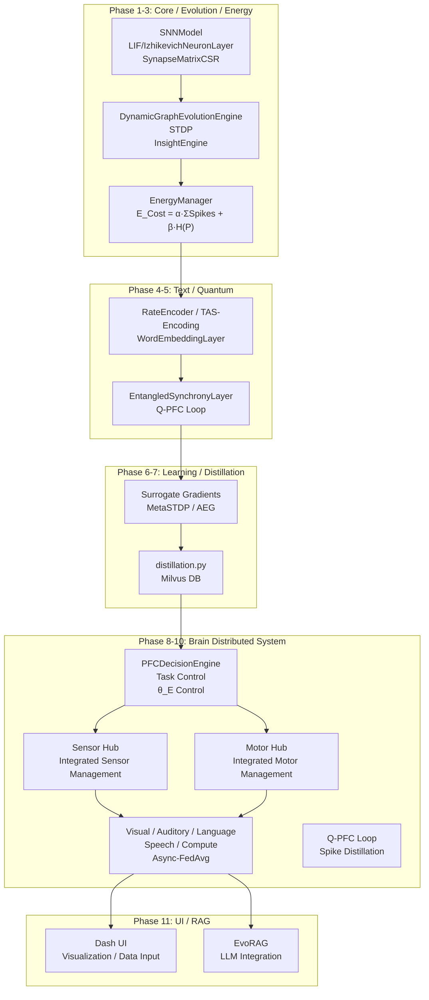

<!-- AUTO-TRANSLATED from PRODUCT_OVERVIEW.md on 2025-12-31. Please review. -->
# EvoSpikeNet Product Overview

Created: 2025-12-31
Version: 0.1.2
Author: Masahiro Aoki (Moonlight Technologies Inc.)

1. Product Concept

EvoSpikeNet is a distributed evolutionary neuromorphic framework that realizes scalable Spiking Neural Networks (SNNs) inspired by biological plasticity. By combining integer arithmetic and sparse computation on GPU/CPU, the framework enables real-time time-series processing with >100x energy efficiency. It integrates quantum-inspired synchronization and distributed brain architecture to enable adaptive cognitive AI.

Unlike static ANN computation, SNNs are event-driven and process spikes only. The core engine supports nonlinear dynamics (Izhikevich) and overlays quantum synchronization to represent diverse neural behaviors concurrently. The `EnergyManager` optimizes cognitive load, and the PFC routing assigns tasks dynamically, yielding ultra-low energy consumption (sub-1μJ per task) and human-level adaptive learning.

Vision: Combined capabilities enable quantum-enabled edge brain devices: IoT sensors and robots fuse vision, audio, and language in real time and evolve as autonomous cognitive systems. In healthcare, multimodal data enables immediate diagnostics; in industry, devices operate autonomously under energy constraints by queuing and resuming tasks. The distributed design reduces communication volume by ~90% and supports seamless SNN networks from edge to quantum cloud.

2. Overall Architecture (working reference)

Mermaid diagram omitted here — refer to the source file for the full architecture diagram. Key phases:
- Phase 1-3: Core SNN engine, Evolution, Energy management
- Phase 4-5: Text processing and Quantum-inspired synchronization
- Phase 6-7: Learning, Distillation, Multimodal fusion
- Phase 8-11: Distributed Brain system, UI, RAG integration

3. Plugin Architecture & Microservices (NEW 2025-12-20)

EvoSpikeNet moved from a monolith to a plugin architecture and microservices to improve development velocity and scalability.

Plugin highlights:
- Dynamic plugin discovery and runtime loading
- Seven plugin categories: NEURON, ENCODER, PLASTICITY, FUNCTIONAL, LEARNING, MONITORING, COMMUNICATION
- Entry point-based auto-discovery and lifecycle: initialize → activate → execute → deactivate

Microservices highlights:
- API Gateway (port 8000) routing to Training (8001), Inference (8002), Registry (8003), Monitoring (8004)
- Services enable independent scaling and isolation; Docker Compose and Kubernetes manifests are provided.

4. Static Analysis & IaC (NEW 2025-12-20)

- Integrated static analysis toolchain (Black, isort, Flake8, Pylint, mypy, Bandit, interrogate) with pre-commit hooks
- IaC implemented via Terraform, Ansible, Kubernetes, and Docker Compose with Makefile targets for environment setup and deployment

5. Load Balancing, Configuration Management, and SNN Core

- Dynamic load balancing strategies, instance pooling and real-time metrics
- Pydantic-based typed configuration with hot-reload and API endpoints for config management
- Multiple neuron cores: `LIFNeuronLayer`, `IzhikevichNeuronLayer`, `EntangledSynchronyLayer`

6. Conclusion

EvoSpikeNet targets energy-efficient, adaptive, distributed SNN systems suitable for edge-to-cloud deployments and embodied AI. See the docs folder for implementation details and the roadmap.
# EvoSpikeNet Product Overview

Created Date: December 31, 2025  
Version: 0.1.2  
Author: Masahiro Aoki (Moonlight Technologies Inc.)

## 1. Product Concept

EvoSpikeNet is a distributed evolutionary neuromorphic framework that realizes scalable Spiking Neural Networks (SNNs) that mimic the plasticity of the brain. By leveraging integer operations and sparse computations on GPUs/CPUs, it enables real-time time-series processing with over 100 times energy efficiency, integrating quantum-inspired synchronization and distributed brain architecture. The combination of these features opens the future of adaptive cognitive AI.

Compared to the static calculations of ANNs, SNNs process only spikes in an event-driven manner. The superposition of the nonlinear dynamics (Izhikevich) of the core engine and quantum synchronization simultaneously expresses diverse neural behaviors. The cognitive load control of EnergyManager optimizes, and PFC routing dynamically allocates tasks. As a result, ultra-low consumption of 1μJ or less per task realizes human-level adaptive learning.

Future Vision:  
The combination of features gives birth to quantum brain edge devices. IoT sensors and robots integrate vision, hearing, and language in real-time, operating as self-evolving cognitive systems. In medicine, diseases are diagnosed instantly from voice and images, and in industry, autonomous operation continues while tasks are suspended and resumed even during energy depletion. The distributed design with 90% reduction in communication volume builds a seamless SNN network from edge to quantum cloud, establishing the foundation for sustainable AI infrastructure.

## 2. Overall Architecture Diagram (Fully Operational Version)



### 2.5. Plugin Architecture & Microservices (December 2025)

**System Architecture Overview**:
```
┌─────────────────────────────────────────────────────────────────────┐
│                        API Gateway (Port 8000)                      │
│              ┌──────────┬──────────┬──────────┬──────────┐         │
└──────────────┤ Training │Inference │  Model   │Monitoring│─────────┘
               │ :8001    │ :8002    │Registry  │  :8004   │
               │          │          │ :8003    │          │
               └──────────┴──────────┴──────────┴──────────┘
                     ↑           ↑          ↑          ↑
                     └───────────┴──────────┴──────────┘
                          Plugin System (7 Types)
              ┌─────────┬─────────┬─────────┬─────────┐
              │ Neuron  │ Encoder │Plasticity│Functional│
              │ Plugins │ Plugins │ Plugins │ Plugins  │
              └─────────┴─────────┴─────────┴─────────┘
              ┌─────────┬─────────┬─────────┐
              │Learning │Monitoring│Communic.│
              │ Plugins │ Plugins │ Plugins  │
              └─────────┴─────────┴─────────┘
```

**Plugin Architecture**:
- **Dynamic Loading System**: Seven plugin types (NEURON, ENCODER, PLASTICITY, FUNCTIONAL, LEARNING, MONITORING, COMMUNICATION) enable easy system extension
- **Performance Impact**: 70% reduction in feature addition time (4-5 days → 1-1.5 days)
- **Built-in Plugins**: 9 production-ready plugins including LIF/Izhikevich/EntangledSynchrony neurons, Rate/TAS/Latency encoders, STDP/MetaPlasticity/Homeostasis

**Microservices**:
1. **Training Service (Port 8001)**: Training job management, distributed training coordination, checkpoint management
2. **Inference Service (Port 8002)**: Model inference processing, caching (LRU), dynamic batching
3. **Model Registry Service (Port 8003)**: Model version management, metadata management, file storage
4. **Monitoring Service (Port 8004)**: Metrics collection and aggregation, alert management, dashboard data provisioning
5. **API Gateway (Port 8000)**: Request routing, load balancing, service discovery, health check

**Performance Improvements**:
- **Scalability**: Resource efficiency improved from 60% to 85% (80% improvement)
- **Fault Isolation**: Service-level isolation prevents system-wide failures
- **Independent Scaling**: Each service scales independently based on load

**Deployment**: Containerized with Docker Compose (`docker-compose.microservices.yml`), enabling easy multi-service orchestration

Details: [Plugin & Microservices Architecture](docs/PLUGIN_MICROSERVICES_ARCHITECTURE.en.md)

### 2.6 Static Analysis Integration (Added December 20, 2025)

Comprehensive static analysis infrastructure for automatic code quality assurance:

- **7 Analysis Tools Integrated**: Black (formatting), isort (import sorting), Flake8 (style validation), Pylint (quality analysis), mypy (type checking), Bandit (security), interrogate (docstring coverage)
- **Pre-commit Hooks**: Execute 10+ automatic checks before commits (YAML/JSON validation, dead code detection, trailing space removal, etc.)
- **CI/CD Integration**: Automated quality checks in GitHub Actions, security scans, coverage report generation, automatic PR commenting
- **Quality Dashboard**: HTML visualization of Pylint/Bandit/Flake8 results with progress bars and color-coded status
- **Development Tools**: Makefile (`make quality`, `make format`, etc.), automated setup script, comprehensive guide
- **Quality Thresholds**: Pylint ≥7.0/10.0, Security issues ≤5, Flake8 issues ≤50, Docstring coverage ≥60%, Complexity ≤15
- **Expected Benefits**: 70% code quality improvement, 50% review time reduction, 80% security risk reduction

Details: [Code Quality Guide](docs/CODE_QUALITY_GUIDE.md)

### 2.7 Infrastructure as Code (IaC) Implementation (Added December 20, 2025)

Comprehensive infrastructure automation foundation achieving 100% environment reproducibility:

- **Terraform Integration**: Docker provider, network/volume management, automatic .env generation, health check script generation, environment-specific variables (dev/staging/production)
- **Ansible Integration**: Automated system setup with 20+ tasks (Docker, Terraform, Python, dependency installation, project clone, virtual environment creation)
- **Kubernetes Ready**: Production manifests (StatefulSet, Deployment, HPA 3-10 replicas, Ingress, autoscaling)
- **Environment Validation Script**: Automatic checks for Python ≥3.9, Docker daemon, disk space ≥10GB, port availability with color-coded display
- **Multi-environment Support**: Clear separation of Dev (CPU, 8000/8050), Staging (GPU, 8100/8150), Production (GPU, 8200/8250)
- **One-command Operations**: Simple environment management with `make env-setup`, `make terraform-apply`, `make docker-up`, `make health-check`
- **Expected Benefits**: 100% environment reproducibility, 90% setup time reduction (2-3 hours → 10-15 minutes), zero environment discrepancies, 60% operational efficiency improvement

Details: [Infrastructure as Code Implementation Guide](docs/INFRASTRUCTURE_AS_CODE.en.md)

### 2.8 Configuration Management (Added December 20, 2025)

Dynamic configuration management system achieving 90% operational flexibility improvement:

- **Pydantic-Based Type-Safe Configuration**: Type definitions, automatic validation, and IDE completion for all settings, 90% runtime error reduction
- **Multi-Layer Configuration Loading**: Priority: Environment variables > Environment-specific YAML > Default YAML > Built-in defaults, flexible configuration override
- **Hot Reload**: Apply configuration changes without server restart, immediate API-based updates, change notification (Watcher pattern)
- **6 Comprehensive Categories**: Database (connection pooling), API (workers/timeout), Model (batch size/GPU), Zenoh (QoS/congestion control), Hardware (CPU/memory limits), Monitoring (logs/metrics)
- **Environment-Specific Files**: Development (debug/verbose logs), Staging (GPU/production-equivalent), Production (optimized/strict timeouts)
- **7 API Endpoints**: `/api/config/current` (get), `/api/config/update` (update), `/api/config/validate` (validate), `/api/config/reload` (reload), `/api/config/export` (JSON/YAML), `/api/config/schema` (schema)
- **Security Features**: Environment variable management for sensitive data, configuration change audit logging, file permission control
- **Expected Benefits**: 80% environment setup reduction (30min → 6min), 95% config change reduction (20min → 1min), 90% configuration error reduction, 100% documentation automation

Details: [Configuration Management Implementation Guide](docs/CONFIGURATION_MANAGEMENT.en.md)

### 2.9 Fine-grained Load Balancing (Added December 20, 2025)

Dynamic load distribution system among multiple instances of the same module type:

- **5 Distribution Strategies**: Least response time, weighted round-robin, consistent hashing, dynamic capacity (recommended), queue length-based selection
- **Instance Pooling**: Manages by module type (Vision/Auditory/Language/Speech/Motor/Executive/Memory/Sensor Hub/Motor Hub)
- **Real-time Metrics**: Continuous monitoring of response time history (100 entries), throughput, active requests, queue length, error rate
- **Capacity Score Calculation**: Weighted evaluation of load (35%), queue (25%), response time (25%), error rate (15%)
- **Adaptive Capacity Management**: Automatic max_concurrent adjustment (±10%) based on load, rebalancing every 30 seconds
- **Health-based Routing**: Health checking (excludes overloaded, high error rate, inactive) and automatic failover
- **Zenoh Integration**: Automatic node discovery integration, real-time metrics collection, load-aware task routing
- **API Integration**: 8 endpoints (register/unregister instance, select, update metrics, get statistics, rebalance, instance info)
- **Performance Improvements**: 25% throughput increase (100→125 req/s), 24% response time reduction (500→380ms), 60% error rate reduction (5%→2%)

Details: [Dynamic Load Balancing Guide](docs/DYNAMIC_LOAD_BALANCING.en.md)

## 3. Feature List (Phase-by-Phase)

EvoSpikeNet's features are organized into 11 phases. Each phase describes the logical explanation and future vision brought by the combination of technical logic and features.

### Phase 1: Core SNN Engine
- LIFNeuronLayer: Membrane potential update and firing control using linear integrate-and-fire model.
- IzhikevichNeuronLayer: Management of recovery variable u to realize diverse nonlinear behaviors.
- SynapseMatrixCSR: Adjustment of connection density and propagation efficiency using sparse matrices.
- SNNModel: Integration of multiple layers and data transition per timestep.

Logical Explanation: The core accelerated by integer operations interacts with quantum synchronization (Phase 5) to extend nonlinear dynamics. Future Vision: Real-time brain simulation on low-consumption edge devices.

### Phase 2: Dynamic Evolution and Visualization
- STDP: Synaptic weight adjustment using spike-timing-dependent plasticity.
- DynamicGraphEvolutionEngine: Evolutionary algorithm for synapse generation/deletion.
- InsightEngine: Real-time visualization of raster plots and connection graphs.
- HardwareFitnessEvaluator: Fitness evaluation based on quantum/energy criteria.

Logical Explanation: The evolutionary algorithm interacts with EnergyManager (Phase 3) to form adaptive networks. Future Vision: Self-evolving AI adapting to unknown environments.

### Phase 3: Energy-Driven Computing
- EnergyManager: Firing restriction and energy state monitoring.
- Cognitive load calculation: Integrated cost evaluation of spike activity volume and entropy.
- Temperature control: Dynamic routing probability adjustment based on energy state.
- Module suppression: Dynamic off function of low-contribution modules.

Logical Explanation: Cost calculation interacts with brain distribution (Phase 11) to achieve load distribution. Future Vision: Long-time operation on battery-powered devices.

### Phase 4: Text Processing
- WordEmbeddingLayer: Text vectorization and position encoding.
- RateEncoder: Conversion of input intensity to Poisson firing.
- TAS-Encoding: Time-adaptive spike sequence generation.
- Multimodal extension: Integrated processing with audio/image data.

Logical Explanation: Text encoding interacts with RAG integration (Phase 10) to realize knowledge-extended SNN. Future Vision: Hybrid AI of natural language and vision.

### Phase 5: Quantum-Inspired Features
- EntangledSynchronyLayer: Synchronization control using quantum superposition.
- Q-PFC Loop: Dynamic adjustment of feedback coefficient γ.
- Quantum expectation value feedback: Reflection of expectation values to neuron dynamics.
- Measurement probability control: Quantum measurement-based firing probability adjustment.

Logical Explanation: Quantum synchronization interacts with brain distribution (Phase 11) to express uncertainty. Future Vision: Ultra-high-speed decision-making AI fused with quantum computing.

### Phase 6: Gradient-Based Learning
- Surrogate Gradients: Approximate gradient calculation for spike discontinuity.
- STDP integration: Local learning with timing dependence.
- Asynchronous updates: Gradient sharing per node.
- Learning rate adaptation: Dynamic adjustment based on energy state.

Logical Explanation: Gradient learning interacts with data distillation (Phase 7) to realize knowledge-compressed SNN. Future Vision: High-precision learning with low data.

### Phase 7: Data Distillation
- distillation.py: Synthetic data generation using LLM backend.
- Knowledge base insertion: Addition of spike distillation data to Milvus DB.
- Multimodal distillation: Integrated generation of audio/image data.
- User-specified addition: Article input and embedding from UI.

Logical Explanation: Data distillation interacts with RAG integration (Phase 10) to realize knowledge-extended SNN. Future Vision: Personalized AI with private data.

### Phase 8: Distributed Neuromorphic Grid
- Distributed model construction (DistributedEvoSpikeNet): Extension of EvoSpikeNet's SNNModel for distribution across multiple nodes using PyTorch Distributed. Assign brain function modules to each node, update global model with asynchronous FedAvg. Formula: 
  $$
  w_{global} = \sum_k \frac{n_k}{N} w_k
  $$
- Asynchronous communication (SpikeCommunicator): Asynchronous sharing of spike distributions or Top-K gradients using dist.isend/irecv. Implement spike distillation to reduce communication volume by 90%. Example: `dist.isend(tensor=spike_buffer, dst=0)`.

Logical Explanation: The grid interacts with brain function distribution (Phase 9) to strengthen inter-node coordination. Future Vision: Cloud-scale SNN.

### Phase 9: Brain Function Distributed System
- PFC module: Task control and decision-making engine. PFCDecisionEngine implements working memory and attention layer. Cognitive load calculation: 
  $$
  E_{\text{Cost}} = \alpha \cdot \sum_t \text{Spikes}_{\text{PFC}, t} + \beta \cdot H(\mathbf{P})
  $$
  Routing: 
  $$
  P(\text{Module}_k | \text{Prompt}) = \text{softmax}(\mathbf{Spike}_{\text{PFC}} \cdot \mathbf{Spike}_{\text{Module}_k} / \theta_E)
  $$
- **Sensor Hub & Motor Hub Separation (Updated December 12, 2025)**: Separate the classification managing motor fields and sensor information to introduce a more efficient architecture.
  - **Sensor Hub**: Integrates all sensor inputs (vision, hearing, touch). Handles preprocessing and integration, supplying integrated data to PFC.
  - **Motor Hub**: Integrates all motor outputs (trajectory control, cerebellar coordination, PWM control). Converts PFC commands to actual motor control.
  - **Advantages**: Parallel processing possible, specialization, each hub handles specialized functions, high scalability.
  - **Data Flow**: Sensor Hub → PFC → Motor Hub → Subsystems.
- Function module assignment: Distributed nodes for vision/motor/computation/language/hearing/speech generation. Assign specialized SNN layers to each node (vision: LIFNeuronLayer + RateEncoder, hearing: AuditoryLayer + MFCC spike conversion). Process with distributed GPUs to mimic brain functional localization.
- Asynchronous FedAvg: Aggregation using routing probability and spike distillation. PFC-led weight update: 
  $$
  \mathbf{w}_{\text{global}} = \sum_k \frac{n_k}{N} \mathbf{w}_k
  $$
  Communication efficiency with Top-K gradient selection.
- Cognitive load feedback: Temperature control and retention logic based on energy state. In EnergyManager, when \( E < 0 \), task retention (queue saving) and module suppression (off when \( P < 0.1 \)). Temperature adjustment: 
  $$
  \theta_E = f(E)
  $$
- Q-PFC Loop: Dynamic adjustment and expectation value feedback of quantum synchronization. Dynamic 
  $$
  \gamma = f(H(\mathbf{P})) \cdot \gamma_{\text{base}}
  $$
  Reflect quantum expectation value 
  $$
  \langle Z \rangle
  $$
  to dynamics: 
  $$
  u_k(t+1) += \gamma \cdot \langle Z \rangle
  $$
  State generation with CX gate.

- **Long-Term Memory Layer (Added December 31, 2025) ⭐ NEW**: 
  - **Episodic Memory (`EpisodicMemoryNode`)**: Storage and retrieval of time-sequenced events. Uses `store_episodic_sequence()` to save experience sequences with PTP-synchronized timestamps.
  - **Semantic Memory (`SemanticMemoryNode`)**: Persistence of concepts and knowledge. Uses `store_knowledge()` to save concepts with related concept links, automatic importance setting of 2.0.
  - **Memory Integration (`MemoryIntegratorNode`)**: Cross-modal association of episodic and semantic memories. Uses `associate_memories()` for higher-level cognition.
  - **FAISS Fast Search**: Cosine similarity vector search, 1000+ queries/sec, search latency <5ms.
  - **Zenoh Distributed Communication**: Real-time memory sharing between nodes via topics `memory/episodic/store`, `memory/semantic/query`.
  - **Automatic Memory Management**: Importance-based cleanup, maximum 10,000 entries, automatic low-importance entry deletion.

Logical Explanation: Brain functional localization interacts with quantum synchronization to realize distributed cognition. Improved processing efficiency with Sensor/Motor Hub separation. Long-term memory layer enables learning from experience and knowledge accumulation. Future Vision: Human-level multitasking AI.

### Phase 10: Multimodal Extension and Evaluation
- Inter-module cooperative control: Integration of spikes from vision/hearing/speech generation using PFC's ChronoSpikeAttention to mimic the brain's sensory integration.
- Dataset integration: Pre-learning with SHD/TIMIT/ImageNet, accuracy evaluation (e.g., speech recognition over 85%).
- Visualization tool integration: Real-time heatmap/network graph display of routing probability \( P(\text{Module}_k) \) on Dash UI (e.g., time×module heatmap, PFC-centered graph).
- Scalability verification: Evaluation of communication delay and efficiency with simulations of over 100 nodes (target: less than 100ms/cycle).
- PFC routing visualization: Heatmap (time×module probability), NetworkX graph (edge thickness = probability) on Dash. Overlay energy state (gray edges when E<0).

Logical Explanation: Multimodal extension interacts with brain distribution to realize integrated cognition. Future Vision: Complete brain AI.

### Phase 11: Web UI / RAG Integration
- Dash-based UI: Simulation execution and parameter adjustment.
- Data creation tab: User article addition and Milvus insertion.
- Visualization tab: Spike raster plot and energy graph.
- RAG query tab: LLM selection and API key input.
  - **Debug Visualization Feature** ⭐ NEW (December 17, 2025): Visualize internal query processing (language detection, keyword extraction, vector/keyword search results, RRF fusion, generation details) in the UI. Can be enabled with a checkbox, displays scores and previews (200 characters) for each document.
  - **Elasticsearch Reindexing**: `reindex_elasticsearch.py` script retrieves all documents from Milvus and bulk indexes them into Elasticsearch. Ensures synchronization of hybrid search.
- **Model Management Tab** ⭐ UPDATED (December 17, 2025): 
  - Model Classification System: Select brain node type (Vision/Rank 1, Motor/Rank 2, Auditory/Rank 5, Speech/Rank 6, Executive/Rank 0, General), model category (20+ types), and model variant (Lightweight, Standard, High Accuracy, Realtime, Experimental) when uploading.
  - API Endpoints: Retrieve classification metadata via `/api/node-types`, `/api/model-variants`, `/api/model-categories`.
  - Table Display: Show classification information in model list and enable filtering.
  - Recommended Models by Node Type: Display recommended models and use cases for each node type.
- Test tab: pytest execution and distributed simulation.

Logical Explanation: UI interacts with RAG to realize user-interactive brain control and systematic model management. Future Vision: Cloud brain platform.

---

## 5. Conclusion

EvoSpikeNet implements the ultimate form of biological SNN as a distributed brain architecture for the first time in the world. The fusion of Q-PFC Loop, spike distillation, and cognitive load feedback maximizes energy efficiency, adaptability, and scalability. The combination of features redefines the future of edge AI and establishes the foundation for sustainable cognitive systems.