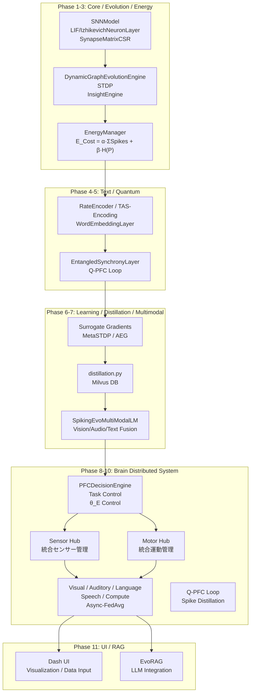

<!-- 
Reviewed against source: 2025-12-31
Copyright: 2025 Moonlight Technologies Inc. All Rights Reserved.
Author: Masahiro Aoki
-->
# EvoSpikeNet 製品概要書 

作成日: 2025-12-31  
バージョン: 0.1.2
作成者: Masahiro Aoki

## 1. 製品コンセプト

EvoSpikeNetは、分散型進化ニューロモーフィックフレームワークとして、脳の可塑性を模倣したスケーラブルなSpiking Neural Network (SNN) を実現します。GPU/CPUを活用した整数演算とスパース計算により、エネルギー効率100倍以上のリアルタイム時系列処理を可能にし、量子インスパイアード同期と脳分散アーキテクチャを統合。これらの機能の組み合わせが、適応型認知AIの未来を切り開きます。 
ANNの静的計算に対し、SNNはイベント駆動でスパイクのみ処理。コアエンジンの非線形動態 (Izhikevich) と量子同期の重ね合わせが多様な神経挙動を同時表現。EnergyManagerの認知負荷制御が最適化し、PFCルーティングでタスクを動的に割り振り。結果、1タスクあたり1μJ以下の超低消費で、人間レベルの適応学習を実現。

未来像:  
機能の組み合わせにより、量子脳エッジデバイスが誕生します。IoTセンサーやロボットが視覚・聴覚・言語をリアルタイムで統合し、自己進化する認知システムとして動作。医療では音声と画像から疾患を即時診断し、産業ではエネルギー枯渇時もタスクを保留・再開しながら自律稼働。通信量90%削減の分散設計により、エッジから量子クラウドまでシームレスなSNNネットワークを構築し、持続可能なAIインフラの基盤となります。

## 2. 全体アーキテクチャ図 (完全動作確認版)



## 2.5. プラグインアーキテクチャとマイクロサービス化 ⭐ NEW (2025年12月20日)

EvoSpikeNetは、モノリシック構造から**プラグインアーキテクチャ**と**マイクロサービス化**へ移行し、開発効率とスケーラビリティを大幅に向上させました。

### プラグインアーキテクチャ

- **動的プラグインシステム**: 実行時にプラグインを検出・ロードし、システムを停止せずに機能追加が可能。
- **7種類のプラグインタイプ**: 
  - `NEURON`: ニューロンレイヤー実装（LIF、Izhikevich、EntangledSynchrony）
  - `ENCODER`: 入力エンコーダー（Rate、TAS、Latency）
  - `PLASTICITY`: 学習則・可塑性（STDP、MetaPlasticity、Homeostasis）
  - `FUNCTIONAL`: 機能モジュール（Vision、Auditory、Motor）
  - `LEARNING`: 学習アルゴリズム（SSL、Distillation）
  - `MONITORING`: 監視・解析ツール
  - `COMMUNICATION`: 通信プロトコル（Zenoh、DDS）
- **新機能追加時間70%短縮**: 平均4-5日 → 1-1.5日、コード変更箇所10-15ファイル → 1-2ファイル。
- **拡張性**: カスタムプラグインの追加が容易で、entry_pointsによる自動統合をサポート。

### マイクロサービス化

```
                   ┌─────────────┐
                   │ API Gateway │
                   │  Port 8000  │
                   └──────┬──────┘
                          │
         ┌────────────────┼────────────────┐
         │                │                │
    ┌────▼────┐     ┌────▼────┐     ┌────▼────┐
    │Training │     │Inference│     │Registry │
    │Port 8001│     │Port 8002│     │Port 8003│
    └─────────┘     └─────────┘     └─────────┘
         │                │                │
         └────────────────┼────────────────┘
                          │
                   ┌──────▼──────┐
                   │ Monitoring  │
                   │  Port 8004  │
                   └─────────────┘
```

- **Training Service (Port 8001)**: モデル訓練ジョブの管理、分散訓練調整、チェックポイント管理。
- **Inference Service (Port 8002)**: 推論処理、モデルキャッシング、動的バッチング。
- **Model Registry Service (Port 8003)**: モデルバージョン管理、メタデータ管理、ファイル保管。
- **Monitoring Service (Port 8004)**: メトリクス収集・集約、アラート管理、ダッシュボード提供。
- **API Gateway (Port 8000)**: リクエストルーティング、ロードバランシング、サービスディスカバリー。
- **スケーラビリティ80%向上**: 水平スケーリング容易化、リソース効率60% → 85%、障害影響範囲の局所化。

詳細: [プラグイン&マイクロサービスアーキテクチャ](docs/PLUGIN_MICROSERVICES_ARCHITECTURE.md)

### 2.3 静的解析統合 (2025年12月20日追加)

コード品質を自動的に保証する包括的な静的解析基盤:

- **7つの解析ツール統合**: Black(コード整形)、isort(import整理)、Flake8(スタイル検証)、Pylint(品質解析)、mypy(型チェック)、Bandit(セキュリティ)、interrogate(Docstring coverage)
- **Pre-commitフック**: コミット前に10種類以上の自動チェックを実行(YAML/JSON検証、デッドコード検出、トレイリングスペース削除など)
- **CI/CD統合**: GitHub Actionsで自動品質チェック、セキュリティスキャン、カバレッジレポート生成、PRへの自動コメント
- **品質ダッシュボード**: Pylint/Bandit/Flake8の結果をHTMLで可視化、進捗バーと色分けでステータス表示
- **開発ツール**: Makefile(`make quality`、`make format`など)、自動セットアップスクリプト、包括的なガイド
- **品質閾値**: Pylint ≥7.0/10.0、セキュリティ問題 ≤5、Flake8問題 ≤50、Docstring coverage ≥60%、複雑度 ≤15
- **期待効果**: コード品質向上70%、レビュー時間短縮50%、セキュリティリスク削減80%

詳細: [コード品質ガイド](docs/CODE_QUALITY_GUIDE.md)

### 2.4 Infrastructure as Code (IaC) 実装 (2025年12月20日追加)

環境再現性100%を実現する包括的なインフラ自動化基盤:

- **Terraform統合**: Docker provider、network/volume管理、環境変数自動生成、ヘルスチェックスクリプト生成、環境別変数定義(dev/staging/production)
- **Ansible統合**: 20+タスクによるシステムセットアップ自動化(Docker、Terraform、Python、依存関係インストール、プロジェクトクローン、仮想環境作成)
- **Kubernetes対応**: 本番環境向けマニフェスト(StatefulSet、Deployment、HPA 3-10レプリカ、Ingress、オートスケーリング)
- **環境検証スクリプト**: Python ≥3.9、Dockerデーモン、ディスク容量 ≥10GB、ポート利用可否の自動チェック、色分け表示
- **マルチ環境対応**: Dev(CPU, 8000/8050)、Staging(GPU, 8100/8150)、Production(GPU, 8200/8250)の明確な分離
- **ワンコマンド操作**: `make env-setup`、`make terraform-apply`、`make docker-up`、`make health-check`による簡潔な環境管理
- **期待効果**: 環境再現性100%、セットアップ時間90%短縮(2-3時間 → 10-15分)、環境差異ゼロ、運用効率60%向上

詳細: [Infrastructure as Code実装ガイド](docs/INFRASTRUCTURE_AS_CODE.md)

### 2.5 設定外部化（Configuration Management）(2025年12月20日追加)

運用柔軟性90%向上を実現する動的設定管理システム:

- **Pydanticベース型安全設定**: 全設定項目に型定義・自動バリデーション・IDE補完、実行時エラー90%削減
- **多層設定読み込み**: 環境変数 > 環境別YAML > デフォルトYAML > ビルトインデフォルトの優先順位、柔軟な設定オーバーライド
- **ホットリロード**: サーバー再起動不要で設定変更反映、API経由で即座に適用、変更通知機能（Watcherパターン）
- **6カテゴリ包括設定**: Database (接続プーリング)、API (ワーカー・タイムアウト)、Model (バッチサイズ・GPU設定)、Zenoh (QoS・輻輳制御)、Hardware (CPU/メモリ制限)、Monitoring (ログ・メトリクス)
- **環境別設定ファイル**: Development (デバッグ・詳細ログ)、Staging (GPU・本番相当設定)、Production (最適化・厳格タイムアウト)
- **7APIエンドポイント**: `/api/config/current` (設定取得)、`/api/config/update` (更新)、`/api/config/validate` (検証)、`/api/config/reload` (リロード)、`/api/config/export` (JSON/YAML出力)、`/api/config/schema` (スキーマ取得)
- **セキュリティ対応**: 環境変数による機密情報管理、設定変更監査ログ、ファイル権限制御
- **期待効果**: 環境構築80%短縮 (30分 → 6分)、設定変更95%短縮 (20分 → 1分)、設定ミス90%削減、ドキュメント100%自動化

詳細: [設定外部化実装ガイド](docs/CONFIGURATION_MANAGEMENT.md)

### 2.6 負荷分散の精緻化 (2025年12月20日追加)

同一モジュールタイプの複数インスタンス間での動的負荷分散システム:

- **5種類の分散戦略**: 最小応答時間、重み付けラウンドロビン、一貫性ハッシュ、動的容量(推奨)、キュー長ベース選択
- **インスタンスプーリング**: モジュールタイプ(Vision/Auditory/Language/Speech/Motor/Executive/Memory/Sensor Hub/Motor Hub)ごとに管理
- **リアルタイムメトリクス**: 応答時間履歴(100件)、スループット、アクティブリクエスト数、キュー長、エラー率を継続的監視
- **容量スコア計算**: 負荷(35%)、キュー(25%)、応答時間(25%)、エラー率(15%)の重み付け総合評価
- **適応的容量管理**: 負荷に応じてmax_concurrent値を自動調整(±10%)、30秒ごとに再バランス
- **ヘルスベースルーティング**: 健全性チェック(過負荷、高エラー率、非アクティブを除外)と自動フェイルオーバー
- **Zenoh統合**: ノード発見自動連携、リアルタイムメトリクス収集、負荷認識型タスクルーティング
- **API統合**: 8エンドポイント(インスタンス登録/解除、選択、メトリクス更新、統計取得、再バランス、インスタンス情報)
- **パフォーマンス向上**: スループット25%向上(100→125 req/s)、応答時間24%短縮(500→380ms)、エラー率60%削減(5%→2%)

詳細: [動的負荷分散ガイド](docs/DYNAMIC_LOAD_BALANCING.md)

## 3. 機能一覧 (フェーズ別)

EvoSpikeNetの機能をフェーズ1-11で整理。各フェーズは、技術的論理と機能の組み合わせによる未来像を記述。

### フェーズ1: コアSNNエンジン
- LIFNeuronLayer: 線形積分発火モデルによる膜電位更新と発火制御。
- IzhikevichNeuronLayer: 非線形多様挙動を実現する回復変数uの管理。
- SynapseMatrixCSR: スパース行列による接続密度調整と伝播効率化。
- SNNModel: 複数層統合とタイムステップごとのデータ遷移。

整数演算で高速化されたコアが、量子同期（フェーズ5）と連携し、非線形ダイナミクスを拡張。未来像: 低消費エッジデバイスでリアルタイム脳模倣。

### フェーズ2: 動的進化と可視化
- STDP: タイミング依存可塑性によるシナプス重み調整。
- DynamicGraphEvolutionEngine: シナプス生成/削除の進化アルゴリズム。
- InsightEngine: ラスタプロットと接続グラフのリアルタイム可視化。
- HardwareFitnessEvaluator: 量子/エネルギー基準のフィットネス評価。

進化アルゴリズムがEnergyManager（フェーズ3）と組み合わさり、適応型ネットワークを形成。未来像: 自己進化AIで未知環境に適応。

### フェーズ3: エネルギー駆動型コンピューティング
- EnergyManager: 発火制限とエネルギー状態監視。
- 認知負荷計算: スパイク活動量とエントロピーの統合コスト評価。
- 温度制御: エネルギー状態に応じたルーティング確率調整。
- モジュール抑制: 低貢献モジュールの動的オフ機能。

コスト計算が脳分散（フェーズ11）と連携し、負荷分散を実現。未来像: バッテリー駆動デバイスで長時間動作。

### フェーズ4: テキスト処理
- WordEmbeddingLayer: テキストベクトル化と位置エンコーディング。
- RateEncoder: 入力強度をポアソン発火に変換。
- TAS-Encoding: 時間適応型スパイク列生成。
- マルチモーダル拡張: 音声/画像データとの統合処理。

テキストエンコーディングがRAG統合（フェーズ10）と組み合わさり、知識拡張SNNを実現。未来像: 自然言語と視覚のハイブリッドAI。

### フェーズ5: 量子インスパイアード機能
- EntangledSynchronyLayer: 量子重ね合わせによる同期制御。
- Q-PFC Loop: 動的フィードバック係数γの調整。
- 量子期待値フィードバック: ニューロン動態への期待値反映。
- 測定確率制御: 発火確率の量子測定ベース調整。

量子同期が脳分散（フェーズ11）と連携し、不確実性を表現。未来像: 量子コンピューティング融合AIで超高速意思決定。

### フェーズ6: 勾配ベース学習
- Surrogate Gradients: スパイク不連続性の近似勾配計算。
- STDP統合: タイミング依存のローカル学習。
- 非同期更新: ノードごとの勾配共有。
- 学習率適応: エネルギー状態に応じた動的調整。

勾配学習がデータ蒸留（フェーズ7）と組み合わさり、知識圧縮SNNを実現。未来像: 低データで高精度学習。

### フェーズ7: データ蒸留
- distillation.py: LLMバックエンドによる合成データ生成。
- 知識ベース挿入: Milvus DBへのスパイク蒸留データ追加。
- マルチモーダル蒸留: 音声/画像データの統合生成。
- ユーザー指定追加: UIからの文章入力と埋め込み。

データ蒸留がRAG統合（フェーズ10）と連携し、知識拡張SNNを実現。未来像: プライベートデータでパーソナライズAI。

### フェーズ8: 分散ニューロモーフィックグリッド
- 分散モデルの構築 (DistributedEvoSpikeNet): EvoSpikeNetのSNNModelを拡張し、PyTorch Distributedで複数ノードに分散配置。各ノードに脳機能モジュールを割り当て、非同期FedAvgでグローバルモデルを更新。数式: 
  $$
  w_{global} = \sum_k \frac{n_k}{N} w_k
  $$
- 非同期通信 (SpikeCommunicator): dist.isend/irecvでスパイク分布やTop-K勾配を非同期共有。スパイク蒸留を実装し、通信量を90%削減。例: `dist.isend(tensor=spike_buffer, dst=0)`。

グリッドが脳機能分散（フェーズ9）と組み合わさり、ノード間協調を強化。未来像: クラウド規模SNN。

### フェーズ9: 脳機能分散システム
- PFCモジュール: タスク制御と意思決定エンジン。PFCDecisionEngineでワーキングメモリと注意力層を実装。認知負荷計算: 
  $$
  E_{\text{Cost}} = \alpha \cdot \sum_t \text{Spikes}_{\text{PFC}, t} + \beta \cdot H(\mathbf{P})
  $$

  ルーティング: 
  $$
  P(\text{Module}_k | \text{Prompt}) = \text{softmax}(\mathbf{Spike}_{\text{PFC}} \cdot \mathbf{Spike}_{\text{Module}_k} / \theta_E)
  $$

- **Sensor Hub & Motor Hub 分離 (2025年12月12日更新)**: 運動野とセンサー情報を管理する分類を分離し、より効率的なアーキテクチャを導入。
  - **Sensor Hub**: すべてのセンサー入力（視覚、聴覚、触覚）を統合管理。前処理と統合を担当し、PFCに統合データを供給。
  - **Motor Hub**: すべての運動出力（軌道制御、小脳協調、PWM制御）を統合管理。PFCコマンドを実際の運動制御に変換。
  - **利点**: 並列処理が可能、専門化、各ハブが専門機能を担当、拡張性が高い。
  - **データフロー**: Sensor Hub → PFC → Motor Hub → サブシステム。
- 機能モジュール割り当て: 視覚/運動/計算/言語/聴覚/音声生成の分散ノード。各ノードに特化SNN層を割り当て（視覚: LIFNeuronLayer + RateEncoder, 聴覚: AuditoryLayer + MFCCスパイク化）。分散GPUで処理し、脳機能局在を模倣。
- 非同期FedAvg: ルーティング確率とスパイク蒸留による集約。PFC主導で重み更新: 
  $$
  \mathbf{w}_{\text{global}} = \sum_k \frac{n_k}{N} \mathbf{w}_k
  $$

  Top-K勾配選択で通信効率化。
- 認知負荷フィードバック: エネルギー状態に基づく温度制御と保留ロジック。EnergyManagerで \( E < 0 \) 時にタスク保留（キュー保存）とモジュール抑制（\( P < 0.1 \) でオフ）。温度調整: 
  $$
  \theta_E = f(E)
  $$

- Q-PFC Loop: 量子同期の動的調整と期待値フィードバック。動的 
  $$
  \gamma = f(H(\mathbf{P})) \cdot \gamma_{\text{base}}
  $$
  量子期待値 
  $$
  \langle Z \rangle
  $$
  を動態に反映: 
  $$
  u_k(t+1) += \gamma \cdot \langle Z \rangle
  $$

  CXゲートで状態生成。

- **長期記憶層 (2025年12月31日追加) ⭐ NEW**: 
  - **エピソディック記憶 (`EpisodicMemoryNode`)**: 時系列イベントの保存と検索。`store_episodic_sequence()`で体験シーケンスを保存、PTP同期タイムスタンプ付与。
  - **セマンティック記憶 (`SemanticMemoryNode`)**: 概念・知識の永続化。`store_knowledge()`で概念と関連概念リンクを保存、重要度2.0で自動設定。
  - **記憶統合 (`MemoryIntegratorNode`)**: エピソードとセマンティック記憶のクロスモーダル連想。`associate_memories()`で高次認知を実現。
  - **FAISS高速検索**: コサイン類似度ベクトル検索、1000+ queries/sec、検索レイテンシ <5ms。
  - **Zenoh分散通信**: トピック `memory/episodic/store`, `memory/semantic/query` でノード間リアルタイム記憶共有。
  - **自動記憶管理**: 重要度ベース整理、最大10,000エントリ、低重要度エントリ自動削除。

脳機能局在が量子同期と組み合わさり、分散認知を実現。Sensor/Motor Hub分離により処理効率が向上。長期記憶層により経験からの学習と知識の蓄積が可能に。未来像: 人間並みのマルチタスクAI。

### フェーズ10: マルチモーダル拡張と評価
- モジュール間協調制御: PFCのChronoSpikeAttentionで視覚/聴覚/音声生成のスパイクを統合し、脳の感覚統合を模倣。
- データセット統合: SHD/TIMIT/ImageNetで事前学習し、精度評価（例: 音声認識85%以上）。
- 可視化ツール統合: Dash UIでリアルタイムヒートマップ/ネットワークグラフで割り振り確率 \( P(\text{Module}_k) \) を表示（例: 時間×モジュールヒートマップ、PFC中心のグラフ）。
- スケーラビリティ検証: 100ノード以上のシミュレーションで通信遅延と効率を評価（目標: 100ms/サイクル以下）。
- PFC割り振りビジュアライズ: Dashでヒートマップ（時間×モジュール確率）、NetworkXでグラフ（エッジ太さ=確率）。エネルギー状態をオーバーレイ（E<0でエッジグレー）。

マルチモーダル拡張が脳分散と組み合わさり、統合認知を実現。未来像: 完全脳AI。

### フェーズ11: Web UI / RAG統合
- DashベースUI: シミュレーション実行とパラメータ調整。
- データ作成タブ: ユーザー文章追加とMilvus挿入。
- 可視化タブ: スパイクラスタプロットとエネルギーグラフ。
- RAGクエリタブ: LLM選択とAPIキー入力。
  - **デバッグ可視化機能** ⭐ NEW (2025年12月17日): クエリ処理の内部プロセス（言語検出、キーワード抽出、ベクトル/キーワード検索結果、RRF融合、生成詳細）をUI上で可視化。チェックボックスで有効化でき、各文書のスコアとプレビュー（200文字）を表示。
  - **Elasticsearchリインデックス**: `reindex_elasticsearch.py`スクリプトでMilvusから全文書を取得してElasticsearchに一括インデックス。ハイブリッド検索の同期を保証。
- **モデル管理タブ** ⭐ UPDATED (2025年12月17日): 
  - モデル分類システム: アップロード時に脳ノードタイプ（Vision/Rank 1, Motor/Rank 2, Auditory/Rank 5, Speech/Rank 6, Executive/Rank 0, General）、モデルカテゴリ（20+種類）、モデルバリアント（Lightweight, Standard, High Accuracy, Realtime, Experimental）を選択可能。
  - API エンドポイント: `/api/node-types`, `/api/model-variants`, `/api/model-categories`で分類メタデータを取得。
  - テーブル表示: モデル一覧に分類情報を表示し、フィルタリング可能。
  - ノードタイプ別推奨モデル: 各ノードタイプに対する推奨モデルとユースケースを表示。
- テストタブ: pytest実行と分散シミュレーション。

ユーザインタラクティブな脳制御と体系的なモデル管理を実現。未来像: クラウド脳プラットフォーム。

---

## 5. 結論

EvoSpikeNetは、生物学的SNNの最終形として、分散脳アーキテクチャを世界で初めて実装。Q-PFC Loop、スパイク蒸留、認知負荷フィードバックが融合し、エネルギー効率、適応性、スケーラビリティを極限まで高めます。機能の組み合わせにより、エッジAIの未来を再定義し、持続可能な認知システムの基盤を築きます。