# Copyright 2025 Moonlight Technologies Inc. All Rights Reserved.
# Auth Masahiro Aoki

# Advanced Node Discovery System

## Overview

The EvoSpikeNet advanced node discovery system enables dynamic detection and management of active nodes in distributed brain simulations. Leveraging Zenoh's Pub/Sub mechanism, it tracks node states in real-time and enables adaptive routing by the PFC decision engine.

## Key Features

### 1. **Dynamic Node Detection**
- Automatic detection of active nodes via heartbeat mechanism
- Automatic registration of new nodes and discovery announcements
- Node state management (active/inactive/error)

### 2. **Module Type Filtering**
- Retrieve node lists by module type (PFC, lang-main, visual, audio, motor)
- Normalization of compound module names (lang-embed-18 → lang-main)
- Extract active nodes only

### 3. **Network Topology Management**
- Generate visualization data for inter-node connections
- Export formatted data for UI
- Real-time node statistics

### 4. **Fallback Mechanism Integration**
- Check active nodes for target modules
- Automatic fallback to lang-main when inactive
- Guarantee query completion to prevent UI hangs

## Architecture

```mermaid
flowchart TD
    subgraph "Node Discovery Service"
        ND[ZenohNodeDiscovery<br/>- Heartbeat monitoring 2秒間隔<br/>- Discovery announcement処理<br/>- ノード状態管理 timeout: 5秒]
    end

    ND --> ZC

    subgraph "Zenoh Communication"
        HB[heartbeat/&lt;node&gt;<br/>2秒毎に送信]
        DA[discovery/announce<br/>起動時に送信]
    end

    ZC --> DBN

    subgraph "Distributed Brain Nodes"
        PFC[PFC<br/>Rank 0]
        LM[Lang-Main<br/>Rank 1]
        V[Visual<br/>Rank 2]
        A[Audio<br/>Rank 3]
    end

    PFC --> CHK
    LM --> CHK
    V --> CHK
    A --> CHK

    CHK[_has_active_nodes_for_module<br/>NodeDiscoveryを使用してアクティブ確認]
```


## Implementation Details

### NodeDiscovery Class

#### Initialization
```python
from evospikenet.node_discovery import init_node_discovery, get_node_discovery

# Initialize global instance
discovery = init_node_discovery(namespace="evospikenet")

# Get existing instance
discovery = get_node_discovery()
```

#### Retrieving Node Information
```python
# Get all nodes
all_nodes = discovery.get_all_nodes()

# Get active nodes only
active_nodes = discovery.get_active_nodes()

# Get by module type
visual_nodes = discovery.get_nodes_by_type("visual")
lang_nodes = discovery.get_nodes_by_type("lang-main")

# Get node count statistics
counts = discovery.get_node_count()
# Returns: {"active": 4, "inactive": 0, "total": 4}
```

#### UI Data Export
```python
# Format for UI display
ui_data = discovery.export_for_ui()
# Returns:
# {
#   "nodes": [
#     {
#       "node_id": "pfc-0",
#       "type": "pfc",
#       "host": "brain-node-0",
#       "status": "active",
#       "status_icon": "🟢",
#       "last_seen": "14:23:15",
#       "uptime": "2.3s ago",
#       "metadata": {...}
#     },
#     ...
#   ],
#   "summary": {"active": 4, "inactive": 0, "total": 4},
#   "updated_at": "14:23:17"
# }

# Get network topology
topology = discovery.get_topology()
# Returns:
# {
#   "nodes": [...],
#   "edges": [...],
#   "timestamp": 1701234567.89
# }
```

### Brain Node Integration

#### Heartbeat Transmission
Each Brain Node periodically sends heartbeats:

```python
def _send_heartbeat(self):
    """Send heartbeat to node discovery service."""
    current_time = time.time()
    
    if current_time - self._last_heartbeat < self._heartbeat_interval:
        return
    
    self._last_heartbeat = current_time
    
    heartbeat_data = {
        "node_id": self.node_id,
        "module_type": self.module_type,
        "host": os.environ.get("HOSTNAME", "unknown"),
        "timestamp": current_time,
        "metadata": {
            "step_count": self.step_count,
            "active_task": self.active_task
        }
    }
    
    self.comm.publish(f"heartbeat/{self.node_id}", heartbeat_data, serialize="json")
```

#### Active Node Verification
PFC nodes verify active nodes for target modules before routing:

```python
def _has_active_nodes_for_module(self, module_type: str) -> bool:
    """
    Check if there are active nodes for the given module type.
    Uses NodeDiscovery service to dynamically detect active nodes.
    """
    # lang-main is always available
    if module_type == "lang-main":
        return True
    
    # Use NodeDiscovery service
    if self.node_discovery is not None:
        try:
            # Normalize module type
            base_type = self._get_base_module_type(module_type)
            
            # Get active nodes
            active_nodes = self.node_discovery.get_nodes_by_type(base_type)
            active_nodes = [n for n in active_nodes if n.status == "active"]
            
            has_nodes = len(active_nodes) > 0
            
            if has_nodes:
                self.logger.debug(f"Found {len(active_nodes)} active {base_type} nodes")
            else:
                self.logger.debug(f"No active {base_type} nodes found")
            
            return has_nodes
            
        except Exception as e:
            self.logger.warning(f"Error querying node discovery: {e}")
    
    # Fallback: only lang-main is guaranteed
    return False
```

## Zenoh Topics

### Discovery Topics

| Topic | Direction | Content | Purpose |
|-------|-----------|---------|---------|
| `discovery/announce` | Node → Discovery | Node info (JSON) | Register new nodes |
| `heartbeat/<node_id>` | Node → Discovery | Heartbeat (JSON) | Node liveness check |

### Heartbeat Message Format
```json
{
  "node_id": "pfc-0",
  "module_type": "pfc",
  "host": "brain-node-0",
  "timestamp": 1701234567.89,
  "metadata": {
    "step_count": 42,
    "active_task": true
  }
}
```

### Discovery Announcement Format
```json
{
  "node_id": "visual-2",
  "module_type": "visual",
  "host": "brain-node-2",
  "metadata": {
    "config": "Visual processing node"
  }
}
```

## Configuration Parameters

### NodeDiscovery Configuration
```python
ZenohNodeDiscovery(
    namespace="evospikenet",  # Zenoh namespace
    timeout=5.0               # Node inactive timeout (seconds)
)
```

### Brain Node Configuration
```python
# Heartbeat send interval
self._heartbeat_interval = 2.0  # Every 2 seconds

# NodeDiscovery integration
self.node_discovery = get_node_discovery()
```

## Usage Examples

### Basic Usage
```python
from evospikenet.node_discovery import init_node_discovery

# Initialize node discovery service
discovery = init_node_discovery()

# Check active nodes
active_nodes = discovery.get_active_nodes()
for node in active_nodes:
    print(f"{node.node_id} ({node.module_type}) - {node.status}")

# Check specific module
visual_nodes = discovery.get_nodes_by_type("visual")
if visual_nodes:
    print(f"Found {len(visual_nodes)} visual processing nodes")
else:
    print("No visual nodes available, falling back to lang-main")
```

### Integration with PFC Routing
```python
# Routing within PFC Decision Engine
if self._has_active_nodes_for_module(target_module):
    # Route to target module
    topic = self._get_topic_for_module(target_module)
    self.comm.publish(topic, data)
else:
    # Fallback to lang-main
    self.logger.warning(f"No active {target_module} nodes, falling back to lang-main")
    self.comm.publish("pfc/text_prompt", data)
```

### UI Integration
```python
# Display node status in frontend
ui_data = discovery.export_for_ui()

# Render in React/Vue etc.
for node in ui_data['nodes']:
    render_node_card(
        icon=node['status_icon'],
        name=node['node_id'],
        type=node['type'],
        status=node['status'],
        last_seen=node['last_seen']
    )
```

## Performance Characteristics

### Latency
- **Heartbeat send**: ~1ms (async publish)
- **Node detection**: max 2 sec (heartbeat_interval)
- **Status check**: ~0.1ms (in-memory data structure)

### Resource Usage
- **Memory**: ~1KB per node (NodeInfo)
- **Network**: ~200 bytes per heartbeat (every 2 sec)
- **CPU**: < 0.1% (monitoring thread)

### Scalability
- **Supported nodes**: Thousands of nodes
- **Discovery time**: O(1) - in-memory lookup
- **Timeout processing**: O(n) - checked every second

## Troubleshooting

### Nodes Not Detected
```bash
# Verify Zenoh session
# Check logs for "Node discovery initialized"

# Verify heartbeat transmission
# Check logs for "heartbeat/<node_id>" publish

# Verify timeout setting
# Default: 5 sec (increase if too short)
```

### Frequent Fallbacks
```python
# Check node status
discovery = get_node_discovery()
counts = discovery.get_node_count()
print(f"Active: {counts['active']}, Inactive: {counts['inactive']}")

# Check specific module nodes
nodes = discovery.get_nodes_by_type("visual")
for node in nodes:
    print(f"{node.node_id}: {node.status} (last seen: {time.time() - node.last_seen:.1f}s ago)")
```

### Memory Leak Concerns
```python
# Automatic cleanup of old nodes (future implementation)
# Currently: inactive nodes remain in memory
# Recommended: periodic discovery reinitialization or service restart
```

## Future Extensions

### Planned Features
1. **Automatic node cleanup**: Remove long-inactive nodes
2. **Inter-node connection graph**: Auto-infer edges from metadata
3. **Health checks**: Health metrics beyond heartbeat
4. **Load balancing**: Balance load across multiple nodes of same module type
5. **Geographic distribution support**: Manage nodes across multiple data centers

### Customization Points
- Adjust timeout values
- Optimize heartbeat intervals
- Extend metadata fields
- Custom filtering logic

## Related Documentation

- [DISTRIBUTED_BRAIN_SYSTEM.en.md](./DISTRIBUTED_BRAIN_SYSTEM.en.md) - Overall distributed brain system
- [ADVANCED_DECISION_ENGINE.en.md](./ADVANCED_DECISION_ENGINE.en.md) - Advanced decision engine
- [SPIKE_COMMUNICATION_ANALYSIS.md](./SPIKE_COMMUNICATION_ANALYSIS.md) - Zenoh communication details

## Summary

The advanced node discovery system enables EvoSpikeNet's distributed brain simulation to achieve:

- ✅ **Dynamic node detection**: Track active nodes in real-time
- ✅ **Adaptive routing**: Flexible routing based on available nodes
- ✅ **Fallback guarantee**: Always guarantee query completion
- ✅ **UI integration**: Real-time node status visualization
- ✅ **Scalable**: Support thousands of nodes

This enables high availability and flexibility in full brain simulations.
