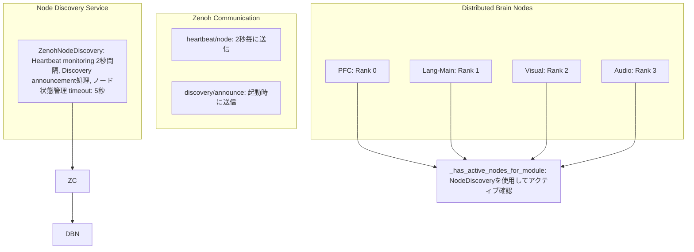

# Copyright 2025 Moonlight Technologies Inc. All Rights Reserved.
# Auth Masahiro Aoki

# 高度なノード発見システム

## 概要

EvoSpikeNetの高度なノード発見システムは、分散脳シミュレーションにおけるアクティブノードの動的検出と管理を実現します。ZenohのPub/Subメカニズムを活用し、リアルタイムでノードの状態を追跡し、PFC決定エンジンによる適応的なルーティングを可能にします。

## 主要機能

### 1. **動的ノード検出**
- ハートビートメカニズムによるアクティブノードの自動検出
- 新規ノードの自動登録とdiscovery announcement
- ノードの状態管理（active/inactive/error）

### 2. **モジュールタイプ別フィルタリング**
- PFC、lang-main、visual、audio、motorなど各モジュールタイプ別のノード一覧取得
- 複合モジュール名の正規化（lang-embed-18 → lang-main）
- アクティブノードのみの抽出

### 3. **ネットワークトポロジー管理**
- ノード間の接続関係の可視化データ生成
- UI向けのフォーマット済みデータエクスポート
- リアルタイムのノード統計情報

### 4. **フォールバックメカニズム統合**
- ターゲットモジュールのアクティブノード確認
- 非アクティブ時のlang-mainへの自動フォールバック
- クエリ完了保証による UI ハング防止

## アーキテクチャ



## 実装詳細

### NodeDiscovery クラス

#### 初期化
```python
from evospikenet.node_discovery import init_node_discovery, get_node_discovery

# グローバルインスタンスの初期化
discovery = init_node_discovery(namespace="evospikenet")

# 既存インスタンスの取得
discovery = get_node_discovery()
```

#### ノード情報の取得
```python
# すべてのノード取得
all_nodes = discovery.get_all_nodes()

# アクティブノードのみ取得
active_nodes = discovery.get_active_nodes()

# モジュールタイプ別取得
visual_nodes = discovery.get_nodes_by_type("visual")
lang_nodes = discovery.get_nodes_by_type("lang-main")

# ノード数の統計
counts = discovery.get_node_count()
# Returns: {"active": 4, "inactive": 0, "total": 4}
```

#### UI向けデータエクスポート
```python
# UIディスプレイ用フォーマット
ui_data = discovery.export_for_ui()
# Returns:
# {
#   "nodes": [
#     {
#       "node_id": "pfc-0",
#       "type": "pfc",
#       "host": "brain-node-0",
#       "status": "active",
#       "status_icon": "🟢",
#       "last_seen": "14:23:15",
#       "uptime": "2.3s ago",
#       "metadata": {...}
#     },
#     ...
#   ],
#   "summary": {"active": 4, "inactive": 0, "total": 4},
#   "updated_at": "14:23:17"
# }

# ネットワークトポロジー取得
topology = discovery.get_topology()
# Returns:
# {
#   "nodes": [...],
#   "edges": [...],
#   "timestamp": 1701234567.89
# }
```

### Brain Node統合

#### ハートビート送信
各Brain Nodeは定期的にハートビートを送信します：

```python
def _send_heartbeat(self):
    """Send heartbeat to node discovery service."""
    current_time = time.time()
    
    if current_time - self._last_heartbeat < self._heartbeat_interval:
        return
    
    self._last_heartbeat = current_time
    
    heartbeat_data = {
        "node_id": self.node_id,
        "module_type": self.module_type,
        "host": os.environ.get("HOSTNAME", "unknown"),
        "timestamp": current_time,
        "metadata": {
            "step_count": self.step_count,
            "active_task": self.active_task
        }
    }
    
    self.comm.publish(f"heartbeat/{self.node_id}", heartbeat_data, serialize="json")
```

#### アクティブノード確認
PFCノードは、ルーティング前にターゲットモジュールのアクティブノードを確認：

```python
def _has_active_nodes_for_module(self, module_type: str) -> bool:
    """
    Check if there are active nodes for the given module type.
    Uses NodeDiscovery service to dynamically detect active nodes.
    """
    # lang-mainは常に利用可能
    if module_type == "lang-main":
        return True
    
    # NodeDiscoveryサービスを使用
    if self.node_discovery is not None:
        try:
            # モジュールタイプの正規化
            base_type = self._get_base_module_type(module_type)
            
            # アクティブノード取得
            active_nodes = self.node_discovery.get_nodes_by_type(base_type)
            active_nodes = [n for n in active_nodes if n.status == "active"]
            
            has_nodes = len(active_nodes) > 0
            
            if has_nodes:
                self.logger.debug(f"Found {len(active_nodes)} active {base_type} nodes")
            else:
                self.logger.debug(f"No active {base_type} nodes found")
            
            return has_nodes
            
        except Exception as e:
            self.logger.warning(f"Error querying node discovery: {e}")
    
    # Fallback: lang-mainのみ保証
    return False
```

## Zenoh Topics

### Discovery Topics

| Topic | Direction | Content | Purpose |
|-------|-----------|---------|---------|
| `discovery/announce` | Node → Discovery | Node情報 (JSON) | 新規ノードの登録 |
| `heartbeat/<node_id>` | Node → Discovery | ハートビート (JSON) | ノードの生存確認 |

### Heartbeat Message Format
```json
{
  "node_id": "pfc-0",
  "module_type": "pfc",
  "host": "brain-node-0",
  "timestamp": 1701234567.89,
  "metadata": {
    "step_count": 42,
    "active_task": true
  }
}
```

### Discovery Announcement Format
```json
{
  "node_id": "visual-2",
  "module_type": "visual",
  "host": "brain-node-2",
  "metadata": {
    "config": "Visual processing node"
  }
}
```

## 設定パラメータ

### NodeDiscovery設定
```python
ZenohNodeDiscovery(
    namespace="evospikenet",  # Zenoh namespace
    timeout=5.0               # ノード非アクティブタイムアウト（秒）
)
```

### Brain Node設定
```python
# ハートビート送信間隔
self._heartbeat_interval = 2.0  # 2秒毎

# NodeDiscovery統合
self.node_discovery = get_node_discovery()
```

## 使用例

### 基本的な使用
```python
from evospikenet.node_discovery import init_node_discovery

# ノード発見サービス初期化
discovery = init_node_discovery()

# アクティブノード確認
active_nodes = discovery.get_active_nodes()
for node in active_nodes:
    print(f"{node.node_id} ({node.module_type}) - {node.status}")

# 特定モジュールの確認
visual_nodes = discovery.get_nodes_by_type("visual")
if visual_nodes:
    print(f"Found {len(visual_nodes)} visual processing nodes")
else:
    print("No visual nodes available, falling back to lang-main")
```

### PFCルーティングとの統合
```python
# PFC Decision Engine内でのルーティング
if self._has_active_nodes_for_module(target_module):
    # ターゲットモジュールにルーティング
    topic = self._get_topic_for_module(target_module)
    self.comm.publish(topic, data)
else:
    # lang-mainにフォールバック
    self.logger.warning(f"No active {target_module} nodes, falling back to lang-main")
    self.comm.publish("pfc/text_prompt", data)
```

### UI統合
```python
# フロントエンドでのノード状態表示
ui_data = discovery.export_for_ui()

# React/Vue等でのレンダリング
for node in ui_data['nodes']:
    render_node_card(
        icon=node['status_icon'],
        name=node['node_id'],
        type=node['type'],
        status=node['status'],
        last_seen=node['last_seen']
    )
```

## パフォーマンス特性

### レイテンシ
- **ハートビート送信**: ~1ms (非同期publish)
- **ノード検出**: 最大 2秒 (heartbeat_interval)
- **状態確認**: ~0.1ms (メモリ内データ構造)

### リソース使用量
- **メモリ**: ~1KB per node (NodeInfo)
- **ネットワーク**: ~200 bytes per heartbeat (2秒毎)
- **CPU**: < 0.1% (monitoring thread)

### スケーラビリティ
- **サポートノード数**: 数千ノード
- **発見時間**: O(1) - メモリ内検索
- **タイムアウト処理**: O(n) - 1秒毎のチェック

## トラブルシューティング

### ノードが検出されない
```bash
# Zenohセッション確認
# ログで "Node discovery initialized" を確認

# ハートビート送信確認
# ログで "heartbeat/<node_id>" publish を確認

# タイムアウト設定確認
# デフォルト: 5秒（短すぎる場合は増加）
```

### フォールバックが頻繁に発生
```python
# ノード状態確認
discovery = get_node_discovery()
counts = discovery.get_node_count()
print(f"Active: {counts['active']}, Inactive: {counts['inactive']}")

# 特定モジュールのノード確認
nodes = discovery.get_nodes_by_type("visual")
for node in nodes:
    print(f"{node.node_id}: {node.status} (last seen: {time.time() - node.last_seen:.1f}s ago)")
```

### メモリリーク懸念
```python
# 古いノードの自動クリーンアップ（将来実装予定）
# 現在: 非アクティブノードもメモリに保持
# 推奨: 定期的なdiscovery再初期化またはサービス再起動
```

## 今後の拡張

### 予定機能
1. **自動ノードクリーンアップ**: 長期間非アクティブなノードの削除
2. **ノード間接続グラフ**: メタデータから自動的にエッジを推論
3. **ヘルスチェック**: ハートビート以外の健全性指標
4. **負荷分散**: 同一モジュールタイプの複数ノード間での負荷分散
5. **地理的分散サポート**: 複数データセンター間のノード管理

### カスタマイズポイント
- タイムアウト値の調整
- ハートビート間隔の最適化
- メタデータフィールドの拡張
- カスタムフィルタリングロジック

## 関連ドキュメント

- [DISTRIBUTED_BRAIN_SYSTEM.md](./DISTRIBUTED_BRAIN_SYSTEM.md) - 分散脳システム全体
- [ADVANCED_DECISION_ENGINE.md](./ADVANCED_DECISION_ENGINE.md) - 高度な意思決定エンジン
- [SPIKE_COMMUNICATION_ANALYSIS.md](./SPIKE_COMMUNICATION_ANALYSIS.md) - Zenoh通信詳細

## まとめ

高度なノード発見システムにより、EvoSpikeNetの分散脳シミュレーションは以下を実現します：

- ✅ **動的ノード検出**: リアルタイムでアクティブノードを追跡
- ✅ **適応的ルーティング**: 利用可能なノードに基づく柔軟なルーティング
- ✅ **フォールバック保証**: 常にクエリ完了を保証
- ✅ **UI統合**: リアルタイムのノード状態可視化
- ✅ **スケーラブル**: 数千ノードまで対応可能

これにより、full brainシミュレーションにおける高い可用性と柔軟性を実現します。
