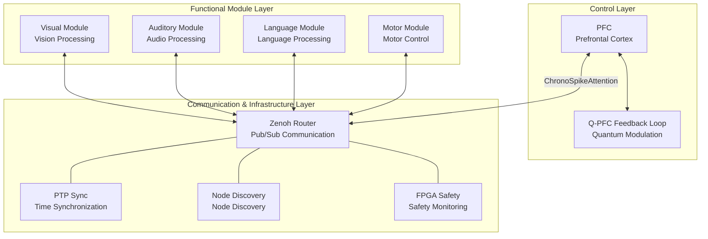
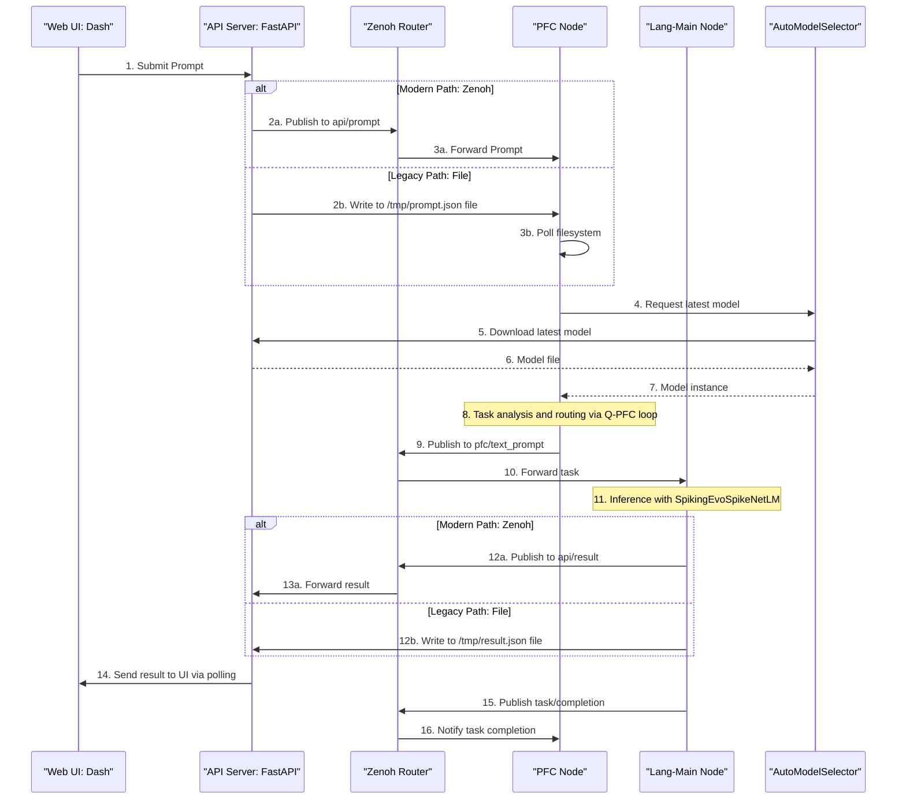
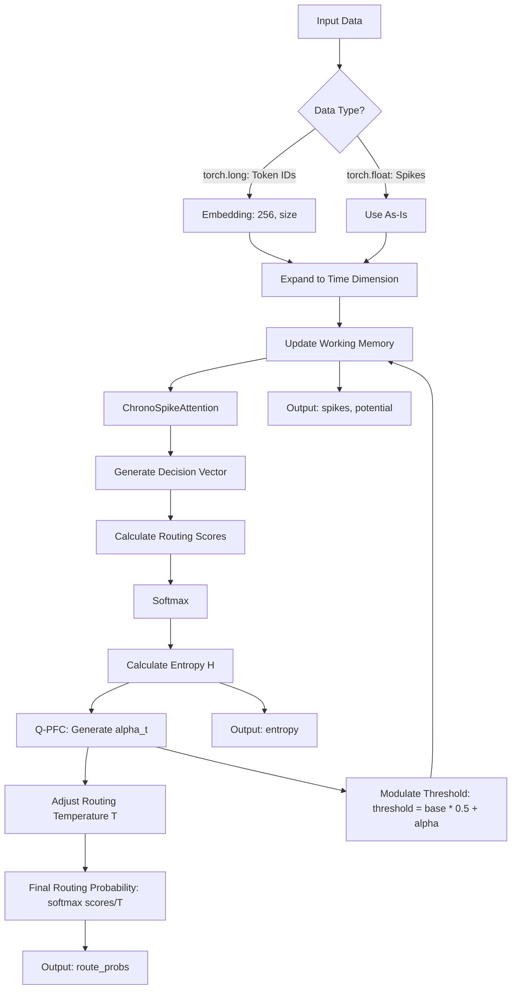
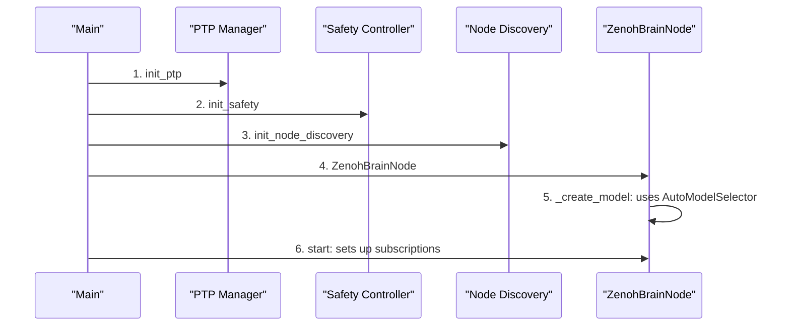

# EvoSpikeNet Distributed Brain Simulation System - Technical Specification

**Created:** 2025-12-10 (Last Updated)  
**Copyright:** 2025 Moonlight Technologies Inc. All Rights Reserved.  
**Author:** Masahiro Aoki

---

## Table of Contents

1. [System Overview](#1-system-overview)
2. [Architecture Design](#2-architecture-design)
3. [Zenoh Communication System](#3-zenoh-communication-system)
4. [PFC and Q-PFC Feedback Loop](#4-pfc-and-q-pfc-feedback-loop)
5. [Advanced Decision Engine](#5-advanced-decision-engine)
6. [Node Discovery System](#6-node-discovery-system)
7. [ChronoSpikeAttention Mechanism](#7-chronospikeattention-mechanism)
8. [Distributed Brain Node Execution Flow](#8-distributed-brain-node-execution-flow)
9. [Data Structures and Type Definitions](#9-data-structures-and-type-definitions)
10. [Performance Optimization and Control](#10-performance-optimization-and-control)
11. [Simulation Data Recording](#11-simulation-data-recording)

---

## 1. System Overview

### 1.1. Concept

The EvoSpikeNet Distributed Brain Simulation System is a scalable neuromorphic computing framework designed based on the principles of **functional specialization and integration** found in biological brains.

**Design Philosophy:**
- **Specialization**: Each functional module (visual, auditory, language, motor) handles specialized processing.
- **Integration**: The Prefrontal Cortex (PFC) coordinates and integrates all modules.
- **Asynchronous Communication**: Low-latency Pub/Sub pattern via Zenoh.
- **Self-Modulation**: Dynamic threshold adjustment through the Q-PFC feedback loop.

### 1.2. Key Components



### 1.3. System Features

| Feature                        | Description                               | Technical Elements                                |
| ------------------------------ | ----------------------------------------- | ------------------------------------------------- |
| **Asynchronous Communication** | Zenoh Pub/Sub Model                       | Low latency (<1ms), loose coupling, version compatibility |
| **Quantum-Inspired**           | Q-PFC Feedback Loop                       | Entropy → modulation coefficient α(t)             |
| **Temporal Causality**         | ChronoSpikeAttention                      | Temporal proximity mask, causality guarantee      |
| **Hierarchical Control**       | Top-down control by PFC                   | Task routing, resource allocation                 |
| **Self-Adaptivity**            | Dynamic threshold adjustment              | Exploration (low α) ↔ Exploitation (high α)       |
| **Advanced Decision Making**   | Executive Control Engine                  | Meta-cognition, hierarchical planning             |
| **Dynamic Node Discovery**     | Real-time centralized monitoring service  | Heartbeat, automatic fallback                     |
| **Dynamic Model Loading**      | Model resolution via `AutoModelSelector`  | Automatically downloads the latest model via API  |
| **Simulation Recording**       | Data persistence via `SimulationRecorder` | Spikes, membrane potential, weights, control states |

---

## 2. Architecture Design

### 2.1. Overall Architecture



### 2.2. Node Configuration and Naming Convention

The system consists of the following node types. Node names can be hierarchical and are resolved to a base type by the `_get_base_module_type()` function (e.g., `lang-embed-18` → `lang-main`, `vis-object-9` → `visual`).

#### PFC Node (Prefrontal Cortex)
**Role:** Central control hub, task routing, cognitive control, advanced decision-making.

**Implementation Classes:**
- `evospikenet.pfc.PFCDecisionEngine` (Base PFC)
- `evospikenet.pfc.AdvancedPFCEngine` (Advanced PFC)
- `evospikenet.executive_control.ExecutiveControlEngine` (Executive Control)

**Key Functions:**
1. Receives tasks from both Zenoh and the filesystem.
2. Dynamically loads models using `AutoModelSelector`.
3. Performs self-modulation and routing via the Q-PFC feedback loop.
4. Discovers active nodes and performs automatic fallback to `lang-main`.

#### Lang-Main Node (Language Main)
**Role:** Language processing, text generation. Serves as the **default fallback target** for the entire system.

**Implementation Class:** `evospikenet.models.SpikingEvoSpikeNetLM`

**Key Functions:**
1. Receives and tokenizes text prompts.
2. Runs spike-driven inference in a background thread.
3. Outputs results to both Zenoh and a file.

#### Visual Node (Visual Processing)
**Role:** Processes visual information.

**Implementation Class:** `SimpleLIFNode` (basic) / custom vision encoders.

**Key Functions:**
1. Receives visual data and performs spike encoding.
2. Transmits feature spikes to the PFC.

#### Motor Node (Motor Control)
**Role:** Generates motor outputs and performs distributed consensus.

**Implementation Class:** `evospikenet.motor_consensus.AutonomousMotorNode`

**Key Functions:**
1. Receives motor goals and performs distributed consensus.
2. Verifies safety in coordination with the `FPGA Safety` service.

### 2.3. Communication Topology

```
evospikenet/
├── api/prompt              # API → PFC (prompt via Zenoh)
├── api/result              # Functional Node → API (result via Zenoh)
├── pfc/text_prompt         # PFC → Lang-Main (text task)
├── pfc/visual_task         # PFC → Visual (visual task)
├── pfc/audio_task          # PFC → Audio (audio task)
├── pfc/motor_goals         # PFC → Motor (motor goal)
├── pfc/add_goal            # Executive Control (add goal)
├── pfc/get_status          # Executive Control (get status)
├── spikes/visual/pfc       # Visual → PFC (visual spikes)
├── spikes/auditory/pfc     # Auditory → PFC (auditory spikes)
├── task/completion         # Functional Node → PFC (completion notification)
├── heartbeat/{node_id}     # Each Node → Discovery (heartbeat, every 2s)
└── discovery/announce      # All Nodes → Discovery (announcement on startup)
```

---

## 3. Zenoh Communication System

### 3.1. What is Zenoh

**Zenoh** (Zero Overhead Network Protocol) is a next-generation communication protocol for robotics and IoT.

**Features:**
- **Low Latency**: Sub-millisecond communication delay.
- **High Throughput**: Millions of messages/second.
- **Flexibility**: Supports Pub/Sub, Request/Reply, and Querying.
- **Loose Coupling**: Allows for dynamic addition/removal of nodes.

### 3.2. ZenohConfig Data Structure

```python
# evospikenet/zenoh_comm.py
@dataclass
class ZenohConfig:
    mode: str = "peer"                      # "peer" or "client"
    connect: Optional[List[str]] = None     # Endpoints to connect to
    listen: Optional[List[str]] = None      # Endpoints to listen on
    namespace: str = "evospikenet"          # Namespace for all topics
```

### 3.3. Implementation Details

#### 3.3.1. `ZenohCommunicator`
Provides basic Pub/Sub and Request/Reply functionalities.

- **Version Compatibility**: Includes a compatibility layer to handle API differences between Zenoh 0.6+ and 0.4.x.
- **Asynchronous Queue**: The `subscribe_queue()` method allows receiving messages in a `Queue` object instead of via a callback.
- **Request-Reply**: The default timeout is set to **5.0 seconds**.

#### 3.3.2. `ZenohBrainCommunicator`
Inherits from `ZenohCommunicator` and provides specialized methods for brain simulation (e.g., `publish_spikes`, `publish_command`).

### 3.4. Spike Transmission Optimization

**SpikePacket Data Structure (PTPSpikePacket):**
```python
# evospikenet/ptp_sync.py
@dataclass
class PTPSpikePacket:
    timestamp_ns: int             # PTP-synchronized nanosecond timestamp
    modality: str
    data: torch.Tensor
    metadata: Dict
```
Utilizes PTP-synchronized, high-precision timestamps to ensure temporal consistency between modules.

---

## 4. PFC and Q-PFC Feedback Loop

### 4.1. PFCDecisionEngine Overview

The PFC is responsible for the system's highest-level cognitive functions:

1. **Working Memory**: Short-term memory via LIF neuron layer.
2. **Task Routing**: Attention mechanism via ChronoSpikeAttention.
3. **Entropy Calculation**: Quantification of decision uncertainty.
4. **Self-Modulation**: Q-PFC feedback loop.

### 4.2. Q-PFC Feedback Loop Theory

#### 4.2.1. Definition of Cognitive Entropy
$$
H = -\sum_{i=1}^{N} p_i \log p_i
$$

#### 4.2.2. Quantum-Inspired Modulation
$$
\theta = \pi \cdot \frac{H}{H_{\max}}, \quad \alpha(t) = \cos^2\left(\frac{\theta}{2}\right) = \cos^2\left(\frac{\pi H}{2\log N}\right)
$$

#### 4.2.3. Self-Modulation Mechanism

**Dynamic Threshold Adjustment:**
$$
\text{threshold}(t) = \text{threshold}_{\text{base}} \cdot (0.5 + \alpha(t))
$$
- **Low $\alpha(t)$ (high entropy)**: Threshold decreases, increasing exploratory firing.
- **High $\alpha(t)$ (low entropy)**: Threshold increases, leading to stable, deterministic firing.

**Routing Temperature Control:**
$$
T_{\text{routing}} = \frac{1}{\alpha(t) + \epsilon} \quad (\epsilon = 10^{-9})
$$
- **Low $\alpha(t)$**: Temperature increases, making softmax approach a uniform distribution (exploratory routing).
- **High $\alpha(t)$**: Temperature approaches 1, concentrating softmax on the maximum value (exploitative routing).

### 4.3. PFC Implementation (`evospikenet/pfc.py`)

#### 4.3.1. `QuantumModulationSimulator`
Calculates `alpha_t` exactly as described in the documentation's formulas.

#### 4.3.2. `PFCDecisionEngine`
**Implementation Features:**
- **Standalone Mode**: Handles `num_modules=0` by setting a default `max_entropy` of `1.0` to operate without errors.
- **Flexible Input**: The `forward()` method processes `torch.long` inputs (token IDs) through an embedding layer, while other inputs (spike trains) are used directly.
- **Fixed Values**: `vocab_size` defaults to `256`. Text input to the PFC is handled by a **simple character-code conversion placeholder** (`ord(c) % 256`).

**Detailed Flow Diagram:**


---

## 5. Advanced Decision Engine

### 5.1. `AdvancedPFCEngine`
Extends `PFCDecisionEngine` and integrates `ExecutiveControlEngine` to provide advanced cognitive control.

**Implementation Features:**
- **Dynamic Goal Addition**: The `add_goal()` method allows for the dynamic addition of high-level goals from external sources.
- **Placeholder Implementation**: The goal embedding generation within `add_goal()` is a **dummy implementation** (`torch.randn(self.size)`) that will need to be replaced with a proper encoding method in the future.
- **Performance Tracking**: The `get_performance_stats()` method retrieves performance metrics such as total decisions, success rate, and average entropy.

Details: [ADVANCED_DECISION_ENGINE.en.md](./ADVANCED_DECISION_ENGINE.en.md)

---

## 6. Node Discovery System

### 6.1. `ZenohNodeDiscovery` (`evospikenet/node_discovery.py`)

Implemented as a **centralized monitoring service**, where a single instance (singleton) monitors the health of all nodes.

**Key Features:**
- **Heartbeat Monitoring**: Subscribes to the `evospikenet/heartbeat/*` topic to monitor heartbeats from all nodes.
- **State Management**: Updates a node's status to `inactive` if no heartbeat is received within a certain period (default: **5.0 seconds**). The monitoring loop runs at **1.0-second** intervals.
- **UI Integration**: The `export_for_ui()` method provides formatted data for UI display, including status icons (`🟢`/`🔴`).

### 6.2. Usage by PFC

After deciding on a routing target, the PFC queries the `ZenohNodeDiscovery` service via the `_has_active_nodes_for_module()` method to check if the target module is active.

**Fallback Logic:**
- If no active nodes are found for the target module (e.g., `visual`), the task is **automatically fallbacked to the `lang-main` module**. This robust design ensures that the system remains functional even if some nodes are down.

Details: [ADVANCED_NODE_DISCOVERY.en.md](./ADVANCED_NODE_DISCOVERY.en.md)

---

## 7. ChronoSpikeAttention Mechanism

### 7.1. Overview

`ChronoSpikeAttention` is a **spiking attention mechanism that guarantees temporal causality**.

1. **Causality Guarantee**: Does not reference future information.
2. **Temporal Proximity Bias**: Weights are larger for closer times.
3. **Spike Output**: Supports multiple neuron models (LIF, Izhikevich, etc.).

### 7.2. Theoretical Foundation

**Causal Temporal Proximity Mask:**
$$
\text{mask}(t, t') = \begin{cases}
0 & \text{if } t' > t \\
\exp\left(-\frac{t - t'}{\tau}\right) & \text{if } t' \leq t
\end{cases}
$$
**Complete Formula:**
$$
\text{Attention}_{\text{chrono}}(Q, K, V) = \text{SpikingNeuron}\left(\text{sigmoid}\left(\frac{QK^T}{\sqrt{d_k}}\right) \odot M \cdot V \cdot W_{\text{out}}\right)
$$

### 7.3. Implementation Details (`evospikenet/attention.py`)

- **Default Tau Value**: If the time constant `tau` is not specified, it is set based on a **fixed heuristic**: `time_steps / 4.0`.
- **Diverse Neuron Types**: The `neuron_type` argument allows switching between `'LIF'` (snnTorch), `'EvoLIF'` (custom integer-based LIF), and `'Izhikevich'`.
- **Fixed Scaling Factor**: When `neuron_type='EvoLIF'`, the input to the LIF layer is scaled by `* 1000.0`. This is a **fixed value** to convert the float output to the proper operating range for the integer-based neuron.
- **Data Shape**: The input is expected to be a 4D tensor of shape `(batch_size, time_steps, seq_len, input_dim)`.

---

## 8. Distributed Brain Node Execution Flow

### 8.1. Node Initialization Sequence



### 8.2. Prompt Processing Flow (Implementation-Compliant)

The PFC node receives prompts from the UI via two paths:
1.  **Via Zenoh**: The API publishes to the `api/prompt` topic, triggering the PFC's `_on_api_prompt()` callback.
2.  **Via File (Legacy)**: The API writes a `/tmp/evospikenet_prompt_*.json` file, which is discovered by the PFC's `_process_pfc_timestep()` polling at a 100Hz loop.

In both cases, the PFC analyzes the task and publishes it to the topic of the appropriate functional module (e.g., `pfc/text_prompt` for `lang-main`).

### 8.3. Timestep Processing

Each node executes `process_timestep()` in a **100Hz** (every 10ms) loop. Inside the loop, the following actions are performed:
1. Increment step counter.
2. Record control state to `SimulationRecorder`.
3. For PFC nodes, update status to the API (at **2-second intervals**).
4. Send `safety_heartbeat()`.
5. Perform module-specific processing (e.g., file polling for PFC).

---

## 9. Data Structures and Type Definitions

### 9.1. PTPSpikePacket

Defined in `evospikenet.ptp_sync`. A spike packet containing a high-precision, PTP-synchronized timestamp.

### 9.2. MotorGoal

Defined in `evospikenet.motor_consensus`. Defines a goal for motor control.

### 9.3. NodeInfo

Defined in `evospikenet.node_discovery`. Contains information about a node managed by the node discovery service.

---

## 10. Performance Optimization and Control

### 10.1. Fast Startup (`FastStartupSequencer`)

Used with the `--fast-startup` flag in `examples/run_zenoh_distributed_brain.py`.
- **Goal**: Start all nodes within 15 seconds.
- **Strategy**: Parallel initialization with `max_workers=5` and priority-based startup, with PFC at `priority=0`.
- **Fixed Values**: Timeout is **5.0 seconds** for PFC and **3.0 seconds** for other nodes.

### 10.2. PTP Time Synchronization

Provided by `evospikenet.ptp_sync` for microsecond-level time synchronization.

### 10.3. Safety Monitoring

Provided by `evospikenet.fpga_safety` to monitor safety limits such as velocity and temperature.

### 10.4. Bottleneck Analysis
1. **Network**: Zenoh latency is < 1ms (usually negligible).
2. **Computation**: Inference in `SpikingEvoSpikeNetLM.generate()` (GPU recommended).
3. **Memory**: Loading large models via `AutoModelSelector`.

---

## 11. Simulation Data Recording

### 11.1. `SimulationRecorder`

Can be enabled with the `--enable-recording` flag. Records internal states during simulation to an HDF5 file.
- **Recording Targets**: Spikes, membrane potential, weights, control states.
- **Configuration**: Recording targets can be finely controlled via command-line arguments.

For details, see [SIMULATION_RECORDING_GUIDE.md](./SIMULATION_RECORDING_GUIDE.md).

---

## Summary

This document details the following aspects of the EvoSpikeNet Distributed Brain Simulation System, **aligned with the source code implementation**:

1. **Zenoh Communication**: An asynchronous Pub/Sub architecture including a version compatibility layer.
2. **Q-PFC Feedback Loop**: A quantum-inspired self-modulation mechanism and its implementation details.
3. **ChronoSpikeAttention**: A spiking attention mechanism that guarantees temporal causality, along with its fixed values.
4. **Distributed Execution Flow**: A robust execution model including dual input paths and automatic fallback.
5. **Dynamic Infrastructure**: A centralized monitoring node discovery service and a dynamic model loader.
6. **Performance & Auxiliary Functions**: A fast startup sequencer and a simulation recording feature.

**Reference Implementation Files:**
- `evospikenet/pfc.py`: PFC and Q-PFC feedback loop
- `evospikenet/attention.py`: ChronoSpikeAttention
- `evospikenet/zenoh_comm.py`: Zenoh communication layer
- `evospikenet/node_discovery.py`: Node discovery service
- `examples/run_zenoh_distributed_brain.py`: Distributed brain execution script
