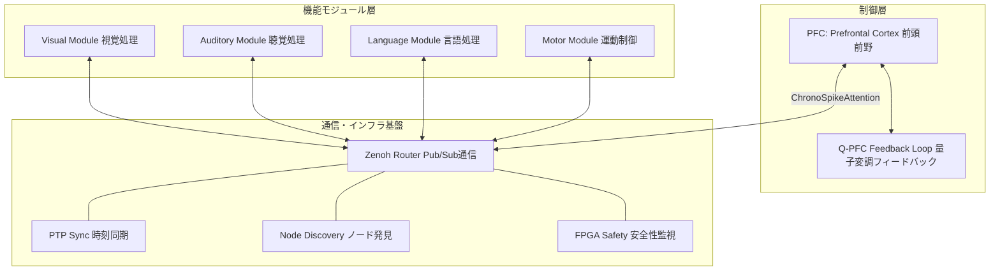
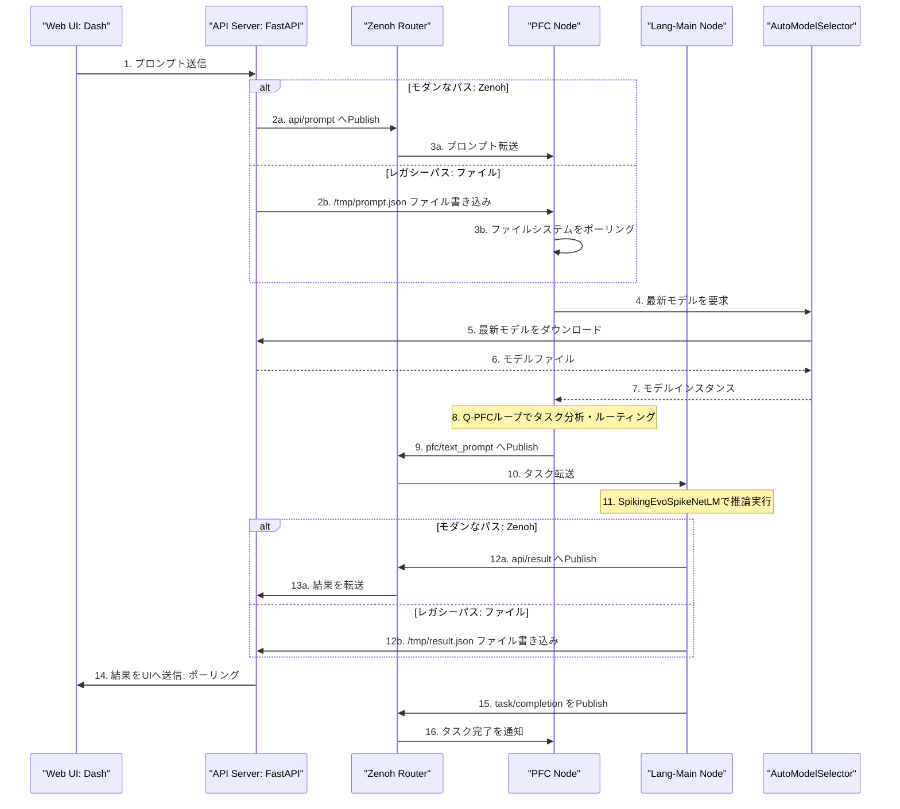
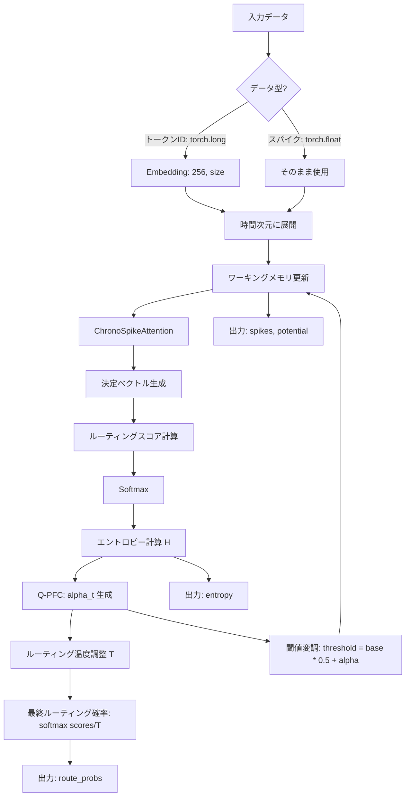
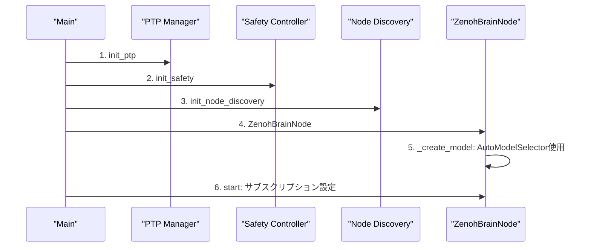

# EvoSpikeNet 分散脳シミュレーションシステム 技術仕様書

**作成日:** 2025年12月10日（最終更新）  
**Copyright:** 2025 Moonlight Technologies Inc. All Rights Reserved.  
**Author:** Masahiro Aoki

---

## 目次

1. [システム概要](#1-システム概要)
2. [アーキテクチャ設計](#2-アーキテクチャ設計)
3. [Zenoh通信システム](#3-zenoh通信システム)
4. [PFCとQ-PFCフィードバックループ](#4-pfcとq-pfcフィードバックループ)
5. [高度な意思決定エンジン](#5-高度な意思決定エンジン)
6. [ノード発見システム](#6-ノード発見システム)
7. [ChronoSpikeAttention機構](#7-chronospikeattention機構)
8. [分散脳ノードの実行フロー](#8-分散脳ノードの実行フロー)
9. [データ構造と型定義](#9-データ構造と型定義)
10. [性能最適化と制御](#10-性能最適化と制御)
11. [シミュレーションデータの記録](#11-シミュレーションデータの記録)

---

## 1. システム概要

### 1.1. コンセプト

EvoSpikeNetの分散脳シミュレーションシステムは、**生物学的な脳の機能的専門化と統合の原理**に基づいて設計された、スケーラブルなニューロモーフィックコンピューティングフレーム ワークです。

**設計哲学:**
- **専門化（Specialization）**: 各機能モジュール（視覚、聴覚、言語、運動）が専門的な処理を担当
- **統合（Integration）**: 前頭前野（PFC）が全体の調整・統合を行う
- **非同期通信（Asynchronous Communication）**: Zenohによる低遅延Pub/Subパターン
- **自己変調（Self-Modulation）**: Q-PFCフィードバックループによる動的な閾値調整

### 1.2. 主要コンポーネント



### 1.3. システムの特徴

| 特徴                 | 説明                                   | 技術要素                               |
| -------------------- | -------------------------------------- | -------------------------------------- |
| **非同期通信**       | Zenoh Pub/Subモデル                    | 低遅延（<1ms）、疎結合、バージョン互換性 |
| **量子インスパイア** | Q-PFCフィードバックループ              | エントロピー → 変調係数α(t)            |
| **時系列因果性**     | ChronoSpikeAttention                   | 時間的近接性マスク、因果性保証         |
| **階層的制御**       | PFCによるトップダウン制御              | タスクルーティング、資源配分           |
| **自己適応性**       | 動的閾値調整                           | 探索（低α）↔ 利用（高α）               |
| **高度な意思決定**   | Executive Control Engine               | メタ認知、階層的プランニング           |
| **動的ノード発見**   | リアルタイム中央監視サービス           | ハートビート、自動フォールバック       |
| **動的モデル読込**   | `AutoModelSelector`によるモデル解決    | API経由で最新モデルを自動ダウンロード  |
| **シミュレーション記録** | `SimulationRecorder`によるデータ保存 | スパイク、膜電位、重み、制御状態       |

---

## 2. アーキテクチャ設計

### 2.1. 全体アーキテクチャ



### 2.2. ノード構成と命名規則

分散脳シミュレーションは、以下の種類のノードで構成されます。ノード名は階層構造を表現でき、`_get_base_module_type()`関数によりベースタイプが解決されます。
- `lang-embed-18` → `lang-main`
- `vis-object-9` → `visual`

#### PFCノード（Prefrontal Cortex）
**役割:** 中央制御ハブ、タスクルーティング、認知制御、高度な意思決定

**実装クラス:** 
- `evospikenet.pfc.PFCDecisionEngine` （基本PFC）
- `evospikenet.pfc.AdvancedPFCEngine` （高度なPFC）
- `evospikenet.executive_control.ExecutiveControlEngine` （執行制御）

**主要機能:**
1. Zenohとファイルシステムの両方からタスクを受信
2. `AutoModelSelector`で動的にモデルをロード
3. Q-PFCフィードバックループによる自己変調とルーティング
4. アクティブノードの動的発見と`lang-main`への自動フォールバック

#### Lang-Mainノード（Language Main）
**役割:** 言語処理、テキスト生成。全システムの**デフォルトフォールバック**先。

**実装クラス:** `evospikenet.models.SpikingEvoSpikeNetLM`

**主要機能:**
1. テキストプロンプトの受信とトークン化
2. スパイク駆動推論（バックグラウンドスレッドで実行）
3. 結果をZenohとファイルの両方に出力

#### Visualノード（Visual Processing）
**役割:** 視覚情報の処理

**実装クラス:** `SimpleLIFNode`（基本）/ カスタムビジョンエンコーダー

**主要機能:**
1. 視覚データの受信とスパイクエンコーディング
2. PFCへの特徴スパイク送信

#### Motorノード（Motor Control）
**役割:** 運動出力の生成と分散合意形成

**実装クラス:** `evospikenet.motor_consensus.AutonomousMotorNode`

**主要機能:**
1. モーターゴールの受信と分散コンセンサス
2. `FPGA Safety`サービスと連携した安全性検証

### 2.3. 通信トポロジー

```
evospikenet/
├── api/prompt              # API → PFC （プロンプト送信, Zenoh経由）
├── api/result              # 機能ノード → API （結果送信, Zenoh経由）
├── pfc/text_prompt         # PFC → Lang-Main （テキストタスク）
├── pfc/visual_task         # PFC → Visual （視覚タスク）
├── pfc/audio_task          # PFC → Audio （音声タスク）
├── pfc/motor_goals         # PFC → Motor （運動ゴール）
├── pfc/add_goal            # Executive Control （ゴール追加）
├── pfc/get_status          # Executive Control （ステータス取得）
├── spikes/visual/pfc       # Visual → PFC （視覚スパイク）
├── spikes/auditory/pfc     # Auditory → PFC （聴覚スパイク）
├── task/completion         # 機能ノード → PFC （完了通知）
├── heartbeat/{node_id}     # 各ノード → Discovery （生存確認, 2秒毎）
└── discovery/announce      # 全ノード → Discovery （ノード発見、起動時）
```

---

## 3. Zenoh通信システム

### 3.1. Zenohとは

**Zenoh** (Zero Overhead Network Protocol)は、ロボティクスやIoTのための次世代通信プロトコルです。

**特徴:**
- **低遅延**: サブミリ秒レベルの通信遅延
- **高スループット**: 数百万メッセージ/秒
- **柔軟性**: Pub/Sub、Request/Reply、Queryingをサポート
- **疎結合**: ノードの動的な追加・削除が可能

### 3.2. ZenohConfig データ構造

```python
# evospikenet/zenoh_comm.py
@dataclass
class ZenohConfig:
    mode: str = "peer"                      # "peer" または "client"
    connect: Optional[List[str]] = None     # 接続先エンドポイント
    listen: Optional[List[str]] = None      # リスンエンドポイント
    namespace: str = "evospikenet"          # トピックの名前空間
```

### 3.3. 実装詳細

#### 3.3.1. `ZenohCommunicator`
基本的なPub/Sub、Request/Reply機能を提供します。

- **バージョン互換性**: Zenoh 0.6+ と 0.4.x のAPI差異を吸収する互換性レイヤーを内蔵。
- **非同期キュー**: `subscribe_queue()`メソッドにより、コールバックの代わりに`Queue`オブジェクトでメッセージを受信可能。
- **Request-Reply**: デフォルトタイムアウトは**5.0秒**に設定。

#### 3.3.2. `ZenohBrainCommunicator`
`ZenohCommunicator`を継承し、脳シミュレーション特化のメソッド（`publish_spikes`, `publish_command`など）を提供します。

### 3.4. スパイク送信の最適化

**SpikePacket データ構造 (PTPSpikePacket):**
```python
# evospikenet/ptp_sync.py
@dataclass
class PTPSpikePacket:
    timestamp_ns: int             # PTP同期されたナノ秒タイムスタンプ
    modality: str
    data: torch.Tensor
    metadata: Dict
```
PTPで同期された高精度なタイムスタンプを利用して、モジュール間の時間的整合性を保証します。

---

## 4. PFCとQ-PFCフィードバックループ

### 4.1. PFCDecisionEngine 概要

PFCは、システムの最高次認知機能を担います。

1. **ワーキングメモリ**: LIFニューロン層による短期記憶
2. **タスクルーティング**: ChronoSpikeAttentionによる注意機構
3. **エントロピー計算**: 意思決定の不確実性の定量化
4. **自己変調**: Q-PFCフィードバックループ

### 4.2. Q-PFCフィードバックループの理論

#### 4.2.1. 認知エントロピーの定義

$$
H = -\sum_{i=1}^{N} p_i \log p_i
$$

#### 4.2.2. 量子インスパイアード変調

$$
\theta = \pi \cdot \frac{H}{H_{\max}}, \quad \alpha(t) = \cos^2\left(\frac{\theta}{2}\right) = \cos^2\left(\frac{\pi H}{2\log N}\right)
$$

#### 4.2.3. 自己変調メカニズム

**閾値の動的調整:**
$$
\text{threshold}(t) = \text{threshold}_{\text{base}} \cdot (0.5 + \alpha(t))
$$
- **低$\alpha(t)$（高エントロピー）**: 閾値が下がり、探索的な発火が増加。
- **高$\alpha(t)$（低エントROPY）**: 閾値が上がり、安定的・確定的な発火が増加。

**ルーティング温度の制御:**
$$
T_{\text{routing}} = \frac{1}{\alpha(t) + \epsilon} \quad (\epsilon = 10^{-9})
$$
- **低$\alpha(t)$**: 温度が上昇し、ソフトマックスが均等分布に近づき、探索的ルーティング。
- **高$\alpha(t)$**: 温度が1に近づき、ソフトマックスが最大値に集中し、利用的ルーティング。

### 4.3. PFCの実装 (`evospikenet/pfc.py`)

#### 4.3.1. `QuantumModulationSimulator`
ドキュメントの数式通りに`alpha_t`を計算します。

#### 4.3.2. `PFCDecisionEngine`
**実装上の特徴:**
- **スタンドアロンモード**: `num_modules=0`の場合、エラーを起こさずに動作するよう`max_entropy`にデフォルト値`1.0`を設定。
- **柔軟な入力**: `forward()`メソッドは、入力が`torch.long`（トークンID）の場合は埋め込み層を通し、それ以外（スパイク列）は直接使用する。
- **固定値**: `vocab_size`はデフォルトで`256`。PFCへのテキスト入力は、`ord(c) % 256`という**単純な文字コード変換（プレースホルダー）**で行われる。

**詳細フロー図:**



---

## 5. 高度な意思決定エンジン

### 5.1. `AdvancedPFCEngine`
`PFCDecisionEngine`を拡張し、`ExecutiveControlEngine`を統合して高度な認知制御を提供します。

**実装上の特徴:**
- **動的ゴール追加**: `add_goal()`メソッドにより、外部から高レベルのゴールを動的に追加可能。
- **プレースホルダー実装**: `add_goal()`内のゴール埋め込み生成は、`torch.randn(self.size)`という**ダミー実装**であり、将来的には適切なエンコーディング手法に置き換えが必要。
- **パフォーマンス追跡**: `get_performance_stats()`メソッドにより、総意思決定回数、成功率、平均エントロピーなどのパフォーマンス指標を取得可能。

詳細: [ADVANCED_DECISION_ENGINE.md](./ADVANCED_DECISION_ENGINE.md)

---

## 6. ノード発見システム

### 6.1. `ZenohNodeDiscovery` (`evospikenet/node_discovery.py`)

**中央監視型サービス**として実装されており、単一のインスタンス（シングルトン）が全ノードの健全性を監視します。

**主要機能:**
- **ハートビート監視**: `evospikenet/heartbeat/*`トピックを購読し、全ノードのハートビートを監視。
- **状態管理**: 最後にハートビートを受信してから一定時間（デフォルト**5.0秒**）が経過したノードを`inactive`状態に更新。監視ループは**1.0秒**間隔で実行。
- **UI連携**: `export_for_ui()`メソッドが、UI表示用にステータスアイコン（`🟢`/`🔴`）を含む整形済みデータを提供。

### 6.2. PFCによる利用

PFCは、ルーティング先を決定した後、`_has_active_nodes_for_module()`メソッドで`ZenohNodeDiscovery`サービスに問い合わせ、ターゲットモジュールがアクティブかを確認します。

**フォールバックロジック:**
- ターゲットモジュール（例: `visual`）にアクティブなノードが存在しない場合、タスクは**自動的に`lang-main`モジュールにフォールバック**される。これにより、一部のノードがダウンしてもシステム全体の機能が停止しない堅牢性を確保している。

詳細: [ADVANCED_NODE_DISCOVERY.md](./ADVANCED_NODE_DISCOVERY.md)

---

## 7. ChronoSpikeAttention機構

### 7.1. 概要

`ChronoSpikeAttention`は、**時間的因果性を保証するスパイキング注意機構**です。

1. **因果性の保証**: 未来の情報を参照しない
2. **時間的近接性バイアス**: 近い時刻ほど重みが大きい
3. **スパイク出力**: 複数のニューロンモデル（LIF, Izhikevich等）をサポート

### 7.2. 理論的基礎

**因果的時間近接性マスク:**
$$
\text{mask}(t, t') = \begin{cases}
0 & \text{if } t' > t \\
\exp\left(-\frac{t - t'}{\tau}\right) & \text{if } t' \leq t
\end{cases}
$$
**完全な式:**
$$
\text{Attention}_{\text{chrono}}(Q, K, V) = \text{SpikingNeuron}\left(\text{sigmoid}\left(\frac{QK^T}{\sqrt{d_k}}\right) \odot M \cdot V \cdot W_{\text{out}}\right)
$$

### 7.3. 実装の詳細 (`evospikenet/attention.py`)

- **時定数`tau`のデフォルト値**: `tau`が指定されない場合、`time_steps / 4.0` という**固定の経験則**に基づいて設定される。
- **多様なニューロンタイプ**: `neuron_type`引数により、`'LIF'` (snnTorch)、`'EvoLIF'` (カスタム整数ベースLIF)、`'Izhikevich'`を切り替え可能。
- **固定スケール係数**: `neuron_type='EvoLIF'`の場合、LIF層への入力は`* 1000.0`でスケーリングされる。これは、浮動小数点出力を整数ベースニューロンの適切な動作範囲に変換するための**固定値**。
- **データ形状**: 入力は`(batch_size, time_steps, seq_len, input_dim)`の4次元テンソルを想定している。

---

## 8. 分散脳ノードの実行フロー

### 8.1. ノードの初期化シーケンス



### 8.2. プロンプト処理フロー（実装準拠）

PFCノードは、UIからのプロンプトを2つの経路で受信します。

1.  **Zenoh経由**: APIが`api/prompt`トピックにPublishし、PFCの`_on_api_prompt()`コールバックが起動。
2.  **ファイル経由（レガシー）**: APIが`/tmp/evospikenet_prompt_*.json`ファイルを書き込み、PFCの`_process_pfc_timestep()`が100Hzループでポーリングして発見。

どちらの経路でも、最終的にPFCはタスクを分析し、適切な機能モジュール（例: `lang-main`）のトピック（例: `pfc/text_prompt`）にPublishします。

### 8.3. タイムステップ処理

各ノードは`process_timestep()`を**100Hz**（10msごと）のループで実行します。ループ内では以下の処理が行われます。
1. ステップカウンターのインクリメント
2. `SimulationRecorder`への制御状態記録
3. PFCノードの場合、APIへのステータス更新（**2秒間隔**）
4. `safety_heartbeat()`の送信
5. モジュール固有の処理（PFCのファイルポーリングなど）

---

## 9. データ構造と型定義

### 9.1. PTPSpikePacket

`evospikenet.ptp_sync`で定義。PTP同期された高精度タイムスタンプを含むスパイクパケット。

### 9.2. MotorGoal

`evospikenet.motor_consensus`で定義。モーター制御のゴール定義。

### 9.3. NodeInfo

`evospikenet.node_discovery`で定義。ノード発見サービスが管理するノード情報。

---

## 10. 性能最適化と制御

### 10.1. 高速起動 (`FastStartupSequencer`)

`examples/run_zenoh_distributed_brain.py`の`--fast-startup`フラグで使用。
- **目標**: 15秒以内に全ノードを起動。
- **戦略**: `max_workers=5`の並列初期化と、PFCを`priority=0`とする優先度付き起動。
- **固定値**: PFCのタイムアウトは**5.0秒**、その他ノードは**3.0秒**。

### 10.2. PTP時刻同期

`evospikenet.ptp_sync`により、マイクロ秒レベルの時刻同期を提供。

### 10.3. 安全性監視

`evospikenet.fpga_safety`により、速度や温度などの安全リミットを監視。

### 10.4. ボトルネック分析
1. **ネットワーク**: Zenohの遅延 < 1ms（通常は無視可能）
2. **計算**: `SpikingEvoSpikeNetLM.generate()`での推論（GPU推奨）
3. **メモリ**: `AutoModelSelector`による大規模モデルのロード

---

## 11. シミュレーションデータの記録

### 11.1. `SimulationRecorder`

`--enable-recording`フラグで使用可能。シミュレーション中の内部状態をHDF5ファイルに記録します。
- **記録対象**: スパイク、膜電位、重み、制御状態
- **設定**: コマンドライン引数で記録対象を細かく制御可能。

詳細は[SIMULATION_RECORDING_GUIDE.md](./SIMULATION_RECORDING_GUIDE.md)を参照。

---

## まとめ

本ドキュメントでは、EvoSpikeNetの分散脳シミュレーションシステムの以下の側面を、**ソースコードの実装に即して**詳解しました：

1. **Zenoh通信**: バージョン互換性レイヤーを含む非同期Pub/Subアーキテクチャ
2. **Q-PFCフィードバックループ**: 量子インスパイアードの自己変調メカニズムと実装の詳細
3. **ChronoSpikeAttention**: 時間的因果性を保証するスパイキング注意機構と、その固定値
4. **分散実行フロー**: デュアル入力パスや自動フォールバックを含む堅牢な実行モデル
5. **動的インフラ**: 中央監視型のノード発見サービスと、動的なモデルローダー
6. **性能・補助機能**: 高速起動シーケンサーとシミュレーション記録機能

**参考実装ファイル:**
- `evospikenet/pfc.py`: PFCとQ-PFCフィードバックループ
- `evospikenet/attention.py`: ChronoSpikeAttention
- `evospikenet/zenoh_comm.py`: Zenoh通信層
- `evospikenet/node_discovery.py`: ノード発見サービス
- `examples/run_zenoh_distributed_brain.py`: 分散脳実行スクリプト
