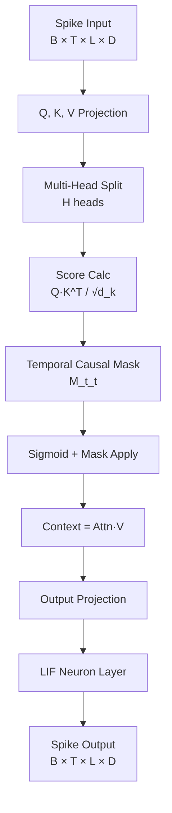
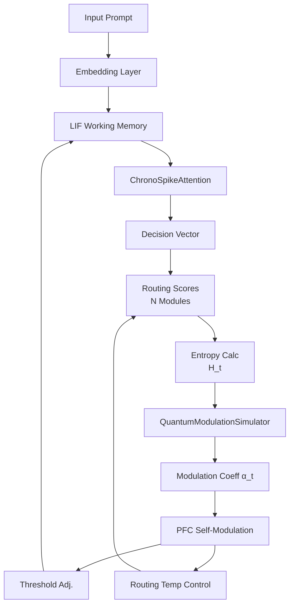
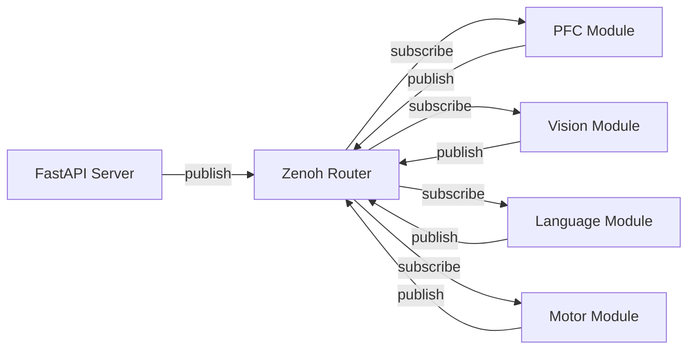

# Copyright 2025 Moonlight Technologies Inc. All Rights Reserved.
# Auth Masahiro Aoki

# EvoSpikeNet: Key Concepts and Technical Details

**Last Updated:** December 10, 2025

This document explains the technical details of the advanced and unique concepts that form the core of the EvoSpikeNet framework. It includes mathematical formulas, architecture diagrams, and implementation details based on the source code.

---

## Table of Contents

1. [Basics of Spiking Neural Networks](#1-basics-of-spiking-neural-networks)
2. [ChronoSpikeAttention: Causal Temporal Attention Mechanism](#2-chronospikeattention-causal-temporal-attention-mechanism)
3. [Quantum Modulation PFC Feedback Loop](#3-quantum-modulation-pfc-feedback-loop)
4. [Multi-Modal Sensor Fusion Pipeline](#4-multi-modal-sensor-fusion-pipeline)
5. [Motor Cortex Learning Pipeline](#5-motor-cortex-learning-pipeline)
6. [Current Architecture: Asynchronous Communication via Zenoh](#6-current-architecture-asynchronous-communication-via-zenoh)
7. [Other Key Concepts](#7-other-key-concepts)

---

## 1. Basics of Spiking Neural Networks

EvoSpikeNet uses **Spiking Neural Networks (SNN)**, which mimic the operation of biological neurons, as its core technology. unlike traditional artificial neural networks that handle continuous values, SNNs transmit information via discrete 0/1 events called **spikes** over time.

### 1.1. LIF (Leaky Integrate-and-Fire) Neuron

The basic neuron model of this framework is the computationally efficient **LIFNeuronLayer** (`evospikenet/core.py`). Its integer-arithmetic implementation facilitates deployment to embedded devices and FPGAs.

#### Mathematical Model

The membrane potential $V(t)$ of an LIF neuron follows these leaky integration dynamics:

$$
V(t+1) = V(t) \cdot \frac{\text{leak}}{256} + I_{\text{syn}}(t)
$$

Where:
- $V(t)$: Membrane potential at time $t$ (16-bit integer)
- $\text{leak}$: Leak coefficient (default 230, corresponding to ~0.9 decay)
- $I_{\text{syn}}(t)$: Synaptic input current
- Spike firing condition: $V(t) \geq \theta$ (Threshold $\theta$ default 1024)
- After firing, $V(t)$ returns to reset potential (default 0)

#### Implementation Code (`evospikenet/core.py`)

```python
# Leak processing with integer arithmetic (32-bit intermediate calc to prevent overflow)
potential_32 = (potential_32 * leak_32) // 256

# Integrate synaptic input
potential_32 = potential_32 + synaptic_input.to(torch.int32)

# Clamp to 16-bit range
self.potential = torch.clamp(potential_32, -32768, 32767).to(torch.int16)

# Threshold check and spike generation
spikes = (self.potential >= self.threshold).to(torch.int8)
self.potential[spikes.bool()] = self.reset_potential  # Reset
```

### 1.2. Izhikevich Neuron

For biological plausibility, the **IzhikevichNeuronLayer** (`evospikenet/core.py`) can be used. This model reproduces diverse neuronal firing patterns like Regular Spiking, Fast Spiking, and Bursting with just 4 parameters.

#### Mathematical Model

The Izhikevich model is expressed by two differential equations:

$$
\frac{dv}{dt} = 0.04v^2 + 5v + 140 - u + I
$$

$$
\frac{du}{dt} = a(bv - u)
$$

Firing condition: When $v \geq 30 \text{ mV}$, then $v \leftarrow c$, $u \leftarrow u + d$

Parameters:
- $a$: Time constant of recovery variable $u$ (default 0.02)
- $b$: Sensitivity of $u$ to membrane potential $v$ (default 0.2)
- $c$: Reset potential (default -65 mV)
- $d$: After-spike reset of $u$ (default 8)

#### Implementation Code (`evospikenet/core.py`)

```python
# Spike generation using surrogate gradient
spikes = self.spike_grad(self.v - 30.0)

# Conditional update (Reset on spike)
spiked_mask = spikes > 0
v_after_spike = torch.where(spiked_mask, self.c, self.v)
u_after_spike = torch.where(spiked_mask, self.u + self.d, self.u)

# Numerical integration via Euler method
dv = (0.04 * v_after_spike**2 + 5 * v_after_spike + 140 - u_after_spike + I)
du = self.a * (self.b * v_after_spike - u_after_spike)

self.v = v_after_spike + self.dt * dv
self.u = u_after_spike + self.dt * du
```

### 1.3. Comparison of Neuron Models

| Model                     | Computation | Biological Plausibility | Gradient Learning | Use Case                                         |
| ------------------------- | ----------- | ----------------------- | ----------------- | ------------------------------------------------ |
| **LIFNeuronLayer**        | Minimal     | Low                     | ✓                 | Edge devices, Large-scale simulation             |
| **IzhikevichNeuronLayer** | Medium      | High                    | ✓                 | Neuroscience research, Realistic firing patterns |
| **snnTorch Leaky**        | Small       | Medium                  | ✓                 | Standard SNN learning tasks                      |

---

## 2. ChronoSpikeAttention: Causal Temporal Attention Mechanism

**ChronoSpikeAttention** (`evospikenet/attention.py`) applies Transformer self-attention to Spiking Neural Networks. It is a unique, patent-pending technology of this framework. Unlike standard attention, it outputs spike trains while strictly adhering to temporal causality.

### 2.1. Architecture Overview



### 2.2. Mathematics of Temporal Causal Mask

The core of ChronoSpikeAttention is the **Temporal Proximity Mask** $M(t, t')$. This mask ensures that attention at each time step $t$ is directed only to past time steps $t' \leq t$.

#### Mask Function

$$
M(t, t') = \begin{cases}
\exp\left(-\frac{t - t'}{\tau}\right) & \text{if } t' \leq t \\
0 & \text{if } t' > t
\end{cases}
$$

Where:
- $\tau$: Time constant (default `time_steps / 4.0`)
- $t - t'$: Time difference (always non-negative)
- Future information ($t' > t$) is completely masked (0)

#### Attention Score Calculation

Standard multi-head attention score calculation:

$$
\text{scores}(t, t') = \frac{Q_h(t) \cdot K_h(t')^T}{\sqrt{d_k}}
$$

In ChronoSpikeAttention, causal mask is applied after sigmoid activation:

$$
\text{attn}(t, t') = \sigma(\text{scores}(t, t')) \cdot M(t, t')
$$

This prevents leakage of future information while applying temporal decay to past information.

### 2.3. Implementation Code (`evospikenet/attention.py`)

```python
# Generate time difference matrix
arange_t = torch.arange(time_steps, device=device)
delta_t_matrix = arange_t.unsqueeze(1) - arange_t.unsqueeze(0)

# Enforce causality: Set future (t' > t) to infinity
causal_delta_t = delta_t_matrix.float()
causal_delta_t[causal_delta_t < 0] = float('inf')

# Generate exponential decay mask
causal_exp_mask = torch.exp(-causal_delta_t / self.tau)

# Apply mask after sigmoid on scores
attn_probs = torch.sigmoid(scores) * causal_exp_mask
context = torch.matmul(attn_probs, v)
```

### 2.4. Generating Spike Output

The output of the attention mechanism is continuous values, but it is converted to spike trains through an LIF neuron layer for consistency with SNNs:

```python
output_spikes_rec = []
mem = self.output_lif.init_leaky()

for step in range(time_steps):
    # LIF processing for each time step
    spk, mem = self.output_lif(continuous_output[:, step, :, :], mem)
    output_spikes_rec.append(spk)

output_spikes = torch.stack(output_spikes_rec, dim=1)
```

### 2.5. Impact of Time Constant τ

| τ Value      | Characteristic                | Application                      |
| ------------ | ----------------------------- | -------------------------------- |
| Small (T/8)  | Focus on immediate past       | Real-time control                |
| Medium (T/4) | Balanced                      | General sequence processing      |
| Large (T/2)  | Retain long-term dependencies | Context understanding, Long text |

---

## 3. Quantum Modulation PFC Feedback Loop

The **PFCDecisionEngine** (`evospikenet/pfc.py`) implements the **Quantum Modulation Feedback Loop**, a unique patented technology of this framework. It measures the PFC's own cognitive uncertainty (entropy), simulates a quantum-inspired circuit to obtain a modulation coefficient $\alpha(t)$, and dynamically adjusts its own operation—a highly advanced self-referential mechanism.

### 3.1. Overall Architecture



### 3.2. Computing Cognitive Entropy

When deciding which functional module (vision, language, motor, etc.) to route a task to, the PFC measures the uncertainty of that decision as Shannon entropy $H(t)$:

$$
H(t) = -\sum_{i=1}^{N} p_i \log p_i
$$

Where:
- $N$: Number of functional modules
- $p_i = \text{softmax}(\text{route\_scores})_i$: Probability assigned to module $i$
- Max entropy: $H_{\max} = \log N$ (State of complete uncertainty)

#### Implementation Code (`evospikenet/pfc.py`)

```python
# Compute routing scores
route_scores = self.output_head(decision_vector)

# Compute entropy from softmax probabilities
entropy = -torch.sum(
    torch.softmax(route_scores, dim=-1) * torch.log_softmax(route_scores, dim=-1),
    dim=-1
).mean()
```

### 3.3. Quantum Modulation Simulation

The **QuantumModulationSimulator** (`evospikenet/pfc.py`) simulates a single-qubit rotation gate $R_y(\theta)$. It converts entropy into a rotation angle and uses the measurement probability as the modulation coefficient.

#### Quantum Circuit

Apply $R_y(\theta)$ gate to initial state $|0\rangle$:

$$
R_y(\theta) = \begin{pmatrix}
\cos(\theta/2) & -\sin(\theta/2) \\
\sin(\theta/2) & \cos(\theta/2)
\end{pmatrix}
$$

$$
R_y(\theta)|0\rangle = \cos(\theta/2)|0\rangle + \sin(\theta/2)|1\rangle
$$

Probability of obtaining state $|0\rangle$ upon measurement:

$$
\alpha(t) = P(|0\rangle) = \cos^2(\theta/2)
$$

Rotation angle $\theta$ is mapped from entropy as follows:

$$
\theta = \pi \cdot \frac{H(t)}{H_{\max}}
$$

- $H(t) = 0$ (Certainty) → $\theta = 0$ → $\alpha(t) = 1$
- $H(t) = H_{\max}$ (Complete Uncertainty) → $\theta = \pi$ → $\alpha(t) = 0$

#### Implementation Code (`evospikenet/pfc.py`)

```python
def generate_modulation_coefficient(self, entropy: torch.Tensor, max_entropy: float) -> torch.Tensor:
    # Normalize entropy to [0,1]
    normalized_entropy = torch.clamp(entropy / max_entropy, 0, 1)
    
    # Calculate rotation angle theta
    theta = torch.pi * normalized_entropy
    
    # Use P(|0⟩) = cos²(θ/2) as modulation coefficient
    alpha_t = torch.cos(theta / 2) ** 2
    
    return alpha_t
```

### 3.4. Self-Referential Feedback

The calculated $\alpha(t)$ is fed back into the PFC's own operation in two ways:

#### (1) Working Memory Threshold Adjustment (Plasticity Simulation)

$$
\theta_{\text{new}} = \theta_{\text{base}} \cdot (1 + 0.2 \cdot (1 - \alpha(t)))
$$

- High Entropy (Low $\alpha(t)$) → Threshold increases → Harder to fire (Exploration mode)
- Low Entropy (High $\alpha(t)$) → Threshold maintained → Normal firing (Exploitation mode)

```python
# Dynamic adjustment from base threshold
threshold_adjustment = 1.0 + 0.2 * (1.0 - alpha_t)
new_threshold = self.base_lif_threshold * threshold_adjustment
self.working_memory.threshold = new_threshold.to(torch.int16)
```

#### (2) Routing Temperature Control

$$
T_{\text{routing}} = \frac{1}{\alpha(t) + \epsilon}
$$

- High Entropy ($\alpha(t) \approx 0$) → High Temperature → Soft probability distribution (Exploratory)
- Low Entropy ($\alpha(t) \approx 1$) → Low Temperature → Sharp probability distribution (Exploitive)

```python
epsilon = 1e-6
routing_temperature = 1.0 / (alpha_t + epsilon)

# Temperature scaled softmax
route_probs = torch.softmax(route_scores / routing_temperature, dim=-1)
```

### 3.5. Dynamics of the Feedback Loop

Through this mechanism, the PFC exhibits adaptive behaviors:

| Situation     | Entropy | α(t)       | Threshold | Temp | Behavior                              |
| ------------- | ------- | ---------- | --------- | ---- | ------------------------------------- |
| **Confident** | Low     | High (≈1)  | Low       | Low  | Exploitation: Focus on optimal module |
| **Uncertain** | High    | Low (≈0)   | High      | High | Exploration: Try multiple modules     |
| **Moderate**  | Med     | Med (≈0.5) | Med       | Med  | Balance: Flexible switching           |

---

## 4. Multi-Modal Sensor Fusion Pipeline

This framework is designed to integrate data from diverse sensors and generate a unified "world understanding" for the PFC to determine actions. This is achieved through a standardized pipeline.

### 4.1. Core Data Structure: `SpikePacket` (`evospikenet/structures.py`)

All sensor data is converted into a unified `SpikePacket` format. This data class ensures that information from any modality—vision, LiDAR, force, etc.—is transmitted within the brain in a consistent, time-stamped, and meta-data rich structure.

```python
@dataclass
class SpikePacket:
    timestamp: float           # Hardware timestamp (ns)
    modality: str              # "vision", "lidar", "force", etc.
    data: torch.Tensor         # Spike train [neurons, time_steps]
    metadata: Dict             # Camera ID, Bounding Box, etc.
```

### 4.2. Sensor Preprocessing (`evospikenet/preprocessing.py`)

Specialized preprocessing classes convert raw sensor input into `SpikePacket` objects. These classes extensively strictly use dedicated spike-based neural networks for efficient real-time feature extraction.

- **`VisionPreprocessor`**: Uses `SpikeEdgeDetector` and `SpikeYOLOv8` to extract edges and object info from camera frames.
- **`LidarPreprocessor`**: Uses `VoxelSpikeEncoder` to convert 3D point clouds into sparse spike representations.
- **`ForcePreprocessor`**: Converts sudden changes in force/torque sensors into spike events.

### 4.3. Multi-Modal Fusion (`evospikenet/fusion.py`)

The `MultimodalFusion` module is the heart of the perception system. It receives `SpikePacket` objects from all active sensors and performs two main processes:

1. **Projection**: Data from each modality passes through a modality-specific linear layer and is projected into a common dimensional space.
2. **Temporal Integration**: Unified features are processed by `ChronoSpikeAttention`. This weights the importance of various sensory inputs over time to generate a single integrated environmental representation. This final tensor constitutes the PFC's "world understanding".

---

## 5. Motor Cortex Learning Pipeline

The motor cortex system is designed not just to execute commands but to learn and adapt through an advanced 4-stage pipeline managed via a dedicated UI.

- **Stage 1: Imitation Learning (Behavior Cloning)**: New skills are initialized by providing a short demonstration (e.g., 5 mins) by a human operator. The model learns to mimic this behavior perfectly but lacks adaptability.
- **Stage 2: Real-World Reinforcement Learning**: The robot enters a self-improvement phase, executing the task hundreds of times. Using `SpikePPO` and a reward function modeling the human's desired outcome, it optimizes for success, speed, and smoothness (gentleness), refining the initial policy.
- **Stage 3: Zero-Shot Generalization**: Leveraging a `WorldModel` (e.g., DreamerV3), the agent attempts completely new tasks it hasn't been explicitly trained on, often succeeding in a few tries.
- **Stage 4: Human Collaboration**: In its final form, the agent enters collaboration mode, using force sensor data to infer human intent and safely assist in tasks like walking or rehabilitation.

This entire pipeline is orchestrated by the master script `evo_motor_master.py`, controlled and monitored from the Web interface.

---

## 6. Current Architecture: Asynchronous Communication via Zenoh

The distributed brain architecture has migrated from a synchronous `torch.distributed` model to a fully asynchronous, distributed architecture using **Zenoh**. This significantly improves system robustness, scalability, and real-time performance.

### 6.1. Zenoh Pub/Sub Model



### 6.2. Key Features

- **Asynchronous Pub/Sub**: All inter-node communication follows the Zenoh Publish/Subscribe model. This eliminates master/slave bottlenecks, allowing each module to operate independently. Prompts are published from the API to the `evospikenet/api/prompt` topic, and interested modules subscribe to it.
- **Distributed Coordination**: While hierarchical control is maintained, the structure is more flexible, ensuring communication failures do not lead to system-wide halts.
- **Implementation**: This new architecture is implemented by the `examples/run_zenoh_distributed_brain.py` script. `run_distributed_brain_simulation.py` called from the UI is a wrapper kept for backward compatibility, containing the old `torch.distributed`-based implementation code.
- **Robustness and Speed**: This change is a crucial step towards building a truly robust, scalable system capable of fast startup, required for real-world mass-produced robots.

### 6.3. Legacy Architecture: `torch.distributed`

(Summary of legacy architecture for reference)

The legacy architecture employed a master/slave model where a central "Prefrontal Cortex (PFC) Module" coordinated specialized "Functional Modules" running as separate processes using `torch.distributed`.

- **Master Process (Rank 0): PFC Module**: Received high-level goals from API, interpreted them, and dispatched tasks to appropriate slave modules.
- **Slave Processes (Rank > 0): Functional Modules**: Expert nodes for tasks like vision, language, motor.
- **Communication**: Relied on synchronous `send`/`recv` operations of `torch.distributed`, posing potential performance bottlenecks and single points of failure.

---

## 7. Other Key Concepts

### 7.1. Model Classification

The framework implements the following neural network models:

| Model Name                  | Type        | Description                                         |
| --------------------------- | ----------- | --------------------------------------------------- |
| **EvoNetLM**                | Non-Spiking | Transformer Language Model (formerly EvoSpikeNetLM) |
| **SpikingEvoTextLM**        | Spiking     | SNN version of Transformer Language Model           |
| **SpikingEvoVisionEncoder** | Spiking     | Encoder for Image Recognition                       |
| **SpikingEvoAudioEncoder**  | Spiking     | Encoder for Audio Recognition                       |
| **SpikingEvoMultiModalLM**  | Spiking     | Vision-Audio-Text Integrated Model                  |

### 7.2. Hybrid Search RAG

Retrieval-Augmented Generation system using Milvus (vector search) and Elasticsearch (keyword search), fusing results with Reciprocal Rank Fusion (RRF). See `RAG_SYSTEM_DETAILED.md` for details.

### 7.3. Federated Learning

Support for privacy-preserving distributed learning using the `Flower` framework. Includes a specialized `DistributedBrainClient` using "Spike Distillation" for knowledge sharing.

### 7.4. RESTful API & SDK

The `FastAPI` server and corresponding `EvoSpikeNetAPIClient` provide the primary interface for programmatic access to framework functions. See `EvoSpikeNet_SDK.md` for details.
