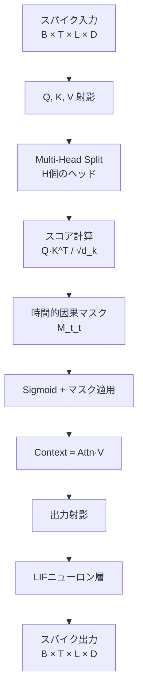
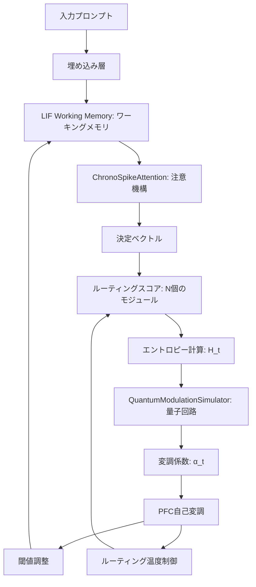
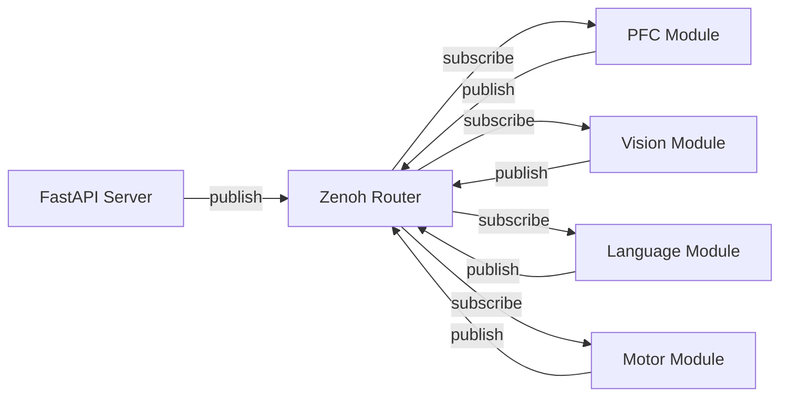

# Copyright 2025 Moonlight Technologies Inc. All Rights Reserved.
# Auth Masahiro Aoki

# EvoSpikeNet: 主要な概念と技術詳細

**最終更新日:** 2025年12月10日

このドキュメントでは、EvoSpikeNetフレームワークの中核をなす、より高度でユニークな概念に関する技術的な詳細を説明します。ソースコードに基づく数式、アーキテクチャ図、実装詳細を含みます。

---

## 目次

1. [スパイキングニューラルネットワークの基礎](#1-スパイキングニューラルネットワークの基礎)
2. [ChronoSpikeAttention: 因果的時間アテンション機構](#2-chronospikeattention-因果的時間アテンション機構)
3. [量子変調PFCフィードバックループ](#3-量子変調pfcフィードバックループ)
4. [マルチモーダル・センサーフュージョン・パイプライン](#4-マルチモーダルセンサーフュージョンパイプライン)
5. [運動野学習パイプライン](#5-運動野学習パイプライン)
6. [現行アーキテクチャ: Zenohによる非同期通信](#6-現行アーキテクチャ-zenohによる非同期通信)
7. [その他の主要な概念](#7-その他の主要な概念)

---

## 1. スパイキングニューラルネットワークの基礎

EvoSpikeNetは、生物学的な神経細胞の動作を模倣する**スパイキングニューラルネットワーク (SNN)** を中核技術として採用しています。従来の人工ニューラルネットワークが連続値を扱うのに対し、SNNは時間的に離散的な**スパイク (spike)** と呼ばれる0/1のイベントで情報を伝達します。

### 1.1. LIF (Leaky Integrate-and-Fire) ニューロン

本フレームワークの基本となるニューロンモデルは、計算効率に優れた **LIFNeuronLayer** (`evospikenet/core.py`) です。整数演算を使用した実装により、組み込みデバイスやFPGAへの展開が容易です。

#### 数理モデル

LIFニューロンの膜電位 $V(t)$ は以下の漏れ統合ダイナミクスに従います：

$$
V(t+1) = V(t) \cdot \frac{\text{leak}}{256} + I_{\text{syn}}(t)
$$

ここで：
- $V(t)$: 時刻 $t$ における膜電位 (16bit整数)
- $\text{leak}$: リーク係数 (デフォルト230、約0.9の減衰に相当)
- $I_{\text{syn}}(t)$: シナプス入力電流
- スパイク発火条件: $V(t) \geq \theta$ (閾値 $\theta$ はデフォルト1024)
- 発火後、$V(t)$ はリセット電位 (デフォルト0) に戻る

#### 実装コード (`evospikenet/core.py`)

```python
# 整数演算によるリーク処理（オーバーフロー防止のため32bit中間計算）
potential_32 = (potential_32 * leak_32) // 256

# シナプス入力の統合
potential_32 = potential_32 + synaptic_input.to(torch.int32)

# 16bit範囲にクランプ
self.potential = torch.clamp(potential_32, -32768, 32767).to(torch.int16)

# 閾値判定とスパイク生成
spikes = (self.potential >= self.threshold).to(torch.int8)
self.potential[spikes.bool()] = self.reset_potential  # リセット
```

### 1.2. Izhikevich ニューロン

生物学的妥当性を重視する場合、**IzhikevichNeuronLayer** (`evospikenet/core.py`) を使用できます。このモデルは、わずか4つのパラメータで、Regular Spiking、Fast Spiking、Burstingなど、多様なニューロン発火パターンを再現可能です。

#### 数理モデル

Izhikevichモデルは2変数の微分方程式で表現されます：

$$
\frac{dv}{dt} = 0.04v^2 + 5v + 140 - u + I
$$

$$
\frac{du}{dt} = a(bv - u)
$$

発火条件: $v \geq 30 \text{ mV}$ のとき、$v \leftarrow c$、$u \leftarrow u + d$

パラメータ：
- $a$: 回復変数 $u$ の時定数 (デフォルト0.02)
- $b$: 膜電位 $v$ に対する $u$ の感度 (デフォルト0.2)
- $c$: リセット電位 (デフォルト-65 mV)
- $d$: リセット後の $u$ の増加量 (デフォルト8)

#### 実装コード (`evospikenet/core.py`)

```python
# 勾配を伝播可能な代理関数を使用したスパイク生成
spikes = self.spike_grad(self.v - 30.0)

# 条件付き更新（スパイク発火時のリセット処理）
spiked_mask = spikes > 0
v_after_spike = torch.where(spiked_mask, self.c, self.v)
u_after_spike = torch.where(spiked_mask, self.u + self.d, self.u)

# オイラー法による数値積分
dv = (0.04 * v_after_spike**2 + 5 * v_after_spike + 140 - u_after_spike + I)
du = self.a * (self.b * v_after_spike - u_after_spike)

self.v = v_after_spike + self.dt * dv
self.u = u_after_spike + self.dt * du
```

### 1.3. ニューロンモデルの比較

| モデル                    | 計算量 | 生物学的妥当性 | 勾配学習 | 用途                                   |
| ------------------------- | ------ | -------------- | -------- | -------------------------------------- |
| **LIFNeuronLayer**        | 極小   | 低             | ✓        | エッジデバイス、大規模シミュレーション |
| **IzhikevichNeuronLayer** | 中     | 高             | ✓        | 神経科学研究、リアルな発火パターン再現 |
| **snnTorch Leaky**        | 小     | 中             | ✓        | 標準的なSNN学習タスク                  |

---

## 2. ChronoSpikeAttention: 因果的時間アテンション機構

**ChronoSpikeAttention** (`evospikenet/attention.py`) は、Transformerのセルフアテンションをスパイキングニューラルネットワークに適用した、本フレームワーク独自の特許出願済み技術です。通常のアテンションと異なり、時間的因果性を厳密に守りつつ、スパイク列を出力します。

### 2.1. アーキテクチャ概要



### 2.2. 時間的因果マスクの数理

ChronoSpikeAttentionの核心は、**時間的近接性マスク** $M(t, t')$ です。このマスクにより、各タイムステップ $t$ における注意が、過去のタイムステップ $t' \leq t$ にのみ向けられます。

#### マスク関数

$$
M(t, t') = \begin{cases}
\exp\left(-\frac{t - t'}{\tau}\right) & \text{if } t' \leq t \\
0 & \text{if } t' > t
\end{cases}
$$

ここで：
- $\tau$: 時定数 (デフォルトは `time_steps / 4.0`)
- $t - t'$: 時間差分（常に非負）
- 未来の情報 ($t' > t$) は完全にマスク（0）

#### アテンションスコアの計算

標準的なマルチヘッドアテンションのスコア計算：

$$
\text{scores}(t, t') = \frac{Q_h(t) \cdot K_h(t')^T}{\sqrt{d_k}}
$$

ChronoSpikeAttentionでは、sigmoid活性化後に因果マスクを適用：

$$
\text{attn}(t, t') = \sigma(\text{scores}(t, t')) \cdot M(t, t')
$$

これにより、未来の情報が漏洩することを防ぎつつ、過去の情報には時間的減衰を適用します。

### 2.3. 実装コード (`evospikenet/attention.py`)

```python
# 時間差分行列の生成
arange_t = torch.arange(time_steps, device=device)
delta_t_matrix = arange_t.unsqueeze(1) - arange_t.unsqueeze(0)

# 因果性の強制: 未来(t' > t)を無限大に設定
causal_delta_t = delta_t_matrix.float()
causal_delta_t[causal_delta_t < 0] = float('inf')

# 指数減衰マスクの生成
causal_exp_mask = torch.exp(-causal_delta_t / self.tau)

# スコアにsigmoidを適用後、マスクを乗算
attn_probs = torch.sigmoid(scores) * causal_exp_mask
context = torch.matmul(attn_probs, v)
```

### 2.4. スパイク出力の生成

Attention機構の出力は連続値ですが、SNNとの整合性のため、LIFニューロン層を通してスパイク列に変換されます：

```python
output_spikes_rec = []
mem = self.output_lif.init_leaky()

for step in range(time_steps):
    # 各タイムステップごとにLIF処理
    spk, mem = self.output_lif(continuous_output[:, step, :, :], mem)
    output_spikes_rec.append(spk)

output_spikes = torch.stack(output_spikes_rec, dim=1)
```

### 2.5. 時定数 τ の影響

| τ の値   | 特性             | 適用例             |
| -------- | ---------------- | ------------------ |
| 小 (T/8) | 直近の情報を重視 | リアルタイム制御   |
| 中 (T/4) | バランス型       | 一般的な系列処理   |
| 大 (T/2) | 長期依存性を保持 | 文脈理解、長文処理 |

---

## 3. 量子変調PFCフィードバックループ

**PFCDecisionEngine** (`evospikenet/pfc.py`) は、本フレームワークの最も独創的な特許技術である**量子変調フィードバックループ**を実装しています。これは、PFC自身の認知的不確実性（エントロピー）を測定し、量子インスパイアード回路をシミュレートして得られた変調係数 $\alpha(t)$ で自身の動作を動的に調整する、高度な自己言及的メカニズムです。

### 3.1. 全体アーキテクチャ



### 3.2. 認知エントロピーの計算

PFCは、どの機能モジュール（視覚、言語、運動など）にタスクをルーティングするかを決定する際、その決定の不確実性をShannon エントロピー $H(t)$ として測定します：

$$
H(t) = -\sum_{i=1}^{N} p_i \log p_i
$$

ここで：
- $N$: 機能モジュール数
- $p_i = \text{softmax}(\text{route\_scores})_i$: モジュール $i$ への割り当て確率
- 最大エントロピー: $H_{\max} = \log N$ （完全に不確実な状態）

#### 実装コード (`evospikenet/pfc.py`)

```python
# ルーティングスコアの計算
route_scores = self.output_head(decision_vector)

# ソフトマックス確率からエントロピーを計算
entropy = -torch.sum(
    torch.softmax(route_scores, dim=-1) * torch.log_softmax(route_scores, dim=-1),
    dim=-1
).mean()
```

### 3.3. 量子変調シミュレーション

**QuantumModulationSimulator** (`evospikenet/pfc.py`) は、単一量子ビットの回転ゲート $R_y(\theta)$ をシミュレートします。エントロピーを回転角に変換し、測定確率を変調係数として使用します。

#### 量子回路

初期状態 $|0\rangle$ に $R_y(\theta)$ ゲートを適用：

$$
R_y(\theta) = \begin{pmatrix}
\cos(\theta/2) & -\sin(\theta/2) \\
\sin(\theta/2) & \cos(\theta/2)
\end{pmatrix}
$$

$$
R_y(\theta)|0\rangle = \cos(\theta/2)|0\rangle + \sin(\theta/2)|1\rangle
$$

測定時に $|0\rangle$ 状態を得る確率：

$$
\alpha(t) = P(|0\rangle) = \cos^2(\theta/2)
$$

回転角 $\theta$ はエントロピーから以下のようにマッピング：

$$
\theta = \pi \cdot \frac{H(t)}{H_{\max}}
$$

- $H(t) = 0$ (確信) → $\theta = 0$ → $\alpha(t) = 1$
- $H(t) = H_{\max}$ (完全不確実) → $\theta = \pi$ → $\alpha(t) = 0$

#### 実装コード (`evospikenet/pfc.py`)

```python
def generate_modulation_coefficient(self, entropy: torch.Tensor, max_entropy: float) -> torch.Tensor:
    # エントロピーを[0,1]に正規化
    normalized_entropy = torch.clamp(entropy / max_entropy, 0, 1)
    
    # 回転角θを計算
    theta = torch.pi * normalized_entropy
    
    # P(|0⟩) = cos²(θ/2) を変調係数とする
    alpha_t = torch.cos(theta / 2) ** 2
    
    return alpha_t
```

### 3.4. 自己言及的フィードバック

計算された $\alpha(t)$ は、PFC自身の動作に2つの方法でフィードバックされます：

#### (1) ワーキングメモリの閾値調整（可塑性のシミュレーション）

$$
\theta_{\text{new}} = \theta_{\text{base}} \cdot (1 + 0.2 \cdot (1 - \alpha(t)))
$$

- 高エントロピー（$\alpha(t)$ 小）→ 閾値上昇 → 発火しにくくなる（探索モード）
- 低エントロピー（$\alpha(t)$ 大）→ 閾値維持 → 通常の発火（活用モード）

```python
# 基準閾値からの動的調整
threshold_adjustment = 1.0 + 0.2 * (1.0 - alpha_t)
new_threshold = self.base_lif_threshold * threshold_adjustment
self.working_memory.threshold = new_threshold.to(torch.int16)
```

#### (2) ルーティング温度の制御

$$
T_{\text{routing}} = \frac{1}{\alpha(t) + \epsilon}
$$

- 高エントロピー（$\alpha(t) \approx 0$）→ 高温度 → ソフトな確率分布（探索的）
- 低エントロピー（$\alpha(t) \approx 1$）→ 低温度 → 鋭い確率分布（活用的）

```python
epsilon = 1e-6
routing_temperature = 1.0 / (alpha_t + epsilon)

# 温度スケーリングされたソフトマックス
route_probs = torch.softmax(route_scores / routing_temperature, dim=-1)
```

### 3.5. フィードバックループのダイナミクス

このメカニズムにより、PFCは以下のような適応的な振る舞いを示します：

| 状況               | エントロピー | α(t)      | 閾値 | 温度 | 挙動                         |
| ------------------ | ------------ | --------- | ---- | ---- | ---------------------------- |
| **タスクに確信**   | 低           | 高 (≈1)   | 低   | 低   | 活用: 最適なモジュールに集中 |
| **不確実な状況**   | 高           | 低 (≈0)   | 高   | 高   | 探索: 複数モジュールを試行   |
| **中程度の複雑さ** | 中           | 中 (≈0.5) | 中   | 中   | バランス: 柔軟な切り替え     |

---

## 4. マルチモーダル・センサーフュージョン・パイプライン

本フレームワークは、多種多様なセンサーからのデータを統合し、PFC（前頭前野）が行動を決定するための統一された「世界理解」を生成するよう設計されています。これは標準化されたパイプラインによって実現されます。

### 4.1. コアデータ構造: `SpikePacket` (`evospikenet/structures.py`)

すべてのセンサーデータは、統一された`SpikePacket`形式に変換されます。このデータクラスにより、視覚、LiDAR、力覚など、あらゆるモダリティからの情報が、一貫性があり、タイムスタンプが付与され、メタデータが豊富な構造で脳内を伝達されることが保証されます。

```python
@dataclass
class SpikePacket:
    timestamp: float           # ハードウェアタイムスタンプ（ns）
    modality: str              # "vision", "lidar", "force" など
    data: torch.Tensor         # スパイク列 [ニューロン数, タイムステップ数]
    metadata: Dict             # カメラID, バウンディングボックスなど
```

### 4.2. センサー前処理 (`evospikenet/preprocessing.py`)

専門の前処理クラスが、生のセンサー入力を`SpikePacket`オブジェクトに変換します。これらのクラスは、効率的なリアルタイム特徴抽出のために、専用のスパイクベース・ニューラルネットワークを多用します。

- **`VisionPreprocessor`**: `SpikeEdgeDetector`と`SpikeYOLOv8`を用いて、カメラフレームからエッジと物体情報を抽出します。
- **`LidarPreprocessor`**: `VoxelSpikeEncoder`を用いて、3D点群をスパースなスパイク表現に変換します。
- **`ForcePreprocessor`**: 力・トルクセンサーの急激な変化をスパイクイベントに変換します。

### 4.3. マルチモーダル統合 (`evospikenet/fusion.py`)

`MultimodalFusion`モジュールは、知覚システムの心臓部です。すべてのアクティブなセンサーから`SpikePacket`オブジェクトを受け取り、2つの主要な処理を実行します：

1. **射影**: 各モダリティのデータは、モダリティ固有の線形層を通過し、共通の次元空間に射影されます。
2. **時間的統合**: 統一された特徴量は、`ChronoSpikeAttention`によって処理されます。これにより、時間を通じてさまざまな感覚入力の重要度が重み付けされ、単一の統合された環境表現が生成されます。この最終的なテンソルが、PFCの「世界理解」を構成します。

---

## 5. 運動野学習パイプライン

運動野システムは、単に命令を実行するだけでなく、専用UIを介して管理される高度な4段階のパイプラインを通じて学習し、適応するように設計されています。

- **ステージ1: 模倣学習 (Behavior Cloning)**: 人間のオペレーターによる短いデモンストレーション（例：5分間）を提供することで、新しいスキルが初期化されます。モデルはこの動作を完全に模倣することを学習しますが、適応性はありません。
- **ステージ2: 実世界強化学習**: ロボットは自己改善フェーズに入り、タスクを何百回も実行します。`SpikePPO`を使用し、人間の望む結果をモデル化した報酬関数に基づいて、成功、速度、滑らかさ（優しさ）を最適化し、初期ポリシーを洗練させます。
- **ステージ3: ゼロショット汎化**: `WorldModel`（DreamerV3など）を活用し、エージェントは明示的に訓練されていない全く新しいタスクに挑戦し、しばしば数回の試行で成功します。
- **ステージ4: 人間との協調**: 最終形態では、エージェントは協調モードに入り、力覚センサーのデータを用いて人間の意図を推定し、歩行やリハビリテーションなどのタスクを安全に支援します。

このパイプライン全体は、Webインターフェースから制御および監視されるマスタースクリプト`evo_motor_master.py`によって編成されます。

---

## 6. 現行アーキテクチャ: Zenohによる非同期通信

分散脳アーキテクチャは、同期的な`torch.distributed`モデルから、**Zenoh**を用いた完全な非同期・分散型アーキテクチャへと移行しました。これにより、システムの堅牢性、スケーラビリティ、リアルタイム性が大幅に向上しています。

### 6.1. Zenoh Pub/Subモデル



### 6.2. 主要な特徴

- **非同期Pub/Sub**: すべてのノード間通信は、Zenohを介したPublish/Subscribeモデルで行われます。これにより、マスター/スレーブ型のボトルネックが解消され、各モジュールが独立して動作できるようになりました。プロンプトはAPIからZenohの`evospikenet/api/prompt`トピックにpublishされ、関心のあるモジュールがこれをsubscribeします。
- **分散協調**: 階層的な制御は維持しつつも、通信の失敗がシステム全体の停止に繋がらない、より柔軟な構造になりました。
- **実装**: この新しいアーキテクチャは`examples/run_zenoh_distributed_brain.py`スクリプトによって実装されています。UIから呼び出される`run_distributed_brain_simulation.py`は、後方互換性のために残されたラッパーであり、その内容は非推奨となった`torch.distributed`ベースの古い実装コードそのものです。
- **堅牢性と速度**: この変更は、現実世界の量産ロボットに求められる、真に堅牢でスケーラブル、かつ高速起動が可能なシステムを構築するための重要なステップです。

### 6.3. 旧アーキテクチャ: `torch.distributed`

（参考情報として、旧アーキテクチャの概要を以下に示します）

旧アーキテクチャは、`torch.distributed`を使用して個別のプロセスとして実行される専門化された「機能モジュール」を、中央の「前頭前野（PFC）モジュール」が調整する、マスター/スレーブ型のモデルを採用していました。

- **マスタープロセス (Rank 0): PFCモジュール**: APIから高レベルの目標を受け取り、それを解釈して適切なスレーブモジュールにタスクをディスパッチしていました。
- **スレーブプロセス (Rank > 0): 機能モジュール**: 視覚、言語、運動などのタスクの専門家ノードでした。
- **通信**: `torch.distributed`の同期的な`send`/`recv`操作に依存しており、これがパフォーマンスのボトルネックや単一障害点となる可能性がありました。

---

## 7. その他の主要な概念

### 7.1. モデル分類

本フレームワークには、以下の6種類のニューラルネットワークモデルが実装されています：

| モデル名                    | タイプ         | 説明                                     |
| --------------------------- | -------------- | ---------------------------------------- |
| **EvoNetLM**                | 非スパイキング | Transformer言語モデル（旧EvoSpikeNetLM） |
| **SpikingEvoTextLM**        | スパイキング   | SNN版Transformer言語モデル               |
| **SpikingEvoVisionEncoder** | スパイキング   | 画像認識用エンコーダ                     |
| **SpikingEvoAudioEncoder**  | スパイキング   | 音声認識用エンコーダ                     |
| **SpikingEvoMultiModalLM**  | スパイキング   | 視覚-音声-テキスト統合モデル             |

### 7.2. ハイブリッド検索RAG

Milvus（ベクトル検索）とElasticsearch（キーワード検索）を使用し、結果をReciprocal Rank Fusion (RRF)で統合するRetrieval-Augmented Generationシステム。詳細は`RAG_SYSTEM_DETAILED.md`を参照。

### 7.3. フェデレーテッド学習

`Flower`フレームワークを用いた、プライバシーを保護する分散学習のサポート。知識共有に「スパイク蒸留」を用いる特殊な`DistributedBrainClient`を含む。

### 7.4. RESTful API & SDK

`FastAPI`サーバーとそれに対応する`EvoSpikeNetAPIClient`が、フレームワークの機能へプログラムでアクセスするための主要なインターフェースを提供。詳細は`EvoSpikeNet_SDK.md`を参照。
