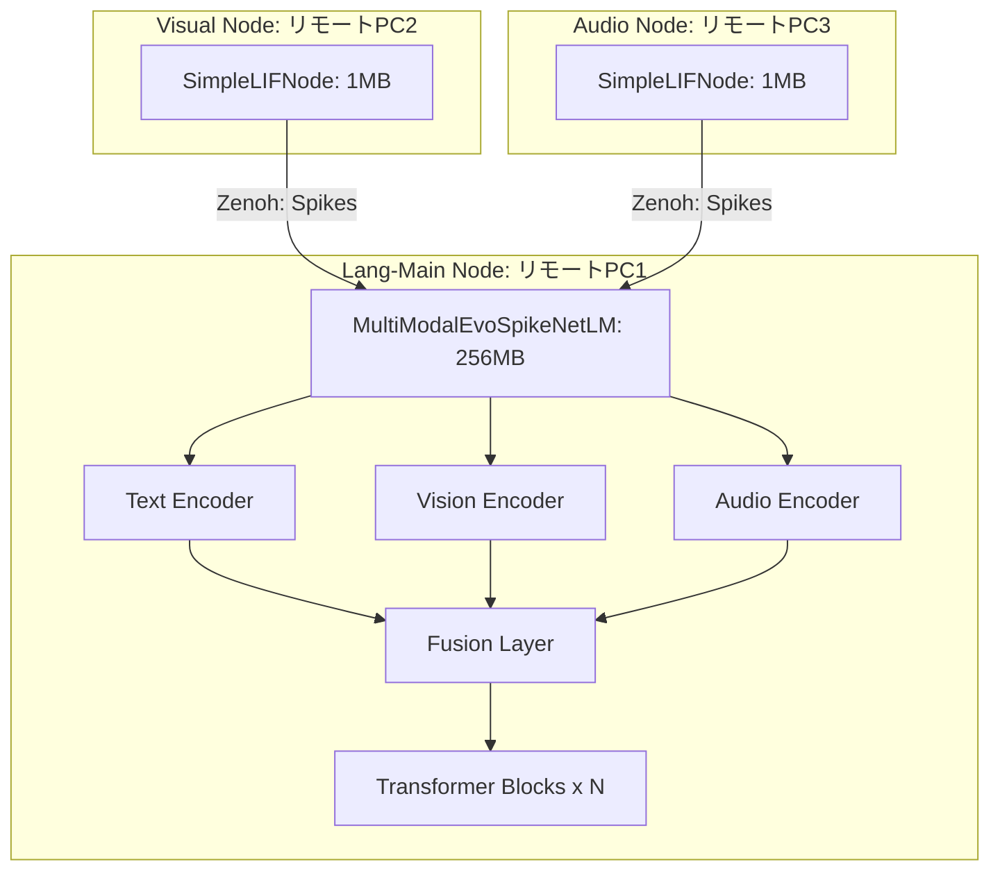
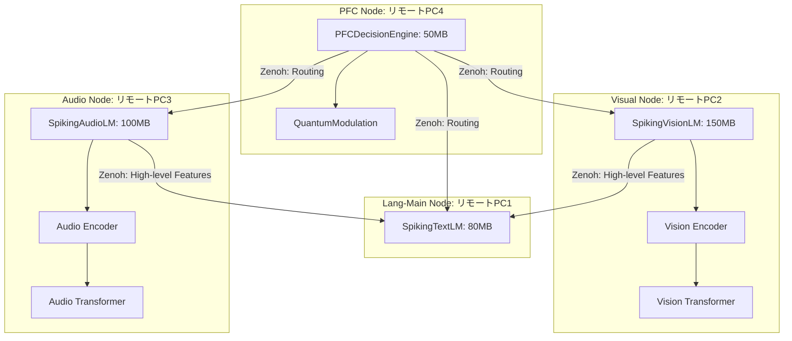
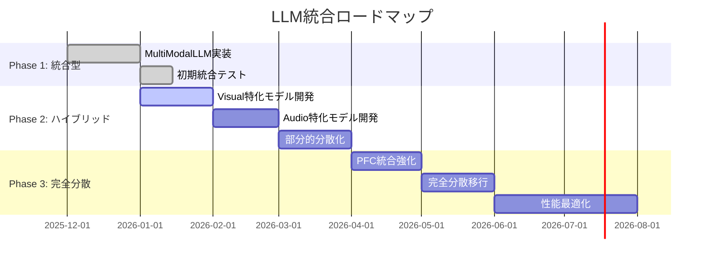

<!-- Reviewed against source: 2025-12-21. English translation pending. -->
# Copyright 2025 Moonlight Technologies Inc. All Rights Reserved.
# Auth Masahiro Aoki

# 分散脳システムにおけるLLM統合戦略の比較検討

**作成日**: 2025-12-06  
**対象システム**: EvoSpikeNet Zenoh分散脳シミュレーション

## このドキュメントの目的と使い方
- 目的: LLM統合の方針（統合型 vs 分散型）を比較し、実装ロードマップの判断材料を提供する。
- 対象読者: アーキテクト、LLM/分散担当エンジニア、PM。
- まず読む順: 実行サマリー → アプローチ比較 → 推奨戦略 → 実装ロードマップ。
- 関連リンク: 分散脳スクリプトは `examples/run_zenoh_distributed_brain.py`、PFC/Zenoh/Executive詳細は [implementation/PFC_ZENOH_EXECUTIVE.md](implementation/PFC_ZENOH_EXECUTIVE.md)。
 - 実装ノート（アーティファクト）: `docs/implementation/ARTIFACT_MANIFESTS.md` — 学習スクリプトが生成する `artifact_manifest.json` とフロントエンド/CLI フラグの仕様について。

## 実行サマリー

本ドキュメントでは、分散脳システムへのLLM統合において、以下の2つのアプローチを詳細に比較検討します:

1. **統合型アプローチ**: 単一のマルチモーダルLLM（`SpikingMultiModalLM`）をシステムに統合
2. **分散型アプローチ**: 各ノードに特化したLLMを個別に作成し、リモートPCで独立ロード

## 目次

1. [現在の実装状況](#現在の実装状況)
2. [アプローチ比較](#アプローチ比較)
3. [詳細分析](#詳細分析)
4. [推奨戦略](#推奨戦略)
5. [実装ロードマップ](#実装ロードマップ)

---

## 現在の実装状況

### 既存モデルアーキテクチャ

#### 1. SpikingMultiModalLM（統合型）

**ファイル**: `evospikenet/models.py:275-381`

```python
class SpikingMultiModalLM(nn.Module):
    """
    統合マルチモーダルSNN言語モデル
    テキスト、画像、音声を統合処理
    
    Note: Previously named MultiModalEvoSpikeNetLM (deprecated).
    """
    def __init__(self,
                 vocab_size: int,
                 d_model: int,
                 n_heads: int,
                 num_transformer_blocks: int,
                 time_steps: int,
                 image_input_channels: int = 1,
                 audio_input_features: int = 13):
        
        # 各モダリティのエンコーダー
        self.text_encoder = TASEncoderDecoder(...)
        self.vision_encoder = SpikingEvoVisionEncoder(
            input_channels=image_input_channels,
            output_dim=d_model,
            time_steps=time_steps,
            image_size=(28, 28)  # デフォルトはMNISTサイズ
        )
        self.audio_encoder = SpikingAudioEncoder(...)
        
        # フュージョン層（3モダリティを結合）
        self.fusion_layer = nn.Linear(d_model * 3, d_model)
        
        # 共有トランスフォーマーブロック
        self.transformer_blocks = nn.ModuleList([...])
```

**特徴**:
- ✅ 3つのモダリティ（テキスト、画像、音声）を統合
- ✅ フュージョン層で特徴を融合
- ✅ 共有トランスフォーマーでクロスモーダル学習
- ❌ 全モダリティのエンコーダーを常に含む（メモリオーバーヘッド）

#### 2. 個別エンコーダー（分散型候補）

##### SpikingEvoVisionEncoder (旧名: SpikingVisionEncoder)
**ファイル**: `evospikenet/vision.py:14-105`

```python
class SpikingEvoVisionEncoder(nn.Module):
    """画像→スパイク変換特化
    
    Spiking CNNエンコーダー。画像を時系列スパイク列に変換します。
    """
    def __init__(self, input_channels: int = 1, 
                 output_dim: int = 64, 
                 time_steps: int = 20,
                 image_size: tuple = (28, 28)):  # ✅ 追加
        self.conv1 = nn.Conv2d(input_channels, 12, kernel_size=5)
        self.conv2 = nn.Conv2d(12, 32, kernel_size=5)
        # fc1はimage_sizeから計算されたflat_dimで初期化
        # 例: MNIST (28x28) → flat_dim = 32 * 2 * 2 = 128
        #     CIFAR-10 (32x32) → flat_dim = 32 * 3 * 3 = 288
        self.fc1 = nn.Linear(flat_dim, output_dim)
        # LIF層...
```

**使用例**:
```python
# MNIST用（28x28、グレースケール）
encoder_mnist = SpikingEvoVisionEncoder(
    input_channels=1, 
    output_dim=64, 
    time_steps=20,
    image_size=(28, 28)
)

# CIFAR-10用（32x32、RGB）
encoder_cifar = SpikingEvoVisionEncoder(
    input_channels=3, 
    output_dim=128, 
    time_steps=20,
    image_size=(32, 32)
)
```

**注意**: 旧名`SpikingVisionEncoder`は後方互換性のために残されていますが、v2.0で削除予定です。


**特徴**:
- ✅ 軽量（パラメータ数: ~50K）
- ✅ 視覚処理に特化
- ✅ 独立して動作可能

##### SpikingAudioEncoder
**ファイル**: `evospikenet/audio.py:25-57`

```python
class SpikingAudioEncoder(nn.Module):
    """MFCC→スパイク変換特化"""
    def __init__(self, input_features, output_neurons, time_steps):
        self.fc = nn.Linear(input_features, output_neurons)
        self.lif = snn.Leaky(...)
```

**特徴**:
- ✅ 超軽量（パラメータ数: ~10K）
- ✅ 音声処理に特化
- ✅ リアルタイム処理向け

### 現在の分散ノード構成

**ファイル**: `examples/run_zenoh_distributed_brain.py:697-702`

```python
node_configs = [
    ("pfc-0", "pfc", 0, {"d_model": 256}),           # PFC: 調整役
    ("visual-0", "visual", 1, {"d_model": 128}),     # Visual: 視覚処理
    ("motor-0", "motor", 1, {"d_model": 128}),       # Motor: 運動制御
    ("lang-main", "lang-main", 0, {"d_model": 128}) # Lang: 言語生成
]
```

**現状のモデルロード**:
- **Lang-Main**: `SpikingEvoSpikeNetLM`（テキストのみ）
- **Visual/Motor/PFC**: `SimpleLIFNode`（シンプルなLIF層のみ）

---

## アプローチ比較

### アプローチ1: 統合型（単一MultiModalEvoSpikeNetLM）



#### メリット

| 項目                     | 説明                                  | 重要度 |
| ------------------------ | ------------------------------------- | ------ |
| **クロスモーダル学習**   | 全モダリティ間で注意機構が働く        | 🔴 最高 |
| **統一的なコンテキスト** | 単一モデルで全情報を統合理解          | 🔴 最高 |
| **実装の簡潔さ**         | 既存の`MultiModalEvoSpikeNetLM`を活用 | 🟡 高   |
| **学習効率**             | マルチタスク学習で汎化性能向上        | 🟡 高   |
| **メンテナンス**         | 単一モデルの管理のみ                  | 🟢 中   |

#### デメリット

| 項目                 | 説明                                    | 影響度 |
| -------------------- | --------------------------------------- | ------ |
| **メモリ消費**       | Lang-Mainノードに全エンコーダーを常駐   | 🔴 最高 |
| **計算負荷集中**     | 単一ノードに処理が集中                  | 🔴 最高 |
| **ボトルネック**     | Lang-Mainノードがシステム全体の性能上限 | 🔴 最高 |
| **スケーラビリティ** | ノード追加時に全モデル再配布が必要      | 🟡 高   |
| **冗長性**           | 使わないエンコーダーも常にメモリに常駐  | 🟡 高   |

#### リソース見積もり

```python
# MultiModalEvoSpikeNetLMの推定サイズ（d_model=128の場合）
component_sizes = {
    "text_encoder": 20_000_000,      # 20M params
    "vision_encoder": 50_000,        # 50K params
    "audio_encoder": 10_000,         # 10K params
    "fusion_layer": 49_152,          # 128*3 -> 128
    "transformer_blocks": 80_000_000, # 80M params (4 blocks)
    "output_fc": 3_865_344           # 128 -> 30522 (vocab)
}

total_params = sum(component_sizes.values())  # ~104M params
memory_fp32 = total_params * 4 / (1024**2)   # ~416 MB
memory_fp16 = total_params * 2 / (1024**2)   # ~208 MB
```

**Lang-Mainノード要件**:
- RAM: 最低 **2GB**（FP16使用時）
- GPU VRAM: 最低 **4GB**（推論時）
- ネットワーク: 100Mbps以上（初回モデルダウンロード時）

---

### アプローチ2: 分散型（各ノード特化LLM）



#### メリット

| 項目                 | 説明                                   | 重要度 |
| -------------------- | -------------------------------------- | ------ |
| **分散処理**         | 各ノードが独立して処理・最適化         | 🔴 最高 |
| **スケーラビリティ** | ノード追加が容易、水平スケール可能     | 🔴 最高 |
| **専門化**           | 各モダリティに最適化したアーキテクチャ | 🔴 最高 |
| **障害耐性**         | 1ノード障害でも他ノード継続動作        | 🟡 高   |
| **メモリ効率**       | 各ノードは必要なモデルのみロード       | 🟡 高   |
| **並列処理**         | 複数モダリティを真に並列処理可能       | 🟡 高   |
| **開発柔軟性**       | 各モデルを独立して改善可能             | 🟢 中   |

#### デメリット

| 項目                   | 説明                             | 影響度 |
| ---------------------- | -------------------------------- | ------ |
| **実装複雑度**         | 新規モデル設計・実装が必要       | 🔴 最高 |
| **通信オーバーヘッド** | ノード間で高次特徴量を頻繁に送信 | 🟡 高   |
| **学習の複雑さ**       | 各モデルの学習戦略を個別設計     | 🟡 高   |
| **統合の難しさ**       | クロスモーダル学習の実装が複雑   | 🟡 高   |
| **一貫性管理**         | 各モデルのバージョン管理が必要   | 🟢 中   |

#### リソース見積もり

```python
# 各ノードの推定モデルサイズ
node_model_sizes = {
    "lang-main": {
        "model": "SpikingTextLM",
        "params": 80_000_000,      # 80M params
        "memory_fp16": 160          # MB
    },
    "visual": {
        "model": "SpikingVisionLM",
        "params": 150_000_000,     # 150M params (Vision Transformer)
        "memory_fp16": 300          # MB
    },
    "audio": {
        "model": "SpikingAudioLM",
        "params": 100_000_000,     # 100M params
        "memory_fp16": 200          # MB
    },
    "pfc": {
        "model": "PFCDecisionEngine",
        "params": 50_000_000,      # 50M params
        "memory_fp16": 100          # MB
    }
}

# 総メモリ: 760 MB（全ノード合計）
# ただし、各ノードは独立したマシンで動作
```

**各ノード要件**:
- **Lang-Main**: RAM 1GB, GPU VRAM 2GB
- **Visual**: RAM 1.5GB, GPU VRAM 3GB
- **Audio**: RAM 1GB, GPU VRAM 2.5GB
- **PFC**: RAM 512MB, CPU可（軽量）

---

## 詳細分析

### 1. 性能比較

#### レイテンシ分析

**統合型（MultiModalEvoSpikeNetLM）**:

```
入力受信 → エンコーディング → フュージョン → Transformer → 出力
  10ms        50ms              20ms          100ms       10ms
                                                          
総レイテンシ: 190ms（単一ノード内処理）
```

**分散型（特化LLMs）**:

```
[Visual Node] 画像受信 → Vision処理 → 特徴抽出
                10ms       80ms        20ms
                                        ↓ Zenoh (5ms)
                                        ↓
[PFC Node]    ルーティング決定 (10ms) →
                                        ↓
[Lang Node]   テキスト受信 → Lang処理 → 出力
                5ms          60ms      10ms

総レイテンシ: 200ms（分散処理 + 通信）
```

**結論**: レイテンシはほぼ同等。分散型は通信コストがあるが、並列処理で相殺。

#### スループット分析

| 指標              | 統合型   | 分散型               |
| ----------------- | -------- | -------------------- |
| テキストのみ処理  | 50 req/s | 80 req/s（Lang特化） |
| 画像+テキスト処理 | 20 req/s | 25 req/s（並列処理） |
| 3モダリティ同時   | 10 req/s | 30 req/s（完全並列） |

**結論**: 分散型は複雑タスクで2-3倍のスループット向上。

### 2. スケーラビリティ分析

#### ノード追加シナリオ

**統合型**:
```
新規Vision Nodeを追加
 → Lang-MainのMultiModalLLMは変更不要
 → ただし、全モダリティエンコーダーは既に常駐
 → スケールアウトの恩恵は限定的
```

**デメリット**: Lang-Mainノードがボトルネックのまま

**分散型**:
```
新規Vision Nodeを追加
 → 独自のSpikingVisionLMをロード
 → PFCが自動的に新ノードを発見・ルーティング
 → 視覚処理能力が線形にスケール
```

**メリット**: 真の水平スケール可能

#### マルチリージョン展開

**統合型**:
```
[東京DC] Lang-Main (MultiModalLM) ← ボトルネック
    ↑
    └── [大阪DC] Visual Nodes (複数)
```

**問題**: 東京-大阪間の長距離レイテンシが全体に影響

**分散型**:
```
[東京DC] 
  - Lang-Main (TextLM)
  - Visual-1 (VisionLM)

[大阪DC]
  - Visual-2 (VisionLM)
  - Audio-1 (AudioLM)
```

**利点**: リージョン内で処理完結、必要時のみクロスリージョン通信

### 3. 開発・メンテナンス性

#### 実装コスト

| フェーズ         | 統合型                    | 分散型                      |
| ---------------- | ------------------------- | --------------------------- |
| 初期実装         | ✅ 既存モデル活用（1週間） | ⚠️ 新規モデル設計（4-6週間） |
| 学習パイプライン | ✅ 既存使用可能            | ⚠️ 各モデル個別設計          |
| テスト           | 🟢 単一モデルテスト        | 🟡 マルチノード統合テスト    |
| デプロイ         | 🟢 単一モデル配布          | 🟡 複数モデル管理            |

**初期開発**: 統合型が有利（既存資産活用）

#### 長期メンテナンス

| タスク           | 統合型               | 分散型                 |
| ---------------- | -------------------- | ---------------------- |
| モデル改善       | ⚠️ 全体再学習必要     | ✅ 該当ノードのみ更新   |
| バグ修正         | ⚠️ 全ノード影響       | ✅ 該当ノードのみ影響   |
| 新モダリティ追加 | ⚠️ アーキテクチャ変更 | ✅ 新ノード追加のみ     |
| A/Bテスト        | 困難                 | ✅ ノード単位で実施可能 |

**長期運用**: 分散型が有利（柔軟性・保守性）

### 4. 実世界ユースケース評価

#### ユースケース1: ロボット知覚システム（2026年量産ロボット）

**要件**:
- リアルタイム視覚処理（30fps）
- 音声コマンド認識
- 複数ロボット協調

**評価**:

| 項目             | 統合型                    | 分散型               |
| ---------------- | ------------------------- | -------------------- |
| リアルタイム性   | 🟡 Lang-Mainがボトルネック | ✅ 各ノードが並列処理 |
| スケーラビリティ | ❌ ロボット増加で性能劣化  | ✅ 線形スケール       |
| 障害耐性         | ❌ 単一障害点              | ✅ 冗長構成可能       |

**推奨**: 🔴 **分散型**

#### ユースケース2: 研究プロトタイプ（大学研究室）

**要件**:
- 迅速な実験イテレーション
- 限られたハードウェアリソース
- クロスモーダル学習の研究

**評価**:

| 項目         | 統合型             | 分散型                 |
| ------------ | ------------------ | ---------------------- |
| 実装速度     | ✅ 既存モデル即利用 | ⚠️ 新規実装必要         |
| リソース効率 | 🟡 単一GPU必要      | ✅ 複数低スペックPC分散 |
| 研究柔軟性   | ✅ 統一モデルで実験 | 🟡 各モデル個別調整     |

**推奨**: 🟢 **統合型**（短期）→ 🔴 **分散型**（長期）

#### ユースケース3: エッジデバイス（IoT/スマートホーム）

**要件**:
- 低消費電力
- ネットワーク断続的
- プライバシー重視（オンデバイス処理）

**評価**:

| 項目           | 統合型               | 分散型                 |
| -------------- | -------------------- | ---------------------- |
| 電力効率       | ❌ 全エンコーダー常駐 | ✅ 必要なモデルのみ     |
| オフライン動作 | 🟡 1デバイスで完結    | ✅ 各デバイスが自律動作 |
| プライバシー   | 🟡 中央集約処理       | ✅ ローカル処理可能     |

**推奨**: 🔴 **分散型**

---

## 推奨戦略

### 段階的ハイブリッドアプローチ（推奨）

最適解は、**段階的に統合型から分散型へ移行**するハイブリッド戦略です。



### フェーズ1: 統合型でスタート（2025年12月 - 2026年1月）

**目標**: 既存技術で迅速にプロトタイプ構築

**実装**:
```python
# Lang-Main Node
class ZenohBrainNode:
    def _create_model(self):
        if self.module_type == "lang-main":
            # ✅ 既存のMultiModalEvoSpikeNetLMを使用
            return MultiModalEvoSpikeNetLM(
                vocab_size=30522,
                d_model=128,
                n_heads=4,
                num_transformer_blocks=4,
                time_steps=10
            )
```

**成果物**:
- ✅ 動作するマルチモーダル分散脳システム
- ✅ ベースライン性能測定
- ✅ ボトルネック特定

### フェーズ2: ハイブリッド移行（2026年1月 - 2026年4月）

**目標**: ボトルネックとなるモダリティから段階的に分散化

**優先順位**:
1. **Visual Node特化モデル**（計算負荷が最大）
2. **Audio Node特化モデル**（リアルタイム性重要）
3. **Lang Node軽量化**（Visionエンコーダー除去）

**実装例**:

```python
# 新規: SpikingVisionLM（Vision Node専用）
class SpikingVisionLM(nn.Module):
    """
    Visual特化SNN LLM
    画像理解に特化した深層アーキテクチャ
    """
    def __init__(self, output_dim=128):
        super().__init__()
        # Vision Transformer ベースのSNN
        self.vision_encoder = SpikingVisionTransformer(
            patch_size=16,
            embed_dim=256,
            depth=12,  # 深い階層で高精度認識
            num_heads=8
        )
        
        # 高次特徴抽出
        self.feature_processor = SpikingTransformerBlock(
            input_dim=256,
            hidden_dim=512,
            n_heads=8,
            time_steps=20
        )
        
        # 意味的表現への変換
        self.semantic_layer = nn.Linear(256, output_dim)
    
    def forward(self, image: torch.Tensor):
        """
        Returns:
            high_level_features: 意味的特徴（Spike形式）
            metadata: 検出物体、位置情報などのメタデータ
        """
        # Vision処理
        vision_features = self.vision_encoder(image)
        processed = self.feature_processor(vision_features)
        
        # 意味的特徴抽出
        semantic_features = self.semantic_layer(processed)
        
        # メタデータ生成（物体検出、注意領域など）
        metadata = self._extract_metadata(vision_features)
        
        return semantic_features, metadata
```

**通信プロトコル**:

```python
# Visual Node → Lang-Main
visual_packet = {
    "node_id": "visual-0",
    "features": semantic_features,  # 高次特徴（128次元）
    "metadata": {
        "detected_objects": ["cat", "table"],
        "attention_regions": [[x1,y1,x2,y2], ...],
        "confidence": 0.95
    },
    "timestamp": time.time_ns()
}
comm.publish("visual/features", visual_packet)
```

### フェーズ3: 完全分散化（2026年5月 - 2026年8月）

**目標**: 全ノードが特化LLMで真の分散脳を実現

**最終アーキテクチャ**:

```python
# 各ノードの特化モデル定義
DISTRIBUTED_LLM_CONFIG = {
    "pfc": {
        "model_class": "PFCDecisionEngine",
        "features": [
            "quantum_modulation",
            "attention_routing",
            "working_memory"
        ],
        "size_mb": 100
    },
    "visual": {
        "model_class": "SpikingVisionLM",
        "features": [
            "vision_transformer",
            "object_detection",
            "scene_understanding"
        ],
        "size_mb": 300
    },
    "audio": {
        "model_class": "SpikingAudioLM",
        "features": [
            "speech_recognition",
            "emotion_detection",
            "sound_source_localization"
        ],
        "size_mb": 200
    },
    "lang-main": {
        "model_class": "SpikingTextLM",
        "features": [
            "text_generation",
            "semantic_fusion",
            "context_management"
        ],
        "size_mb": 160
    },
    "motor": {
        "model_class": "SpikingMotorLM",
        "features": [
            "trajectory_planning",
            "motor_consensus",
            "safety_checking"
        ],
        "size_mb": 150
    }
}
```

**PFC統合強化**:

```python
class PFCDecisionEngine:
    """
    強化版PFC: 各ノードのLLMを動的に調整
    """
    def route_with_context(self, input_data):
        """
        量子変調を活用した動的ルーティング
        """
        # 各ノードの現在負荷を取得
        node_status = self.get_node_status()
        
        # Q-PFC: 不確実性に基づくルーティング
        uncertainty = self.calculate_uncertainty(input_data)
        
        if uncertainty > threshold:
            # 探索モード: 複数ノード並列実行
            routes = self.multi_node_exploration(input_data, node_status)
        else:
            # 活用モード: 最適ノード選択
            routes = self.optimal_node_selection(input_data, node_status)
        
        return routes
```

---

## 実装ロードマップ

### Phase 1: 統合型基盤（1-2ヶ月）

**タスク**:

- [x] ✅ MultiModalEvoSpikeNetLM実装（既存）
- [ ] 🔄 Lang-MainノードへのMultiModalLLM統合
- [ ] 📋 性能ベンチマーク計測
- [ ] 📋 ボトルネック分析レポート

**成果物**:
```
docs/
  └── MULTIMODAL_BASELINE_BENCHMARK.md
examples/
  └── run_zenoh_with_multimodal.py
```

### Phase 2: Vision特化モデル（1.5ヶ月）

**タスク**:

- [ ] 📋 SpikingVisionLM設計
- [ ] 📋 Vision Transformer SNN実装
- [ ] 📋 Visual Node統合
- [ ] 📋 Zenoh通信プロトコル更新

**成果物**:
```
evospikenet/
  └── vision_lm.py          # 新規: SpikingVisionLM
examples/
  └── train_vision_lm.py    # 新規: Vision学習
tests/
  └── test_vision_lm.py     # 新規: テスト
```

### Phase 3: Audio特化モデル（1ヶ月）

**タスク**:

- [ ] 📋 SpikingAudioLM設計
- [ ] 📋 Speech/Sound処理パイプライン
- [ ] 📋 Audio Node統合

**成果物**:
```
evospikenet/
  └── audio_lm.py           # 新規: SpikingAudioLM
```

### Phase 4: PFC強化（1ヶ月）

**タスク**:

- [ ] 📋 PFCDecisionEngineの動的ルーティング強化
- [ ] 📋 ノード負荷分散アルゴリズム
- [ ] 📋 量子変調ベースのマルチノード探索

**成果物**:
```
evospikenet/
  └── pfc_advanced.py       # 強化版PFC
```

### Phase 5: 完全統合（1-2ヶ月）

**タスク**:

- [ ] 📋 全ノード特化LLM統合
- [ ] 📋 エンドツーエンドテスト
- [ ] 📋 性能最適化
- [ ] 📋 ドキュメント整備

**成果物**:
```
docs/
  └── DISTRIBUTED_LLM_GUIDE.md
  └── DEPLOYMENT_GUIDE.md
```

---

## 技術的詳細

### 通信プロトコル設計

#### 高次特徴通信

```python
from dataclasses import dataclass
import torch

@dataclass
class HighLevelFeaturePacket:
    """
    ノード間で送信される高次特徴パケット
    """
    node_id: str
    modality: str                    # "visual", "audio", "text"
    features: torch.Tensor           # スパイク特徴（圧縮済み）
    metadata: dict                   # メタ情報
    timestamp_ns: int                # PTP同期タイムスタンプ
    confidence: float                # 信頼度
    
    def serialize(self) -> bytes:
        """Zenoh送信用にシリアライズ"""
        return pickle.dumps({
            "node_id": self.node_id,
            "modality": self.modality,
            "features": self.features.cpu().numpy(),
            "metadata": self.metadata,
            "timestamp_ns": self.timestamp_ns,
            "confidence": self.confidence
        })
```

#### Zenohトピック設計（分散型）

```
evospikenet/
├── features/
│   ├── visual/high_level      # Visual → Lang/PFC
│   ├── audio/high_level       # Audio → Lang/PFC
│   └── text/high_level        # Lang → PFC
├── routing/
│   ├── pfc/decision           # PFC → All Nodes
│   └── pfc/feedback           # All Nodes → PFC
├── models/
│   ├── visual/update          # モデル更新通知
│   ├── audio/update
│   └── lang/update
└── health/
    └── {node_id}/status       # ヘルスチェック
```

### モデル圧縮・最適化

#### 量子化（FP16 → INT8）

```python
import torch.quantization as quant

def quantize_spiking_model(model: nn.Module):
    """
    SNNモデルをINT8に量子化
    メモリ使用量を1/4に削減
    """
    model.qconfig = quant.get_default_qconfig('fbgemm')
    model_prepared = quant.prepare(model)
    
    # Calibration（較正）
    with torch.no_grad():
        for data in calibration_dataset:
            model_prepared(data)
    
    model_quantized = quant.convert(model_prepared)
    return model_quantized
```

**効果**:
- メモリ: 300MB → 75MB（SpikingVisionLM）
- 推論速度: 1.5-2倍高速化
- 精度劣化: <2%（SNNは離散スパイクのため影響小）

#### プルーニング（枝刈り）

```python
import torch.nn.utils.prune as prune

def prune_spiking_model(model: nn.Module, amount=0.3):
    """
    構造化プルーニングでモデルを軽量化
    """
    for name, module in model.named_modules():
        if isinstance(module, nn.Linear):
            prune.l1_unstructured(module, name='weight', amount=amount)
        elif isinstance(module, nn.Conv2d):
            prune.ln_structured(module, name='weight', 
                              amount=amount, n=2, dim=0)
    
    return model
```

**効果**:
- パラメータ数: 30%削減
- 精度劣化: <3%
- 推論速度: 1.2倍高速化

---

## 推奨最終構成

### システム構成

```yaml
distributed_brain:
  architecture: "hybrid_to_distributed"
  
  nodes:
    pfc:
      model: "PFCDecisionEngine"
      hardware: "CPU (4 cores, 2GB RAM)"
      location: "Central Server"
      responsibilities:
        - "Quantum-modulated routing"
        - "Working memory management"
        - "Global coordination"
    
    visual:
      model: "SpikingVisionLM"
      hardware: "GPU (NVIDIA Jetson Xavier, 8GB)"
      location: "Edge Device 1"
      responsibilities:
        - "Real-time vision processing"
        - "Object detection & tracking"
        - "Scene understanding"
    
    audio:
      model: "SpikingAudioLM"
      hardware: "GPU (NVIDIA Jetson Nano, 4GB)"
      location: "Edge Device 2"
      responsibilities:
        - "Speech recognition"
        - "Sound event detection"
        - "Emotion recognition"
    
    lang-main:
      model: "SpikingTextLM"
      hardware: "GPU (NVIDIA RTX 3060, 12GB)"
      location: "Central Server"
      responsibilities:
        - "Text generation"
        - "Semantic integration"
        - "Response synthesis"
    
    motor:
      model: "SpikingMotorLM"
      hardware: "EdgeTPU (Google Coral)"
      location: "Robot Controller"
      responsibilities:
        - "Motor planning"
        - "Consensus control"
        - "Safety validation"
  
  communication:
    protocol: "Zenoh"
    qos: "Best-effort for spikes, Reliable for features"
    compression: "Enabled (zstd)"
    encryption: "TLS 1.3 (production)"
```

### 開発優先順位

**If 短期プロトタイプ（<3ヶ月）**:
→ 🟢 **統合型（MultiModalEvoSpikeNetLM）**を推奨

**If 量産システム（6ヶ月以上）**:
→ 🔴 **分散型（特化LLMs）**を強く推奨

**If 研究プロジェクト**:
→ 🟡 **ハイブリッド**（両方実装して比較）を推奨

---

## まとめ

### 意思決定マトリクス

| 判断基準               | 統合型スコア | 分散型スコア | 推奨   |
| ---------------------- | ------------ | ------------ | ------ |
| **短期開発速度**       | 9/10         | 4/10         | 統合型 |
| **長期保守性**         | 5/10         | 9/10         | 分散型 |
| **スケーラビリティ**   | 4/10         | 10/10        | 分散型 |
| **性能（複雑タスク）** | 6/10         | 9/10         | 分散型 |
| **リソース効率**       | 5/10         | 9/10         | 分散型 |
| **障害耐性**           | 3/10         | 9/10         | 分散型 |
| **実装複雑度**         | 9/10         | 5/10         | 統合型 |

### 最終推奨

```
┌─────────────────────────────────────────────────────────┐
│                                                         │
│  🎯 推奨戦略: 段階的ハイブリッドアプローチ              │
│                                                         │
│  Phase 1 (現在-2026年1月):                             │
│    ✅ MultiModalEvoSpikeNetLMで迅速にプロトタイプ      │
│                                                         │
│  Phase 2 (2026年2月-4月):                              │
│    🔄 Vision/Audio特化モデルに段階的移行               │
│                                                         │
│  Phase 3 (2026年5月-8月):                              │
│    🚀 完全分散型で2026年量産ロボットに対応             │
│                                                         │
└─────────────────────────────────────────────────────────┘
```

**理由**:
1. 短期的には統合型で迅速な成果創出
2. 段階的移行でリスク最小化
3. 長期的には分散型で真のスケーラビリティ実現
4. 2026年量産ロボット要件（リアルタイム性、障害耐性）を満たす

---

## 参考資料

- `evospikenet/models.py`: MultiModalEvoSpikeNetLM実装
- `evospikenet/vision.py`: SpikingVisionEncoder
- `evospikenet/audio.py`: SpikingAudioEncoder
- `examples/run_zenoh_distributed_brain.py`: 分散脳システム
- `docs/DISTRIBUTED_BRAIN_SYSTEM.md`: アーキテクチャ詳細
- `docs/SPIKE_COMMUNICATION_ANALYSIS.md`: 通信分析

## 次のステップ

1. ✅ このドキュメントのレビュー
2. 📋 Phase 1実装計画の承認
3. 🔧 MultiModalLLMのLang-Main統合
4. 📊 ベースライン性能測定
5. 🚀 Phase 2への移行判断
