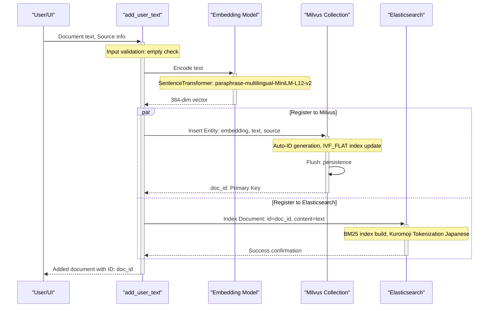
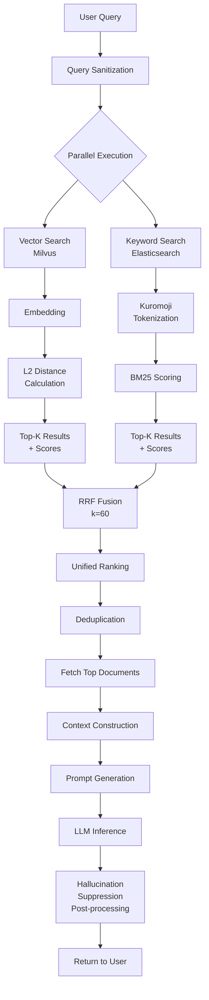

# EvoSpikeNet RAG System In-Depth Guide

**Created:** 2025-12-10
**Copyright:** 2025 Moonlight Technologies Inc. All Rights Reserved.  
**Author:** Masahiro Aoki

---

## Table of Contents

1. [RAG System Overview](#1-rag-system-overview)
2. [Document Ingestion Flow](#2-document-ingestion-flow)
3. [Retrieval and Generation Flow](#3-retrieval-and-generation-flow)
4. [Technical Specifications](#4-technical-specifications)
5. [Code Implementation Deep Dive](#5-code-implementation-deep-dive)
6. [Advanced Features](#6-advanced-features)

---

## 1. RAG System Overview

The EvoSpikeNet RAG (Retrieval-Augmented Generation) system employs a **hybrid search architecture**. It executes semantic similarity-based vector search and keyword-based full-text search in parallel, then fuses the results using the **Reciprocal Rank Fusion (RRF)** algorithm to achieve high-precision document retrieval and generation.

### 1.1. Key Components

| Component               | Role                                     | Technology Stack                                       |
| ----------------------- | ---------------------------------------- | ------------------------------------------------------ |
| **Milvus**              | Vector database (semantic search)        | Vector dim: 384, Index: IVF_FLAT                       |
| **Elasticsearch**       | Full-text search engine (keyword search) | BM25 algorithm, kuromoji Japanese tokenizer            |
| **SentenceTransformer** | Text vectorization                       | `paraphrase-multilingual-MiniLM-L12-v2` (multilingual) |
| **RRF Algorithm**       | Search result fusion                     | `k=60`                                                   |
| **LLM Backend**         | Text generation                          | HuggingFace / SNN / Standard LM                        |

### 1.2. Data Structure

Milvus Collection `rag_kb` Schema:

```python
{
    "id": INT64 (Primary Key, auto_id=True),
    "embedding": FLOAT_VECTOR (dim=384),
    "text": VARCHAR (max_length=65535),  # Max 65,535 characters
    "source": VARCHAR (max_length=255)
}
```

---

## 2. Document Ingestion Flow

The document ingestion process employs a **dual indexing** strategy. The same document is registered in both Milvus (for vector search) and Elasticsearch (for keyword search), enabling the utilization of both search engines during subsequent retrieval.

### 2.1. Process Flow Diagram



### 2.2. Error Handling

- **Milvus Connection Failure**: The `_ensure_milvus_connection` function implements a retry mechanism, attempting to connect up to 3 times at 5-second intervals to handle container startup delays.

---

## 3. Retrieval and Generation Flow

The process consists of three main stages: **Parallel Hybrid Search** + **RRF Fusion** + **LLM Generation**.

### 3.1. Overall Flow Diagram



### 3.2. Detailed Generation Steps

#### Step 1: Language Detection and Prompt Selection
The query language (Japanese/English) is detected to automatically select an optimized prompt template, encouraging more natural responses.

#### Step 2: Context Construction and Truncation
Retrieved documents are concatenated into a single text, separated by `\n---\n`. The total context is truncated to a **maximum of 3000 characters** to fit within the LLM's context window.

#### Step 3: Extractive-First Mode
The `_extractive_answer` method (TF-IDF based) first attempts an extractive answer. If a direct answer is found in the context, it is returned immediately without LLM generation, reducing hallucination risk and improving response time.

#### Step 4: LLM Inference
If an extractive answer cannot be found, the LLM backend (HuggingFace, SNN, etc.) generates a response. Parameters like `repetition_penalty=1.5` are set to suppress repetitive outputs.

#### Step 5: Post-processing and Hallucination Suppression
The generated response undergoes the following post-processing to improve quality:
- **Context Overlap Check**: The lexical overlap between the generated answer and the original context is calculated. If the overlap is **less than 25%**, it is considered a high risk of hallucination, and the system attempts to fall back to an extractive answer.
- **Irrelevant Content Filtering**: If the response contains irrelevant content like URLs or advertisements, it is discarded, and an "insufficient information" message is returned.

---

## 4. Technical Specifications

### 4.1. Milvus Configuration

- **Collection Schema**: `id`(PK), `embedding`(384-dim), `text`(65535 chars), `source`(255 chars)
- **Index**: `IVF_FLAT` (cluster count `nlist=128`)
- **Similarity Metric**: `L2` (Euclidean distance)
- **Search Parameter**: `nprobe=10` (number of clusters to probe during search)

### 4.2. Embedding Model Specifications

- **Model**: `paraphrase-multilingual-MiniLM-L12-v2`
- **Output Dimension**: 384
- **Supported Languages**: 100+ (including Japanese and English)

### 4.3. RRF Parameters

- `k = 60`: A balanced setting that gives reasonable weight to lower-ranked documents.

---

## 5. Code Implementation Deep Dive

### 5.1. CRUD Operations
The `evospikenet/rag_milvus.py` file implements the following helper functions for consistent operations across both Milvus and Elasticsearch databases:
- `add_user_text()`: Adds a document.
- `get_all_data()`: Retrieves all documents.
- `update_document()`: Updates a document.
- `delete_document()`: Deletes a document.

### 5.2. `EvoRAG` Class
This class encapsulates the main logic of the RAG system.
- `__init__()`: Selects the LLM backend (`huggingface`, `snn`, etc.) and initializes Milvus/Elasticsearch clients.
- `retrieve()`: Executes hybrid search and RRF fusion.
- `generate()`: Performs text generation, including hallucination suppression logic.
- `rag()`: Provides an end-to-end pipeline combining `retrieve` and `generate`.

---

## 6. Advanced Features

### 6.1. SNN Integration and Neuron Activity Visualization

The `rag_with_vis()` method is a special feature available only when `llm_type='snn'`.
- **Purpose**: To visualize and analyze how the internal SNN model processes information during the RAG pipeline.
- **Mechanism**:
    1. Attaches a `DataMonitorHook` to each layer of the SNN model.
    2. Executes the normal RAG pipeline (prompt tokenization, forward pass).
    3. Captures time-series data of all neuron **spikes** and **membrane potentials** that occur during this process.
    4. Serializes the collected data into a file named `rag_neuron_data.pt`.
- **Usage**: The saved `.pt` file can be loaded by offline analysis scripts like `examples/visualize_rag_neurons.py` for detailed visualizations such as spike raster plots.

### 6.2. Mock Implementation for Testability

To avoid dependency on external services like Milvus in unit tests and CI/CD environments, the system includes a mocking feature activated when the `EVOSPIKENET_TEST_MODE` environment variable is set.

- **`MockCollection` Class**: An in-memory mock class that mimics the Milvus `Collection` object. It simulates key methods like `insert` and `search`.
- **Branch in `_get_or_create_collection()`**: This function checks for the environment variable and returns an instance of `MockCollection` instead of a real Milvus connection if in test mode.

This design allows the RAG system's logic to be tested quickly and reliably, independent of external services.

**Reference Files:**
- `evospikenet/rag_milvus.py`: Core RAG system implementation
- `evospikenet/elasticsearch_client.py`: Elasticsearch client
- `evospikenet/rag_backends.py`: LLM backend integration
- `frontend/pages/rag.py`: Knowledge base management UI
