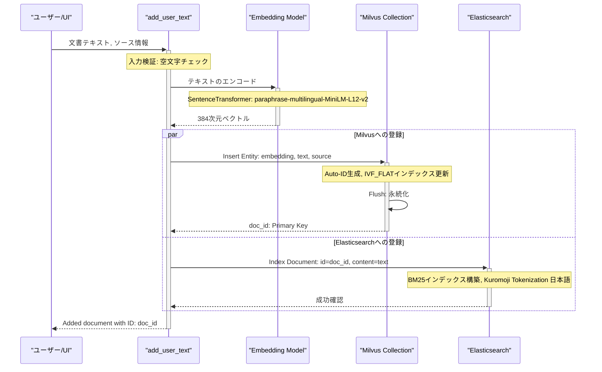
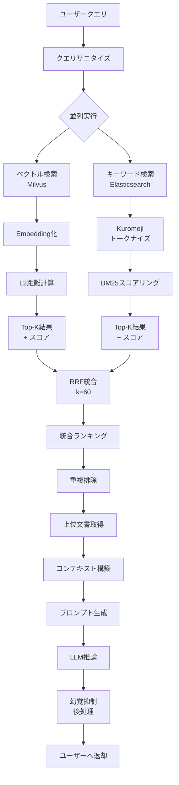

# EvoSpikeNet RAGシステム詳細解説

**作成日:** 2025年12月10日
**Copyright:** 2025 Moonlight Technologies Inc. All Rights Reserved.  
**Author:** Masahiro Aoki

---

## 目次

1. [RAGシステム概要](#1-ragシステム概要)
2. [文書登録処理フロー](#2-文書登録処理フロー)
3. [検索処理フロー](#3-検索処理フロー)
4. [技術仕様詳細](#4-技術仕様詳細)
5. [実装コード解説](#5-実装コード解説)
6. [高度な機能](#6-高度な機能)

---

## 1. RAGシステム概要

EvoSpikeNetのRAG（Retrieval-Augmented Generation）システムは、**ハイブリッド検索**アーキテクチャを採用しています。これは、意味的類似性に基づくベクトル検索と、キーワードマッチングに基づく全文検索を並列実行し、結果を**Reciprocal Rank Fusion (RRF)** アルゴリズムで統合することで、高精度な文書検索と生成を実現するシステムです。

### 1.1. 主要コンポーネント

| コンポーネント          | 役割                               | 技術スタック                                          |
| ----------------------- | ---------------------------------- | ----------------------------------------------------- |
| **Milvus**              | ベクトルデータベース（意味的検索） | ベクトル次元: 384次元、インデックス: IVF_FLAT         |
| **Elasticsearch**       | 全文検索エンジン（キーワード検索） | BM25アルゴリズム、kuromoji日本語トークナイザー        |
| **SentenceTransformer** | テキストのベクトル化               | `paraphrase-multilingual-MiniLM-L12-v2`（多言語対応） |
| **RRFアルゴリズム**     | 検索結果の統合                     | `k=60`                                                  |
| **LLMバックエンド**     | テキスト生成                       | HuggingFace / SNN / Standard LM                       |

### 1.2. データ構造

Milvusコレクション `rag_kb` のスキーマ：

```python
{
    "id": INT64 (Primary Key, auto_id=True),
    "embedding": FLOAT_VECTOR (dim=384),
    "text": VARCHAR (max_length=65535),  # 最大65,535文字
    "source": VARCHAR (max_length=255)
}
```

---

## 2. 文書登録処理フロー

文書をRAGシステムに登録する処理は、**二重登録（Dual Indexing）**戦略を採用しています。同じ文書を、ベクトル検索用のMilvusとキーワード検索用のElasticsearchの両方に登録することで、後続の検索時に両方の検索エンジンを活用できるようにします。

### 2.1. 処理フロー図



### 2.2. エラーハンドリング

- **Milvus接続失敗**: `_ensure_milvus_connection`関数により、コンテナ起動時の遅延を考慮し、最大3回のリトライ（5秒間隔）が実行されます。

---

## 3. 検索処理フロー

検索処理は、**並列ハイブリッド検索** + **RRF統合** + **LLM生成**の3段階で構成されます。

### 3.1. 全体フロー図



### 3.2. 生成ステップ詳細

#### ステップ1: 言語検出とプロンプト選択
クエリの言語（日本語/英語）を検出し、それぞれに最適化されたプロンプトテンプレートを自動で選択します。これにより、言語に応じた自然な回答生成を促します。

#### ステップ2: コンテキスト構築と切り詰め
検索で得られた文書を連結し、`\n---\n`で区切った単一のテキストを構築します。LLMのコンテキストウィンドウを超えないよう、合計文字数を**最大3000文字**に制限する切り詰め処理が行われます。

#### ステップ3: Extractive-Firstモード
`_extractive_answer`メソッド（TF-IDFベース）を用いて、まず抽出型の回答を試みます。コンテキスト内の文章から直接的な答えが見つかった場合は、LLMによる生成を行わずにその結果を返すことで、幻覚のリスクを低減し、応答速度を向上させます。

#### ステップ4: LLM推論
抽出型で回答できなかった場合のみ、LLMバックエンド（HuggingFace, SNN等）を用いて回答を生成します。繰り返しを抑制するため、`repetition_penalty=1.5`などのパラメータが設定されます。

#### ステップ5: 後処理と幻覚抑制
生成された回答に対し、以下の後処理を適用して品質を向上させます。
- **コンテキストとの語彙重複度チェック**: 生成された回答と元のコンテキストの単語の重なりを計算します。重複度が**25%未満**の場合、コンテキストを無視して回答が生成された（幻覚）可能性が高いと判断し、抽出型回答へのフォールバックを試みます。
- **無関係なコンテンツのフィルタリング**: URLや広告のような無関係なテキストが生成された場合、それを破棄して「情報不足」という回答を返します。

---

## 4. 技術仕様詳細

### 4.1. Milvus設定

- **コレクションスキーマ**: `id`(PK), `embedding`(384次元), `text`(65535文字), `source`(255文字)
- **インデックス**: `IVF_FLAT` (クラスタ数 `nlist=128`)
- **類似度指標**: `L2` (ユークリッド距離)
- **検索パラメータ**: `nprobe=10` (検索時に探索するクラスタ数)


#### ベクトル検索の数理

Milvusは、クエリベクトル $\mathbf{q} \in \mathbb{R}^{384}$ に対して、コレクション内の全文書ベクトル $\mathbf{d}_i$ との距離を計算します。

**L2距離（ユークリッド距離）:**

$$
\text{dist}_{\text{L2}}(\mathbf{q}, \mathbf{d}_i) = \sqrt{\sum_{j=1}^{384} (q_j - d_{i,j})^2}
$$

小さいほど類似度が高いと判断され、Top-K文書が返されます。

**IVF_FLATインデックスの仕組み:**

1. 文書ベクトルを $K$ 個のクラスタに分割（デフォルト `nlist=128`）
2. クエリ時、クエリベクトルに最も近い `nprobe=10` 個のクラスタを選択
3. 選択されたクラスタ内の文書のみ詳細に距離計算（全探索より高速）

### 4.2. Embedding Model仕様

- **モデル**: `paraphrase-multilingual-MiniLM-L12-v2`
- **出力次元**: 384
- **対応言語**: 100以上（日本語、英語含む）
- **アーキテクチャ**: BERT-based Transformer (12層)
- **学習目的**: パラフレーズ検出（意味的類似文の識別）

#### テキストエンコード処理

```python
from sentence_transformers import SentenceTransformer

model = SentenceTransformer('paraphrase-multilingual-MiniLM-L12-v2')
embedding = model.encode(text)  # shape: (384,)
```

内部では以下の処理が行われます：

1. **トークナイゼーション**: サブワード単位への分割（BPEベース）
2. **Embeddings Layer**: トークンIDを埋め込みベクトルに変換
3. **Transformer Encoder**: 12層の自己注意機構で文脈を考慮
4. **Pooling**: [CLS]トークンまたは平均プーリングで文全体の表現を生成
5. **正規化**: L2正規化により単位ベクトルに変換

### 4.3. Elasticsearch BM25スコアリング

Elasticsearchは**BM25 (Best Matching 25)** アルゴリズムを使用してキーワード検索を行います。

#### BM25スコア計算式

文書 $d$ とクエリ $q$ のBM25スコア：

$$
\text{score}_{\text{BM25}}(d, q) = \sum_{t \in q} \text{IDF}(t) \cdot \frac{\text{TF}(t, d) \cdot (k_1 + 1)}{\text{TF}(t, d) + k_1 \cdot (1 - b + b \cdot \frac{|d|}{\text{avgdl}})}
$$

ここで：
- $\text{TF}(t, d)$: 文書 $d$ における用語 $t$ の出現頻度
- $\text{IDF}(t) = \log\left(\frac{N - n(t) + 0.5}{n(t) + 0.5}\right)$: 逆文書頻度（レア単語ほど高スコア）
- $N$: 総文書数、$n(t)$: 用語 $t$ を含む文書数
- $|d|$: 文書の長さ（単語数）
- $\text{avgdl}$: 平均文書長
- $k_1 = 1.2$: TF飽和パラメータ
- $b = 0.75$: 文書長正規化係数

### 4.4. RRFパラメータと統合アルゴリズム

**Reciprocal Rank Fusion (RRF)** は、異なる検索システムの結果を統合するアルゴリズムです。

#### RRFスコア計算式

文書 $d$ のRRFスコア：

$$
\text{score}_{\text{RRF}}(d) = \sum_{r \in R} \frac{1}{k + \text{rank}_r(d)}
$$

ここで：
- $R$: 検索システムの集合（本システムでは $R = \{\text{Milvus}, \text{Elasticsearch}\}$）
- $\text{rank}_r(d)$: システム $r$ における文書 $d$ のランク順位（1始まり）
- $k = 60$: ランクバイアス補正定数

#### RRF統合の例

| 文書ID | Milvusランク | ESランク | RRFスコア計算 | 総スコア |
|--------|-------------|---------|--------------|---------|
| doc_1  | 1位         | 3位     | $\frac{1}{60+1} + \frac{1}{60+3}$ | 0.0323 |
| doc_2  | 2位         | 1位     | $\frac{1}{60+2} + \frac{1}{60+1}$ | 0.0323 |
| doc_3  | 3位         | 2位     | $\frac{1}{60+3} + \frac{1}{60+2}$ | 0.0320 |

文書は最終的にRRFスコアの降順にソートされます。

#### 実装コード (`evospikenet/rag_milvus.py`)

```python
rrf_scores = {}
k = 60

# Milvus結果の処理
for rank, doc_id in enumerate(milvus_results, start=1):
    rrf_scores[doc_id] = rrf_scores.get(doc_id, 0) + 1 / (k + rank)

# Elasticsearch結果の処理
for rank, doc_id in enumerate(es_results, start=1):
    rrf_scores[doc_id] = rrf_scores.get(doc_id, 0) + 1 / (k + rank)

# スコア降順にソート
ranked_docs = sorted(rrf_scores.items(), key=lambda x: x[1], reverse=True)
```

---

## 5. 実装コード解説

### 5.1. CRUD操作
`evospikenet/rag_milvus.py`には、MilvusとElasticsearchの両データベースを一貫して操作するための以下のヘルパー関数が実装されています。
- `add_user_text()`: 文書の追加
- `get_all_data()`: 全文書の取得
- `update_document()`: 文書の更新
- `delete_document()`: 文書の削除

### 5.2. `EvoRAG`クラス
RAGシステムの主要なロジックをカプセル化したクラスです。
- `__init__()`: LLMバックエンド (`huggingface`, `snn`等) を選択し、Milvus/Elasticsearchクライアントを初期化します。
- `retrieve()`: ハイブリッド検索とRRF統合を実行します。
- `generate()`: 幻覚抑制ロジックを含むテキスト生成を実行します。
- `rag()`: `retrieve`と`generate`を組み合わせたエンドツーエンドのパイプラインを提供します。

---

## 6. 高度な機能

### 6.1. SNN連携とニューロン活動可視化

`rag_with_vis()`メソッドは、`llm_type='snn'`の場合にのみ利用可能な特殊機能です。
- **目的**: RAGパイプラインの実行中に、内部のSNNモデルがどのように情報を処理しているかを可視化・分析する。
- **仕組み**:
    1. `DataMonitorHook`をSNNモデルの各レイヤーにアタッチ。
    2. 通常のRAGパイプライン（プロンプトのトークン化、フォワードパス）を実行。
    3. この過程で発生した全ニューロンの**スパイク発火**と**膜電位**の時系列データをキャプチャ。
    4. 収集したデータを`rag_neuron_data.pt`というファイルにシリアライズして保存。
- **利用**: 保存された`.pt`ファイルは、`examples/visualize_rag_neurons.py`などのオフライン分析スクリプトで読み込み、発火ラスタープロットなどの詳細な可視化が可能です。

### 6.2. テスト容易性のためのモック実装

ユニットテストやCI/CD環境でMilvusのような外部サービスに依存しないように、`EVOSPIKENET_TEST_MODE`環境変数が設定されている場合にMilvusへの接続をモックする機能が組み込まれています。

- **`MockCollection`クラス**: Milvusの`Collection`オブジェクトを模倣するインメモリのモッククラス。`insert`や`search`といった主要なメソッドをシミュレートします。
- **`_get_or_create_collection()`の分岐**: この関数内で環境変数をチェックし、テストモードであれば実際のMilvus接続の代わりに`MockCollection`のインスタンスを返します。

この設計により、RAGシステムのロジックを外部サービスから独立して高速かつ安定的にテストすることが可能になっています。

**参考ファイル:**
- `evospikenet/rag_milvus.py`: RAGシステムのコア実装
- `evospikenet/elasticsearch_client.py`: Elasticsearchクライアント
- `evospikenet/rag_backends.py`: LLMバックエンド統合
- `frontend/pages/rag.py`: 知識ベース管理UI
