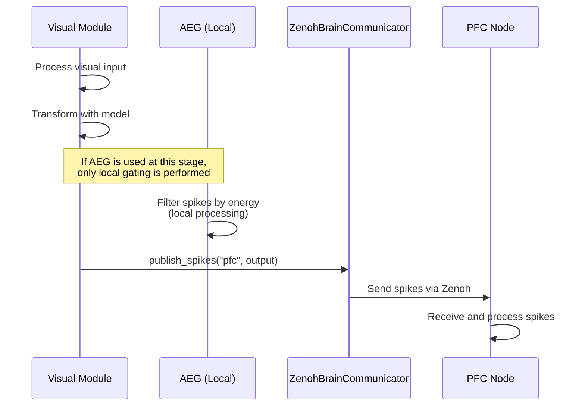

# Analysis of Spike Information Communication in Distributed Brain Simulation

**Created:** December 5, 2025  
**Copyright:** 2025 Moonlight Technologies Inc. All Rights Reserved.  
**Author:** Masahiro Aoki  
**Target System:** EvoSpikeNet Zenoh-based Distributed Brain Simulation

## Executive Summary

**Conclusion**: ❌ **Upstream transmission of spike information by AEG is NOT currently implemented**

## Detailed Analysis

### 1. Role of AEG (Activity-driven Energy Gating)

AEG is defined in `evospikenet/control.py` with the following capabilities:

- **Energy-based Gating Mechanism**: Controls spikes based on neuronal energy levels
- **Local Processing Only**: AEG only filters (gates) spikes within a single node
- **No Communication Functionality**: Does **NOT** have inter-node spike transmission capabilities

#### AEG Implementation Details (`evospikenet/control.py`)

```python
class AEG(nn.Module):
    """Implementation of Activity-driven Energy Gating (AEG)"""
    
    def update(self, spikes: torch.Tensor, importance: torch.Tensor) -> torch.Tensor:
        """
        Gate (filter) spikes based on energy levels
        
        Returns:
            torch.Tensor: Gated spikes (local processing only)
        """
        # Calculate energy consumption
        if self.training:
            consumption = self.consumption_rate * spikes * importance
            self.energy -= consumption.sum(dim=tuple(range(spikes.dim() - 1)))
            self.energy.clamp_(min=0)
        
        # Generate active neuron mask
        active_mask = (self.energy > self.threshold).float()
        
        # Gate spikes locally
        return spikes * active_mask
```

**Important**: The `update()` method only **processes spikes locally** and returns them. It does not perform inter-node communication.

### 2. Actual Spike Communication Mechanism: ZenohBrainCommunicator

Inter-node spike information transmission is handled by the **ZenohBrainCommunicator** class in `evospikenet/zenoh_comm.py`:

#### Spike Transmission (Publish)

```python
class ZenohBrainCommunicator(ZenohCommunicator):
    def publish_spikes(self, target: str, spikes: torch.Tensor, metadata: Dict = None):
        """
        Send spike data to specified target
        
        Args:
            target: Target node or module
            spikes: Spike tensor
            metadata: Optional metadata
        """
        topic = f"spikes/{self.module_type}/{target}"
        data = {
            "node_id": self.node_id,
            "spikes": spikes,
            "metadata": metadata or {},
            "timestamp": time.time_ns()
        }
        self.publish(topic, data)
```

#### Spike Reception (Subscribe)

```python
def subscribe_spikes(self, source: str, callback: Callable):
    """
    Receive spike data from source module
    
    Args:
        source: Source module type
        callback: Callback function
    """
    topic = f"spikes/{source}/*"
    self.subscribe(topic, callback)
```

### 3. Implementation Example: Usage in `run_zenoh_distributed_brain.py`

#### Spike Transmission from Visual → PFC

**File**: `examples/run_zenoh_distributed_brain.py:487-497`

```python
def _handle_visual_input(self, data: Dict):
    """Process visual spike input"""
    spikes = data.get("spikes")
    timestamp_ns = data.get("timestamp")
    
    # Process with model
    with torch.no_grad():
        output = self.model(spikes)
    
    # ✅ Send results to PFC using ZenohBrainCommunicator
    self.comm.publish_spikes("pfc", output, {"source": "visual"})
```

#### PFC Spike Reception Configuration

**File**: `examples/run_zenoh_distributed_brain.py:317-321`

```python
def _setup_pfc_subscriptions(self):
    """Set up PFC node subscriptions"""
    # ✅ Receive spikes from sensory inputs
    self.comm.subscribe_spikes("visual", self._handle_visual_input)
    self.comm.subscribe_spikes("auditory", self._handle_auditory_input)
    
    # Receive task completion notifications
    self.comm.subscribe("task/completion", self._handle_task_completion)
```

### 4. Zenoh Topic Structure

In the current system, spike information is communicated through the following topics:

| Topic Name                        | Sender          | Receiver   | Content            |
| --------------------------------- | --------------- | ---------- | ------------------ |
| `evospikenet/spikes/visual/pfc`   | Visual Module   | PFC        | Visual spike data  |
| `evospikenet/spikes/auditory/pfc` | Auditory Module | PFC        | Audio spike data   |
| `evospikenet/api/prompt`          | API Server      | PFC        | Prompt data        |
| `evospikenet/pfc/text_prompt`     | PFC             | Lang-Main  | Text task          |
| `evospikenet/api/result`          | Lang-Main       | API Server | Generation results |

### 5. Relationship Between AEG and Spike Communication



**Key Points**:
1. **AEG is local processing**: Filters spikes within each node
2. **Transmission via ZenohBrainCommunicator**: Inter-node communication handled by dedicated communication class
3. **Separated architecture**: Processing (AEG) and communication (Zenoh) are clearly separated

## Current Implementation Status

### ✅ Implemented

1. **Zenoh-based Inter-node Communication**
   - `ZenohBrainCommunicator.publish_spikes()`
   - `ZenohBrainCommunicator.subscribe_spikes()`
   
2. **Spike Data Transmission Examples**
   - Visual → PFC
   - Auditory → PFC

3. **AEG Standalone Functionality**
   - Energy-based gating
   - Energy consumption and replenishment during training

### ❌ Not Implemented

1. **AEG Upstream Spike Transmission**
   - AEG currently performs local processing only
   - Does not have inter-node communication capability

2. **AEG and Zenoh Communication Integration**
   - Automatic transmission of AEG-gated spikes is not implemented

## Recommended Improvements

If implementing AEG upstream spike transmission, the following approaches are suggested:

### Option 1: Integrate AEG with Zenoh Communication (Recommended)

```python
class AEGWithUpstream(AEG):
    """AEG with automatic upstream spike transmission"""
    
    def __init__(self, num_neurons: int, communicator: ZenohBrainCommunicator, 
                 target_node: str, **kwargs):
        super().__init__(num_neurons, **kwargs)
        self.comm = communicator
        self.target = target_node
    
    def update(self, spikes: torch.Tensor, importance: torch.Tensor) -> torch.Tensor:
        # Existing AEG processing
        gated_spikes = super().update(spikes, importance)
        
        # ✨ New feature: Automatically transmit gated spikes
        if self.comm and self.training:
            self.comm.publish_spikes(
                self.target, 
                gated_spikes,
                metadata={
                    "energy": self.energy.tolist(),
                    "gated": True
                }
            )
        
        return gated_spikes
```

### Option 2: Use Wrapper Function

```python
def process_and_upstream_spikes(
    aeg: AEG, 
    spikes: torch.Tensor, 
    importance: torch.Tensor,
    communicator: ZenohBrainCommunicator,
    target: str
) -> torch.Tensor:
    """Integrate AEG processing and upstream spike transmission"""
    
    # Gate with AEG
    gated_spikes = aeg.update(spikes, importance)
    
    # Transmit via Zenoh
    communicator.publish_spikes(
        target, 
        gated_spikes,
        metadata={"source": "aeg_gated"}
    )
    
    return gated_spikes
```

## Verification Procedure

### 1. Confirm Current Spike Communication

```bash
# Start Zenoh Router
cd zenoh-router
./start-router.sh

# Start PFC node in another terminal
python examples/run_zenoh_distributed_brain.py --node-id pfc-0 --module-type pfc

# Start Visual node in another terminal
python examples/run_zenoh_distributed_brain.py --node-id visual-0 --module-type visual
```

### 2. Confirm Spike Transmission in Logs

Look for the following in Visual node logs:
```
INFO - Publishing to topic: evospikenet/spikes/visual/pfc
```

Look for the following in PFC node logs:
```
INFO - Received spike data from visual
```

## Conclusions and Recommendations

### Current State

- **AEG**: Functions as a local spike gating mechanism
- **Zenoh**: Handles inter-node spike communication
- **Separation**: Processing and communication are clearly separated

### Recommendations

If AEG upstream spike transmission functionality is needed:

1. **Recommend Option 1**: Implement `AEGWithUpstream` class
2. **Maintain Existing Functionality**: Keep existing AEG class (backward compatibility)
3. **Make Configurable**: Enable/disable upstream transmission

### Next Steps

1. ✅ Review this analysis
2. 📋 Consider necessity of AEG upstream transmission functionality
3. 🔧 Develop implementation plan if needed
4. 🧪 Conduct integration testing after implementation

## References

- `evospikenet/control.py`: AEG implementation
- `evospikenet/zenoh_comm.py`: Zenoh communication implementation
- `examples/run_zenoh_distributed_brain.py`: Usage examples
- `docs/DISTRIBUTED_BRAIN_SYSTEM.md`: System architecture
