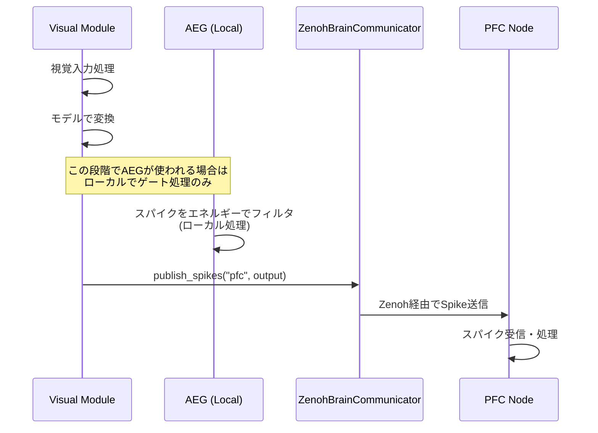

# 分散脳シミュレーションにおけるSpike情報の通信分析

**作成日**: 2025-12-05  
**Copyright:** 2025 Moonlight Technologies Inc. All Rights Reserved.  
**Author:** Masahiro Aoki  
**対象システム**: EvoSpikeNet Zenohベース分散脳シミュレーション

## 実行サマリー

**結論**: ❌ **AEGによるSpike情報の上流送信は現在実装されていません**

## 詳細分析

### 1. AEG（Activity-driven Energy Gating）の役割

AEGは `evospikenet/control.py` で定義されており、以下の機能を持っています:

- **エネルギーベースのゲーティング機構**: ニューロンのエネルギーレベルに基づいてスパイクを制御
- **ローカル処理のみ**: AEGは単一ノード内でスパイクをフィルタリング（ゲート）する役割のみ
- **通信機能なし**: ノード間でのSpike情報の送信機能は**持っていません**

#### AEGの実装詳細（`evospikenet/control.py`）

```python
class AEG(nn.Module):
    """Activity-driven Energy Gating (AEG)の実装"""
    
    def update(self, spikes: torch.Tensor, importance: torch.Tensor) -> torch.Tensor:
        """
        スパイクをエネルギーレベルに基づいてゲート（フィルタリング）
        
        戻り値:
            torch.Tensor: ゲート処理されたスパイク（ローカル処理のみ）
        """
        # エネルギー消費計算
        if self.training:
            consumption = self.consumption_rate * spikes * importance
            self.energy -= consumption.sum(dim=tuple(range(spikes.dim() - 1)))
            self.energy.clamp_(min=0)
        
        # アクティブなニューロンのマスク生成
        active_mask = (self.energy > self.threshold).float()
        
        # ローカルでスパイクをゲート
        return spikes * active_mask
```

**重要**: `update()` メソッドはスパイクを**ローカルで処理**し、返すだけです。ノード間通信は行いません。

### 2. 実際のSpike通信メカニズム: ZenohBrainCommunicator

ノード間のSpike情報送信は、`evospikenet/zenoh_comm.py` の **ZenohBrainCommunicator** クラスが担当しています:

#### Spike送信（Publish）

```python
class ZenohBrainCommunicator(ZenohCommunicator):
    def publish_spikes(self, target: str, spikes: torch.Tensor, metadata: Dict = None):
        """
        Spikeデータを指定ターゲットに送信
        
        Args:
            target: ターゲットノードまたはモジュール
            spikes: スパイクテンソル
            metadata: オプションのメタデータ
        """
        topic = f"spikes/{self.module_type}/{target}"
        data = {
            "node_id": self.node_id,
            "spikes": spikes,
            "metadata": metadata or {},
            "timestamp": time.time_ns()
        }
        self.publish(topic, data)
```

#### Spike受信（Subscribe）

```python
def subscribe_spikes(self, source: str, callback: Callable):
    """
    ソースモジュールからのSpikeデータを受信
    
    Args:
        source: ソースモジュールタイプ
        callback: コールバック関数
    """
    topic = f"spikes/{source}/*"
    self.subscribe(topic, callback)
```

### 3. 実装例: `run_zenoh_distributed_brain.py` での使用状況

#### Visual → PFC へのSpike送信

**ファイル**: `examples/run_zenoh_distributed_brain.py:487-497`

```python
def _handle_visual_input(self, data: Dict):
    """視覚スパイク入力を処理"""
    spikes = data.get("spikes")
    timestamp_ns = data.get("timestamp")
    
    # モデルで処理
    with torch.no_grad():
        output = self.model(spikes)
    
    # ✅ ZenohBrainCommunicatorを使用してPFCに結果を送信
    self.comm.publish_spikes("pfc", output, {"source": "visual"})
```

#### PFCでのSpike受信設定

**ファイル**: `examples/run_zenoh_distributed_brain.py:317-321`

```python
def _setup_pfc_subscriptions(self):
    """PFCノードのサブスクリプション設定"""
    # ✅ 感覚入力からのSpikeを受信
    self.comm.subscribe_spikes("visual", self._handle_visual_input)
    self.comm.subscribe_spikes("auditory", self._handle_auditory_input)
    
    # タスク完了通知を受信
    self.comm.subscribe("task/completion", self._handle_task_completion)
```

### 4. Zenohトピック構造

現在のシステムでは、以下のトピックでSpike情報が通信されています:

| トピック名                        | 送信元          | 受信先     | 内容               |
| --------------------------------- | --------------- | ---------- | ------------------ |
| `evospikenet/spikes/visual/pfc`   | Visual Module   | PFC        | 視覚スパイクデータ |
| `evospikenet/spikes/auditory/pfc` | Auditory Module | PFC        | 聴覚スパイクデータ |
| `evospikenet/api/prompt`          | API Server      | PFC        | プロンプトデータ   |
| `evospikenet/pfc/text_prompt`     | PFC             | Lang-Main  | テキストタスク     |
| `evospikenet/api/result`          | Lang-Main       | API Server | 生成結果           |

### 5. AEGとSpike通信の関係性



**重要なポイント**:
1. **AEGはローカル処理**: 各ノード内でスパイクをフィルタリング
2. **送信はZenohBrainCommunicator**: ノード間通信は専用の通信クラスが担当
3. **分離されたアーキテクチャ**: 処理（AEG）と通信（Zenoh）は明確に分離

## 現在の実装状況

### ✅ 実装済み

1. **Zenohベースのノード間通信**
   - `ZenohBrainCommunicator.publish_spikes()`
   - `ZenohBrainCommunicator.subscribe_spikes()`
   
2. **Spikeデータ送信の実例**
   - Visual → PFC
   - Auditory → PFC

3. **AEG単体機能**
   - エネルギーベースゲーティング
   - トレーニング時のエネルギー消費・供給

### ❌ 未実装

1. **AEGによるSpike上流送信機能**
   - AEGは現在ローカル処理のみ
   - ノード間通信機能は持っていない

2. **AEGとZenoh通信の統合**
   - AEGでゲート処理したスパイクを自動的に送信する機能は未実装

## 推奨される改善案

もしAEGによるSpike上流送信を実装する場合、以下のアプローチが考えられます:

### Option 1: AEGとZenoh通信を統合（推奨）

```python
class AEGWithUpstream(AEG):
    """AEG with automatic upstream spike transmission"""
    
    def __init__(self, num_neurons: int, communicator: ZenohBrainCommunicator, 
                 target_node: str, **kwargs):
        super().__init__(num_neurons, **kwargs)
        self.comm = communicator
        self.target = target_node
    
    def update(self, spikes: torch.Tensor, importance: torch.Tensor) -> torch.Tensor:
        # 既存のAEG処理
        gated_spikes = super().update(spikes, importance)
        
        # ✨ 新機能: ゲート処理したスパイクを自動送信
        if self.comm and self.training:
            self.comm.publish_spikes(
                self.target, 
                gated_spikes,
                metadata={
                    "energy": self.energy.tolist(),
                    "gated": True
                }
            )
        
        return gated_spikes
```

### Option 2: ラッパー関数を使用

```python
def process_and_upstream_spikes(
    aeg: AEG, 
    spikes: torch.Tensor, 
    importance: torch.Tensor,
    communicator: ZenohBrainCommunicator,
    target: str
) -> torch.Tensor:
    """AEG処理とSpike上流送信を統合"""
    
    # AEGでゲート処理
    gated_spikes = aeg.update(spikes, importance)
    
    # Zenoh経由で送信
    communicator.publish_spikes(
        target, 
        gated_spikes,
        metadata={"source": "aeg_gated"}
    )
    
    return gated_spikes
```

## 検証手順

### 1. 現在のSpike通信を確認

```bash
# Zenoh Routerを起動
cd zenoh-router
./start-router.sh

# 別ターミナルでPFCノード起動
python examples/run_zenoh_distributed_brain.py --node-id pfc-0 --module-type pfc

# 別ターミナルでVisualノード起動
python examples/run_zenoh_distributed_brain.py --node-id visual-0 --module-type visual
```

### 2. ログでSpike送信を確認

Visual nodeログで以下を探す:
```
INFO - Publishing to topic: evospikenet/spikes/visual/pfc
```

PFC nodeログで以下を探す:
```
INFO - Received spike data from visual
```

## 結論と推奨事項

### 現状

- **AEG**: ローカルなスパイクゲーティング機構として機能
- **Zenoh**: ノード間Spike通信を担当
- **分離**: 処理と通信は明確に分離されている

### 推奨

もしAEGによるSpike上流送信機能が必要な場合:

1. **Option 1を推奨**: `AEGWithUpstream` クラスを実装
2. **既存機能を維持**: 既存のAEGクラスも保持（後方互換性）
3. **設定可能に**: 上流送信の有効/無効を切り替え可能にする

### 次のステップ

1. ✅ この分析結果を確認
2. 📋 AEG上流送信機能の必要性を検討
3. 🔧 必要であれば実装計画を策定
4. 🧪 実装後の統合テストを実施

## 参考資料

- `evospikenet/control.py`: AEG実装
- `evospikenet/zenoh_comm.py`: Zenoh通信実装
- `examples/run_zenoh_distributed_brain.py`: 使用例
- `docs/DISTRIBUTED_BRAIN_SYSTEM.md`: システムアーキテクチャ
