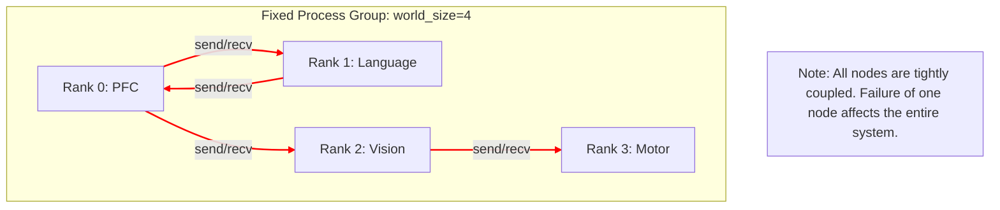

# Communication Backend Comparison: Zenoh vs. torch.distributed

**Last Updated:** 2025-12-10
**Author:** Masahiro Aoki
© 2025 Moonlight Technologies Inc. All Rights Reserved.

This document details the technical comparison and the rationale behind the architectural shift in the communication backend for the EvoSpikeNet distributed brain simulation.

---

## 1. Background: Why a Re-evaluation of the Communication Architecture Was Necessary

The initial version of the distributed brain was built upon `torch.distributed`, the standard distributed computing library in PyTorch. It is the de facto standard for data-parallel and model-parallel training of machine learning models and is highly optimized for high-throughput tensor exchange, especially between GPUs.

However, as the project evolved from a mere simulation to **implementation on physical robots** and **real-time autonomous decision-making**, the following limitations of `torch.distributed` became significant challenges:

1.  **Synchronous, Blocking Communication**: Operations like `send`/`recv` and `all_reduce` are fundamentally synchronous, requiring all participating processes to be in lockstep. This meant that a delay in one node would lead to a delay in the entire system.
2.  **Static Process Groups**: The `world_size` (number of participating processes) is fixed at launch, making it extremely difficult to dynamically add or remove nodes during a simulation. This is unsuitable for scenarios where a robot's modules might fail or new sensors are added.
3.  **Single Point of Failure**: When a single process crashes, it often causes the entire process group to hang or crash, leading to low overall system fault tolerance.
4.  **HPC-centric Design**: It is optimized for training on GPU clusters and is not always suitable for heterogeneous environments where edge devices with varying resources (like small computers on different parts of a robot) are mixed.

To overcome these challenges and build a more **dynamic, robust, and scalable** distributed system, the decision was made to migrate the communication backend to **Zenoh**.

---

## 2. Technical Comparison

| Feature              | `torch.distributed` (Old Architecture)                            | Zenoh (New Architecture)                                                      | Rationale for Selection                                                                                                   |
| :------------------- | :---------------------------------------------------------------- | :---------------------------------------------------------------------------- | :------------------------------------------------------------------------------------------------------------------------ |
| **Communication Model**  | Synchronous (Blocking `send`/`recv`, synchronous barriers)        | **Asynchronous Pub/Sub (Publish/Subscribe)**                                  | For real-time systems, an asynchronous model where each module can operate independently is a significant advantage.     |
| **Process Management**   | Static (fixed `world_size` and `rank` at launch)                  | **Dynamic (Automatic node discovery, free join/leave)**                       | Enables dynamic response to robot module failures or additions, improving system flexibility and fault tolerance.        |
| **Topology**         | Tightly coupled (all nodes are aware of each other's connections) | **Loosely coupled (each node only communicates with the Zenoh router)**       | Drastically reduces system complexity. The impact of adding/changing a node on other nodes is minimized.                 |
| **Fault Tolerance**  | Low (a failure in one node can easily cascade to the whole system)    | **High (a node failure does not directly affect other nodes)**                | Prevents the failure of a single sensor or actuator from causing a total shutdown of the entire brain's functionality. |
| **Performance**      | Optimized for high-throughput tensor transfer between GPUs        | Optimized for **low-latency messaging**                                       | In robot control, the latency of individual messages is often more critical than overall throughput.                     |
| **Scalability**      | Proven in HPC clusters with hundreds of nodes                     | Proven in IoT/Robotics with tens of thousands to millions of devices        | A forward-looking choice for future integration of large robot fleets and numerous sensors/actuators.                |
| **Data Format**      | Specialized for direct transmission of `torch.Tensor`             | Supports **any serializable format** (JSON, Pickle, Protobuf, etc.)           | Facilitates the exchange of structured data other than tensors, such as brain states or intentions.                    |
| **Ecosystem**        | Limited to the PyTorch ecosystem                                  | High affinity with **robotics standards** like DDS, ROS2                      | Lowers the barrier for future integration with robotics middleware like ROS2.                                            |
| **Implementation Complexity** | Rank management and synchronization logic can become complex | The Pub/Sub model simplifies the implementation of each node                | Developers of each module can focus on their own logic rather than the intricacies of communication.                  |

---

## 3. Architectural Diagrams

### 3.1. Old: torch.distributed Architecture



### 3.2. New: Zenoh Architecture

```mermaid
graph TD
    subgraph "Dynamic Distributed System"
        PFC("PFC Node")
        Lang("Language Node")
        Vision("Vision Node")
        Motor("Motor Node")
        NewSensor("New Sensor (Dynamically Added)")
    end

    Router(("Zenoh Router"))

    PFC -- Publish(pfc/control) --> Router
    Router -- Subscribe(pfc/control) --> Lang
    Router -- Subscribe(pfc/control) --> Vision

    Lang -- Publish(lang/features) --> Router
    Vision -- Publish(vision/objects) --> Router
    Motor -- Publish(motor/status) --> Router
    NewSensor -- Publish(sensor/new_data) --> Router

    Router -- Subscribe(vision/*, lang/*) --> PFC
    Router -- Subscribe(vision/objects) --> Motor
    Router -- Subscribe(sensor/new_data) --> PFC

    linkStyle 0 stroke-width:2px,fill:none,stroke:blue;
    linkStyle 1 stroke-width:2px,fill:none,stroke:green;
    linkStyle 2 stroke-width:2px,fill:none,stroke:green;
    linkStyle 3 stroke-width:2px,fill:none,stroke:blue;
    linkStyle 4 stroke-width:2px,fill:none,stroke:blue;
    linkStyle 5 stroke-width:2px,fill:none,stroke:blue;
    linkStyle 6 stroke-width:2px,fill:none,stroke:blue;
    linkStyle 7 stroke-width:2px,fill:none,stroke:green;
    linkStyle 8 stroke-width:2px,fill:none,stroke:green;
    linkStyle 9 stroke-width:2px,fill:none,stroke:green;

    note["Note"](All nodes are loosely coupled via the router.<br>Nodes can be added/removed easily.)
```

---

## 4. Current Status and Future Outlook

### 4.1. Implementation Status

-   **The primary communication backend has been fully migrated to Zenoh.**
-   `run_zenoh_distributed_brain.py` is now the official script for running the distributed brain simulation.
-   The `zenoh-router` service is integrated into `docker-compose.yml`, allowing for easy setup of a Zenoh network in a containerized environment.

### 4.2. Handling of torch.distributed

-   The older `run_distributed_brain_simulation.py` is retained in the repository for **backward compatibility** and **specific research purposes** (e.g., performance evaluation of tightly coupled, tensor-parallel processing).
-   However, all new feature development and functionalities related to physical robot implementation will be built on the Zenoh-based architecture.
-   In the future, the `torch.distributed` version may be deprecated and archived.

## 5. Conclusion

The migration from `torch.distributed` to Zenoh is a **strategically critical architectural change** that marks the transition of the EvoSpikeNet project from a research phase to a practical, product-oriented phase. This change significantly enhances the system's robustness, flexibility, and scalability, establishing the technical foundation for realizing a "true distributed brain" that operates autonomously on physical robot platforms.

---
