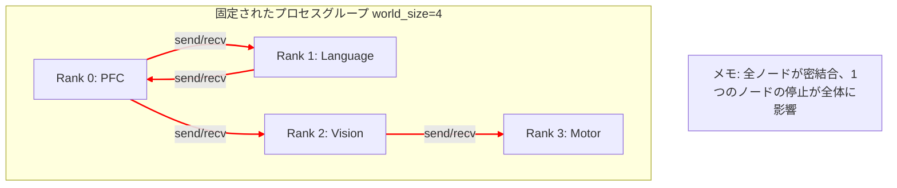
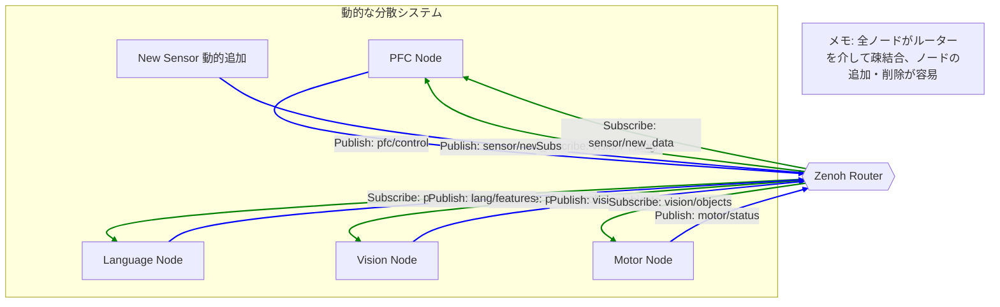

# 通信バックエンドの比較: Zenoh vs. torch.distributed

**最終更新日:** 2025年12月10日
**Author:** Masahiro Aoki
© 2025 Moonlight Technologies Inc. All Rights Reserved.

このドキュメントは、EvoSpikeNetの分散脳シミュレーションにおける通信バックエンドのアーキテクチャ変更について、技術的な比較と意思決定の背景を詳述します。

---

## 1. 背景: なぜ通信アーキテクチャの見直しが必要だったか

プロジェクト初期の分散脳は、PyTorchの標準的な分散コンピューティングライブラリである `torch.distributed` を基盤として構築されていました。これは機械学習モデルのデータ並列・モデル並列学習においてデファクトスタンダードであり、特にGPU間での高スループットなテンソル交換に最適化されています。

しかし、プロジェクトが単なるシミュレーションから、**物理ロボットへの実装**と**リアルタイムでの自律的な意思決定**へと進展するにつれ、`torch.distributed` の持つ以下の制約が大きな課題となりました。

1.  **同期的・ブロッキング通信**: `send`/`recv` や `all_reduce` などの操作は基本的に同期的であり、参加する全プロセスの足並みを揃える必要があります。これにより、一部のノードの遅延がシステム全体の遅延に繋がりました。
2.  **静的なプロセスグループ**: `world_size`（参加プロセス数）は起動時に固定され、シミュレーション中の動的なノードの追加や離脱が極めて困難でした。ロボットのモジュールが故障したり、新しいセンサーが追加されたりする状況に対応できません。
3.  **単一障害点**: 1つのプロセスがクラッシュすると、多くの場合、プロセスグループ全体がハングアップまたはクラッシュし、システム全体の耐障害性が低いという問題がありました。
4.  **HPC中心の設計**: GPUクラスタでの学習に最適化されており、リソースが不均一なエッジデバイス（ロボットの各部に搭載された小型コンピュータなど）が混在する環境には必ずしも適していません。

これらの課題を克服し、より**動的で、堅牢で、スケーラブルな**分散システムを実現するため、通信バックエンドを **Zenoh** へと移行する決定が下されました。

---

## 2. 技術的比較

| 項目                 | `torch.distributed` (旧アーキテクチャ)                                 | Zenoh (新アーキテクチャ)                                                               | 選択理由                                                                                             |
| :------------------- | :--------------------------------------------------------------------- | :------------------------------------------------------------------------------------- | :--------------------------------------------------------------------------------------------------- |
| **通信モデル**       | 同期型 (ブロッキング `send`/`recv`, 同期バリア)                          | **非同期 Pub/Sub (Publish/Subscribe)**                                                 | リアルタイムシステムでは、各モジュールが独立して動作できる非同期モデルが圧倒的に有利。             |
| **プロセス管理**     | 静的 (起動時に`world_size`と`rank`が固定)                              | **動的 (ノードの自動検出、自由参加/離脱)**                                             | ロボットのモジュールの故障や追加に動的に対応可能。システムの柔軟性と耐障害性が向上。               |
| **トポロジー**       | 密結合 (全ノードが相互に接続を意識)                                    | **疎結合 (各ノードはZenohルーターとのみ通信)**                                         | システムの複雑性を大幅に低減。ノードの追加・変更が他のノードに与える影響を最小限に抑えられる。     |
| **耐障害性**         | 低い (1ノードの障害が全体に波及しやすい)                               | **高い (ノードの障害が他ノードに直接影響しない)**                                      | 1つのセンサーやアクチュエーターの故障が、脳全体の機能停止に繋がることを防ぐ。                      |
| **パフォーマンス**   | GPU間の高スループットなテンソル転送に最適化                            | **低レイテンシなメッセージング**に最適化                                               | ロボット制御では、スループットよりも個々のメッセージの遅延時間のほうが重要になるため。             |
| **スケーラビリティ** | 数百ノード規模のHPCクラスタで実績あり                                  | 数万〜数百万デバイス規模のIoT/Roboticsで実績あり                                     | 将来的な大規模ロボット群の連携や、多数のセンサー/アクチュエーターの統合を見据えた選択。        |
| **データ形式**       | `torch.Tensor` の直接送受信に特化                                      | **任意のシリアライズ形式** (JSON, Pickle, Protobufなど) に対応                         | 脳の状態や意図など、テンソル以外の構造化データのやり取りが容易になる。                             |
| **エコシステム**     | PyTorchエコシステム内に限定                                            | DDS, ROS2など、**ロボティクス標準**との親和性が高い                                   | 将来的にROS2などのロボット用ミドルウェアと連携する際の障壁が低い。                                 |
| **実装の複雑さ**     | ランク管理や同期処理が複雑になりがち                                   | Pub/Subモデルにより、各ノードの実装がシンプルになる                                    | 各モジュールの開発者は、通信の詳細ではなく、自身のロジックに集中できる。                           |

---

## 3. アーキテクチャの概念図

### 3.1. 旧: torch.distributed アーキテクチャ

### 3.2. 新: Zenoh アーキテクチャ

---

## 4. 現在の状況と今後の展望

### 4.1. 実装ステータス

-   **主要な通信バックエンドはZenohに完全に移行済み**です。
-   `run_zenoh_distributed_brain.py` が現在の分散脳シミュレーションの公式な実行スクリプトです。
-   `docker-compose.yml` には `zenoh-router` サービスが統合されており、コンテナ環境で容易にZenohネットワークを構築できます。

### 4.2. torch.distributedの扱い

-   旧来の `run_distributed_brain_simulation.py` は、**後方互換性**および**特定の研究目的**（例: 密結合したモジュール間の高効率なテンソル並列処理の性能評価）のためにリポジトリ内に保持されています。
-   しかし、新規の機能開発や、物理ロボットへの実装に関連する機能は、すべてZenohベースのアーキテクチャ上で行われます。
-   将来的には、`torch.distributed` 版は非推奨となり、アーカイブされる可能性があります。

## 5. 結論

`torch.distributed` から Zenoh への移行は、EvoSpikeNetプロジェクトが研究段階から実用・製品化段階へと移行するための、**戦略的に極めて重要なアーキテクチャ変更**です。この変更により、システムの堅牢性、柔軟性、スケーラビリティが大幅に向上し、物理的なロボットプラットフォーム上で自律的に動作する「真の分散脳」の実現に向けた技術的基盤が確立されました。

---
