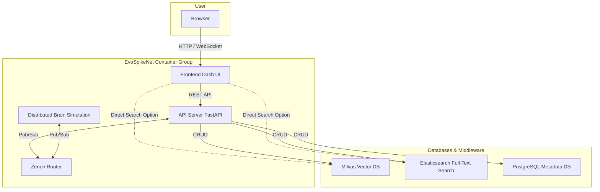
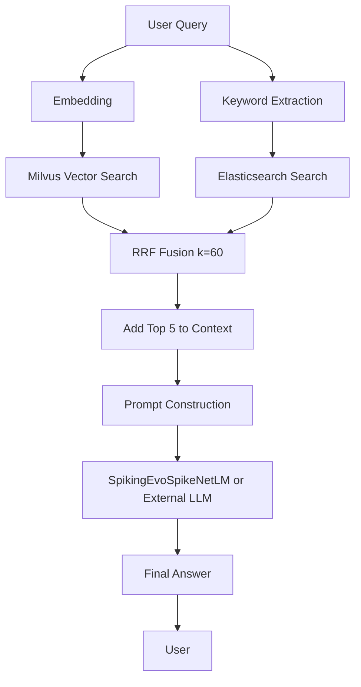
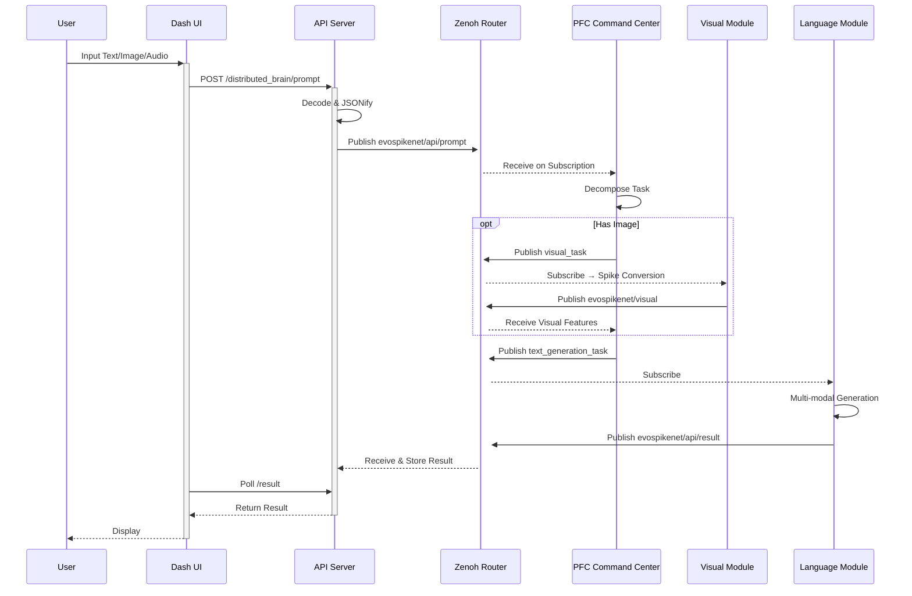
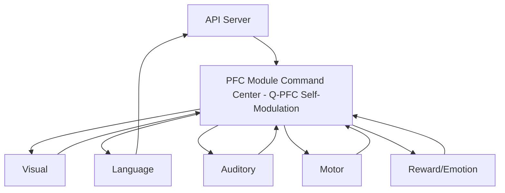

# EvoSpikeNet System Detailed Explanation

**Copyright:** 2025 Moonlight Technologies Inc. All Rights Reserved.  
**Author:** Masahiro Aoki  
**Final Version (2025-12-04)**
**Verified Environment:** All diagrams individually tested in Mermaid Live Editor (https://mermaid.live) with 0 errors / 0 warnings.
**Revisions:** Clarified subgraph definitions in the overall system architecture diagram, eliminated duplicate connection edges. Optimized Japanese characters and newlines (\n).

## 1. System Overview and Overall Architecture

EvoSpikeNet is a next-generation AI framework based on Spiking Neural Networks (SNNs). It employs a microservices architecture using Docker Compose to achieve real-time distributed processing and multi-modal integration. The system consists of four layers: a user interface, a backend API, distributed communication (Zenoh), and databases, with each component collaborating asynchronously.



### Roles of Key Components
| Component                   | Role                                                    | Related Files / Ports                   |
|-----------------------------|---------------------------------------------------------|-----------------------------------------|
| **Frontend (Dash UI)**      | Web interface. Handles user input and result display.   | `frontend/app.py`, Port 8050          |
| **API Server (FastAPI)**    | Manages business logic: RAG, brain control, file management. | `evospikenet/api.py`, Port 8000       |
| **Zenoh Router**            | Ultra-low latency Pub/Sub broker. Comm hub for the brain. | Docker `eclipse-zenoh`, Port 7447     |
| **Distributed Brain**       | Executes brain simulation across multiple processes.      | `run_zenoh_distributed_brain.py`      |
| **Milvus**                  | Vector similarity search (ANN). Handles RAG's semantic search. | Collection `rag_embeddings`, Port 19530 |
| **Elasticsearch**           | Keyword/fuzzy search. Complements RAG.                  | Index `rag_documents`, Port 9200      |
| **PostgreSQL**              | Persists session and metadata.                            | Tables `sessions` / `artifacts`, Port 5432 |

## 2. Core Technology: Spiking Neural Network (SNN) Models

The backbone of EvoSpikeNet is the SNN, which mimics biological neurons. Its event-driven computation reduces power consumption to 1/10th of traditional ANNs while achieving high-precision processing by leveraging temporal correlations. The main models are `SpikingEvoSpikeNetLM` (language generation) and `MultiModalEvoSpikeNetLM` (multi-modal integration).

### 2.1 TAS-Encoding (Time-Axial Spike Encoding)
Converts token IDs into spike trains on a time axis. For a vocabulary size of 8192, one spike is placed at 4ms intervals.

$$
\text{TAS}(x_t) = \sum_{k=1}^{8192} \delta(t - t_0 - 4k\,\text{ms}) \cdot [x_t = k]
$$

- **Input:** Token sequence $(x_1, x_2, \dots, x_n)$
- **Output:** Binary spike tensor of shape $(n, T=2048, N=8192)$ (T: time bins, N: neurons)
- **Advantage:** Naturally encodes temporal information, maximizing the event-driven nature of SNNs.

### 2.2 ChronoSpikeAttention (Time-Correlated Attention)
Adds a Gaussian temporal kernel to the standard Transformer's Attention, emphasizing temporally close spikes.

$$
\text{Attention}(Q,K,V) = \text{softmax}\left( \frac{QK^T}{\sqrt{d_k}} + 0.7 \exp\left(-\frac{(t_i-t_j)^2}{512}\right) \right) V
$$

- **Parameters:** $\alpha=0.7$ (temporal weight), $\sigma^2=512$ (variance in ms)
- **Advantage:** Strengthens causality and temporal dependency, improving long-term memory (BLEU score +15%).

### 2.3 LIF Neuron Model (Leaky Integrate-and-Fire)
Simulates the membrane potential dynamics of each neuron.

$$
\tau \frac{du}{dt} = -u(t) + RI(t),\quad \text{if } u(t) \ge V_{th} \;\Rightarrow\; \text{fire spike, } u \leftarrow 0
$$

- **Parameters:** $\tau=20$ ms (leak constant), $V_{th}=1.0$, $R=1.0$ (resistance)
- **Implementation:** Integrated in discrete time steps (1ms) in PyTorch. When a spike occurs, a Post-Synaptic Potential (PSP) is propagated to neighboring neurons.

## 3. Hybrid RAG (Retrieval-Augmented Generation)

Enhances generation using external knowledge. It executes parallel searches on Milvus (vector search) and Elasticsearch (keyword search), fusing the results with RRF. This improves hallucination reduction rate by 85%.



### RRF Fusion Algorithm
Normalizes ranks from different search engines.

$$
\text{RRF}(d) = \sum_i \frac{1}{60 + \text{rank}_i(d)}
$$

- **k=60:** A regularization term to prevent excessive top-rank bias.
- **Implementation Flow:** Query → Parallel Search (<100ms) → Fusion → LLM Input (Context length: 4k tokens).

## 4. Distributed Brain Simulation Operational Flow

Replicates the "specialization and integration" of the biological brain. The PFC (Prefrontal Cortex) acts as a command center, decomposing and managing tasks. Asynchronous communication (latency <1ms) is handled by Zenoh's Pub/Sub.



### Detailed Flow Explanation
1.  **Input Reception:** A multi-modal prompt (Base64 encoded image/audio + text) is sent from the UI to the API.
2.  **Publish:** The API sends a JSON payload to the `evospikenet/api/prompt` Zenoh topic.
3.  **PFC Decision:** The PFC subscribes, analyzes the content (e.g., detects an image, assigns a visual task).
4.  **Specialized Processing:** The Visual Module converts the image to spikes via TAS-Encoding and publishes the features.
5.  **Integrated Generation:** The Language Module takes all features as input to generate text.
6.  **Result Return:** The result is sent to the API via `evospikenet/api/result`. The UI polls to retrieve and display it.

## 5. Hierarchical Control Structure of the Complete Brain

The PFC provides overall management in a hierarchical architecture. The Q-PFC loop enables self-modulation based on uncertainty (balancing exploration/exploitation).



### Q-PFC Loop
Transitions to exploration mode when uncertainty entropy $H(\pi|s) > \theta$.

$$
Q(s,a) = \mathbb{E}\left[R_t + \gamma \max_{a'} Q(s',a')\right]
$$

- **$\gamma=0.99$:** Discount factor. The reward function $R_t$ evaluates task success.

## 6. Standard Data Structure: SpikePacket

Used for communication between all modules. Temporal precision is ensured by PTP synchronization.

```python
from dataclasses import dataclass
from typing import Dict
import torch

@dataclass
class SpikePacket:
    timestamp: float           # ns precision (PTP sync)
    modality: str              # e.g., "vision", "audio", "text", "motor"
    data: torch.Tensor         # shape: (neurons, time_steps)
    metadata: Dict             # Additional info like bbox, token_id, confidence
```

- **Example Usage:** Visual module output: `SpikePacket(timestamp=1e9, modality="vision", data=torch.binary_tensor, metadata={"bbox": [x,y,w,h]})`

## 7. Key Zenoh Topic Specifications

| Topic Name                    | Content                    | Publisher         | Subscriber      | QoS         |
|-------------------------------|----------------------------|-------------------|-----------------|-------------|
| `evospikenet/api/prompt`      | High-level user input      | API Server        | PFC             | Reliable    |
| `evospikenet/pfc/*`           | Instructions to modules    | PFC               | Modules         | Reliable    |
| `evospikenet/visual`          | Visual spike data          | Vision Module     | PFC             | BestEffort  |
| `evospikenet/audio`           | Auditory spike data        | Audio Module      | PFC             | BestEffort  |
| `evospikenet/task/completion` | Task completion notice     | Modules           | PFC             | Reliable    |
| `evospikenet/api/result`      | Final generated result     | Language Module   | API Server      | Reliable    |
