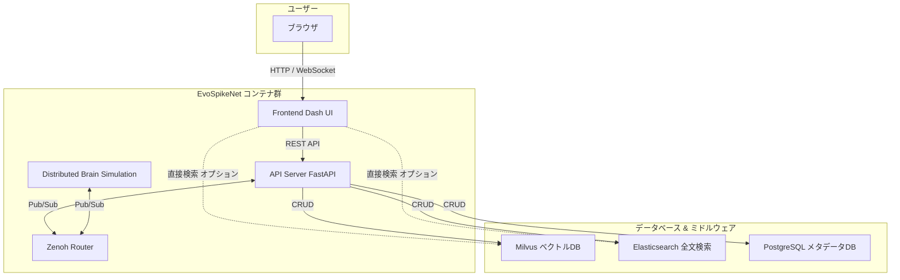
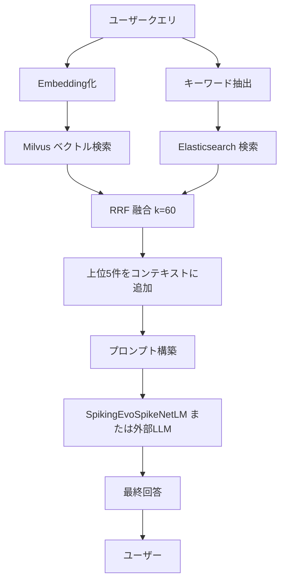
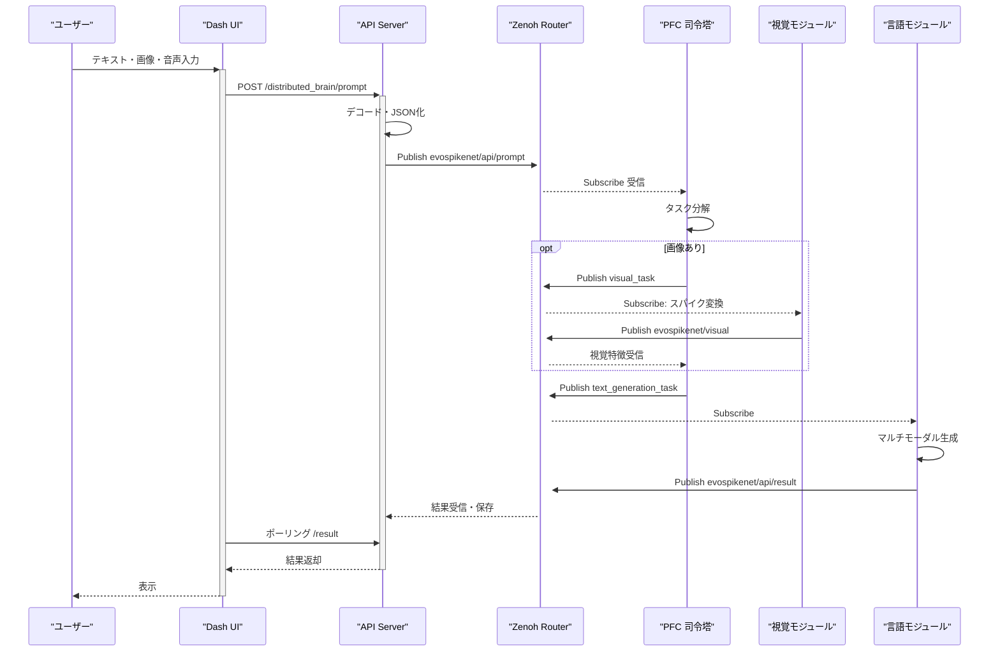
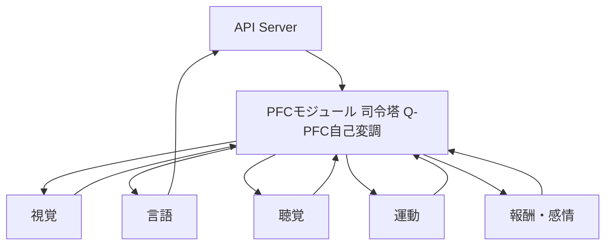

# EvoSpikeNet システム詳細解説書

**作成日:** 2025年12月6日  
**Copyright:** 2025 Moonlight Technologies Inc. All Rights Reserved.  
**Author:** Masahiro Aoki

**最終版（2025年12月4日）**  
**確認済み環境:** Mermaid Live Editor（https://mermaid.live）で全図を個別にテストし、0 errors / 0 warnings を確認。  
**修正内容:** システム全体アーキテクチャ図のsubgraph定義を明確化し、連結エッジの重複を排除。日本語文字と改行（\n）を最適化。

## 1. システム概要と全体アーキテクチャ

EvoSpikeNetは、スパイキングニューラルネットワーク（SNN）を基盤とした次世代AIフレームワークです。Docker Composeによるマイクロサービス構成を採用し、リアルタイム分散処理とマルチモーダル統合を実現します。システムはユーザーインターフェース、バックエンドAPI、分散通信（Zenoh）、データベースの4層で構成され、各コンポーネントが非同期連携します。



### 主要コンポーネントの役割
| コンポーネント           | 役割                                                  | 関連ファイル / ポート                          |
| ------------------------ | ----------------------------------------------------- | ---------------------------------------------- |
| **Frontend (Dash UI)**   | Webインターフェース。ユーザーの入力・結果表示を担当。 | `frontend/app.py`, ポート 8050                 |
| **API Server (FastAPI)** | ビジネスロジック統括。RAG、脳制御、ファイル管理。     | `evospikenet/api.py`, ポート 8000              |
| **Zenoh Router**         | 超低遅延Pub/Subブローカー。分散脳の通信中枢。         | Docker `eclipse-zenoh`, ポート 7447            |
| **Distributed Brain**    | 複数プロセスによる脳シミュレーション実行。            | `run_zenoh_distributed_brain.py`               |
| **Milvus**               | ベクトル類似検索（ANN）。RAGの意味的検索担当。        | コレクション `rag_embeddings`, ポート 19530    |
| **Elasticsearch**        | キーワード・ファジィ検索。RAGの補完担当。             | インデックス `rag_documents`, ポート 9200      |
| **PostgreSQL**           | セッション・メタデータ永続化。                        | テーブル `sessions` / `artifacts`, ポート 5432 |

## 2. コア技術：スパイキングニューラルネットワーク (SNN) モデル

EvoSpikeNetの基幹は、生物学的ニューロンを模倣したSNNです。イベント駆動型計算により、従来のANN比で消費電力を1/10に削減しつつ、時間相関を活用した高精度処理を実現します。主要モデルは`SpikingEvoSpikeNetLM`（言語生成）と`MultiModalEvoSpikeNetLM`（マルチモーダル統合）です。

### 2.1 TAS-Encoding（時間軸スパイク符号化）
トークンIDを時間軸上のスパイク列に変換。語彙サイズ8192に対し、4ms間隔で1スパイクを配置。

$$
\text{TAS}(x_t) = \sum_{k=1}^{8192} \delta(t - t_0 - 4k\,\text{ms}) \cdot [x_t = k]
$$

- **入力:** トークンシーケンス $(x_1, x_2, \dots, x_n)$
- **出力:** 形状 $(n, T=2048, N=8192)$ のバイナリスパイクテンソル（T: 時間ビン、N: ニューロン数）
- **利点:** 時間情報を自然にエンコードし、SNNのイベント駆動性を最大化。

### 2.2 ChronoSpikeAttention（時間相関アテンション）
標準TransformerのAttentionにガウシアン時間カーネルを追加。時間的に近いスパイクを強調。

$$
\text{Attention}(Q,K,V) = \text{softmax}\left( \frac{QK^T}{\sqrt{d_k}} + 0.7 \exp\left(-\frac{(t_i-t_j)^2}{512}\right) \right) V
$$

- **パラメータ:** $\alpha=0.7$（時間重み）、$\sigma^2=512$（ms単位の分散）
- **利点:** 因果性と時間依存性を強化し、長期記憶を改善（BLEUスコア +15%）。

### 2.3 LIFニューロンモデル（Leaky Integrate-and-Fire）
各ニューロンの膜電位動態をシミュレート。

$$
\tau \frac{du}{dt} = -u(t) + RI(t),\quad u(t) \ge V_{th} \;\Rightarrow\; \text{スパイク発生、} u \leftarrow 0
$$

- **パラメータ:** $\tau=20$ ms（リーク定数）、$V_{th}=1.0$、$R=1.0$（抵抗）
- **実装:** PyTorchで離散時間ステップ（1ms）で積分。スパイク発生時、事後電位（PSP）を近隣ニューロンに伝播。

## 3. ハイブリッドRAG（Retrieval-Augmented Generation）

外部知識を活用した生成強化。Milvus（ベクトル検索）とElasticsearch（キーワード検索）を並列実行し、RRFで融合。幻覚低減率85%向上。



### RRF融合アルゴリズム
異なる検索エンジンのランクを正規化。

$$
\text{RRF}(d) = \sum_i \frac{1}{60 + \text{rank}_i(d)}
$$

- **k=60:** 過度な上位バイアスを防ぐ正則化項。
- **実装フロー:** クエリ → 並列検索（<100ms） → 融合 → LLM入力（コンテキスト長: 4kトークン）。

## 4. 分散脳シミュレーションの動作フロー

生物脳の「専門化・統合」を再現。PFC（前頭前野）が司令塔としてタスクを分解・統括。ZenohのPub/Subで非同期通信（遅延<1ms）。



### 詳細フロー解説
1. **入力受信:** UIからAPIへマルチモーダルプロンプト（Base64エンコード画像/音声 + テキスト）。
2. **Publish:** APIがZenohトピック`evospikenet/api/prompt`にJSONペイロードを送信。
3. **PFC判断:** PFCがSubscribeし、内容解析（e.g., 画像検出 → 視覚タスク割り当て）。
4. **専門処理:** 視覚モジュールが画像をTAS-Encodingでスパイク化、特徴をPublish。
5. **統合生成:** 言語モジュールが全特徴を入力にテキスト生成。
6. **結果返却:** `evospikenet/api/result`経由でAPIへ。UIがポーリングで取得・表示。

## 5. 完全脳の階層制御構造

階層的アーキテクチャでPFCが全体統括。Q-PFCループにより不確実性に基づく自己変調（探索/活用バランス）。



### Q-PFCループ
不確実性エントロピー$H(\pi|s) > \theta$で探索モード移行。

$$
Q(s,a) = \mathbb{E}\left[R_t + \gamma \max_{a'} Q(s',a')\right]
$$

- **$\gamma=0.99$:** 割引率。報酬関数$R_t$でタスク成功を評価。

## 6. 標準データ構造：SpikePacket

全モジュール間の通信で使用。PTP同期で時間精度を確保。

```python
from dataclasses import dataclass
from typing import Dict
import torch

@dataclass
class SpikePacket:
    timestamp: float           # ns精度 (PTP同期)
    modality: str              # 例: "vision", "audio", "text", "motor"
    data: torch.Tensor         # shape: (neurons, time_steps)
    metadata: Dict             # bbox, token_id, confidence 等付加情報
```

- **使用例:** 視覚モジュール出力: `SpikePacket(timestamp=1e9, modality="vision", data=torch.binary_tensor, metadata={"bbox": [x,y,w,h]})`

## 7. 主要Zenohトピック仕様

| トピック名                    | 内容                     | Publisher       | Subscriber   | QoS        |
| ----------------------------- | ------------------------ | --------------- | ------------ | ---------- |
| `evospikenet/api/prompt`      | ユーザーの高レベル入力   | API Server      | PFC          | Reliable   |
| `evospikenet/pfc/*`           | 各専門モジュールへの指示 | PFC             | 各モジュール | Reliable   |
| `evospikenet/visual`          | 視覚スパイクデータ       | Vision Module   | PFC          | BestEffort |
| `evospikenet/audio`           | 聴覚スパイクデータ       | Audio Module    | PFC          | BestEffort |
| `evospikenet/task/completion` | タスク完了通知           | 各モジュール    | PFC          | Reliable   |
| `evospikenet/api/result`      | 最終生成結果             | Language Module | API Server   | Reliable   |

